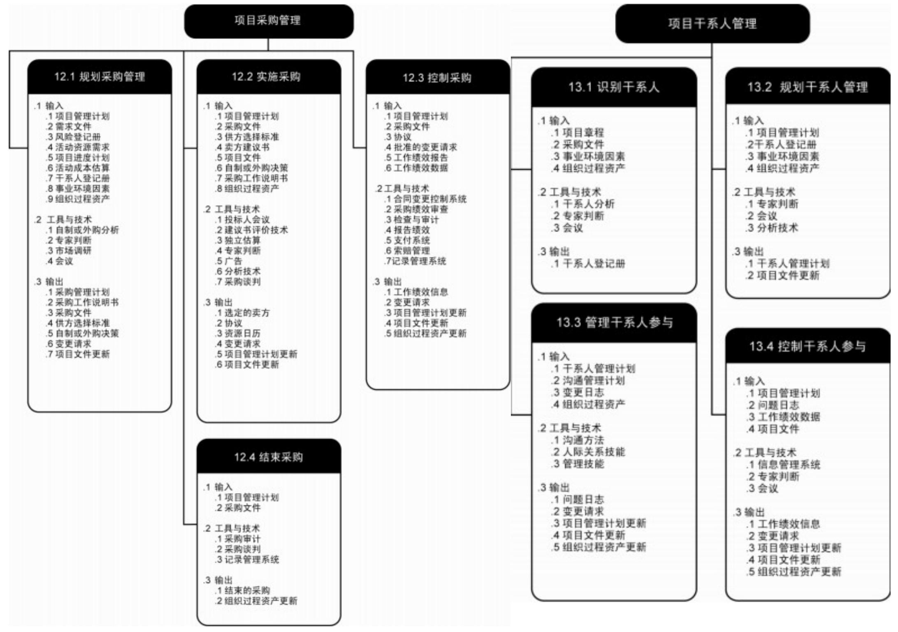

<table><tr><td>知识领域</td><td>过程名称</td><td>过程目的</td><td>输入</td><td>工具与技术</td><td>输出</td></tr><tr><td colspan="6">启动过程组</td></tr><tr><td>4.1项目整合管理</td><td>制定项目章程</td><td>制定一份正式批准项目或阶段的文件，并记录能反映干系人的需要和期望的初步要求，授权项目经理在项目活动中使用组织资源</td><td>1.项目工作说明书（对外招标文件、对内发起人战略计划）
2.商业论证（为什么要做这个项目）
3.合同
4.事业环境因素
5.组织过程资产</td><td>1.专家判断
2.引导技术</td><td>1.项目章程</td></tr><tr><td>项目干系人管理</td><td>识别干系人</td><td>识别所有受项目影响的人或组织，并记录其利益、参与情况和对项目成功之影响力</td><td>1.项目章程
2.采购文件
3.事业环境因素
4.组织过程资产</td><td>1.干系人分析（权利/利益/方格令、重、监、随，干系人管理策略）
2.专家判断
3.会议</td><td>1.干系人登记册</td></tr><tr><td colspan="6">规划过程组</td></tr><tr><td>项目整合管理</td><td>制定项目管理计划</td><td>定义、准备和协调所有子计划，并把它们整合为一份综合项目管理计划的过程。项目管理计划包括经过整合的项目基准和子计划</td><td>1.项目章程
2.其他规划过程的输出
3.事业环境因素
4.组织过程资产</td><td>1.专家判断
2.引导技术</td><td>1.项目管理计划</td></tr><tr><td rowspan="4">项目范围管理</td><td>规划范围管理</td><td>创建范围管理计划，书面描述将如何定义、确认和控制项目范围</td><td>1.项目管理计划
2.项目章程
3.事业环境因素（企业文化、组织结构、行业标准、PMIS、商业数据库）
4.组织过程资产（制度流程、共享数据库）</td><td>1.专家判断
2.会议</td><td>1.范围管理计划
2.需求管理计划</td></tr><tr><td>收集需求</td><td>为实现项目目标而确定、记录并管理干系人的需要和需求</td><td>1.范围管理计划
2.需求管理计划
3.干系人管理计划
4.项目章程
5.干系人登记册</td><td>1.访谈（一对一、一对多、坐谈）
2.焦点小组（专科）
3.引导式研讨会（跨职能、发散）
4.群体创新技术
-头脑风暴法（面对面，不能引导，评论）
-名义小组技术（头脑风暴法优先级排序）
-概念/思维导图（把头脑风暴中的创意整合成一张图）
-亲和图（分类图）
-多标准决策分析（需求打分）
5.群体决策技术
--致同意（德尔菲）匿名
-大多数原则
-相对多数原则
-独裁
-询问券调查（快，不准）
7.观察
8.原型法（IT）
9.标杆对照（找标准，国际、组织标准等）
10.系统交互图
11.文件分析</td><td>1.需求文件
2.需求跟踪矩阵</td></tr><tr><td>定义范围</td><td>制定项目和产品的详细描述</td><td>1.范围管理计划
2.项目章程
3.需求文件
4.组织过程资产</td><td>1.专家判断
2.产品分析（需求分析质量功能展开图CFD，他说他的话，我说我的话关联起来电信行业）
3.备选方案生成定性的分析（配对比较法，技术销售市场推广）
4.引导式研讨会</td><td>1.项目范围说明书（对项目范围、主要可交付成果、假设条件、制约因素、验收标准）2.项目文件（更新）</td></tr><tr><td>创建WBS</td><td>把项目可交付成果和项目工作分解成较小的，更易于管理的组成部分</td><td>1.范围管理计划
2.项目范围说明书
3.需求文件
4.事业环境因素
5.组织过程资产</td><td>1.分解一种把项目范围和项目可交付成果逐步划分为更小、更便于管理的组成部分的技术
2.专家判断</td><td>1.范围基准（范围说明书、WBS、WBS词典）
2.项目文件（更新）</td></tr><tr><td>项目时间管理</td><td>规划进度管理</td><td>为规划、编制、管理、执行和控制项目进度而制定政策、程序和文档</td><td>1.项目管理计划
2.项目章程
3.事业环境因素</td><td>1.专家判断
2.分析技术
3.会议</td><td>1.进度管理计划</td></tr></table>

<table><tr><td rowspan="6"></td><td></td><td></td><td>4.组织过程资产</td><td></td><td></td></tr><tr><td>定义活动</td><td>识别为完成项目可交付成果
而需采取的具体行动</td><td>1.进度管理计划
2.范围基准
3.事业环境因素
4.组织过程资产</td><td>1.分解(从上到下或从下到上)
2.滚动式规划(渐进明细)
3.专家判断</td><td>1.活动清单
2.活动属性(支持型活动
【人力投入】编书开会,
独立型活动(分立型投
入】编书用时、依附性活
动【分摊型投入】)
3.里程碑清单</td></tr><tr><td>排列活动顺序</td><td>识别和记录项目活动逻辑关
系</td><td>1.进度管理计划
2.活动清单
3.活动属性
4.里程碑清单
5.项目范围说明书
6.事业环境因素
7.组织过程资产</td><td>1.紧前关系绘图法(PDM前导图)FS/FF/SF/SS(单代
号网络图双代号网络图)
2.确定依赖关系(强制【先穿袜子后穿鞋】或选择
【裤衩外穿】,内部【项目活动内,机器组装完成
于能测试】或外部【项目活动与非项目活动,如施
工准备要有三同时审批】)
3.利用时间提前量与滞后量</td><td>1.项目进度网络图
2.项目文件(更新)</td></tr><tr><td>估算活动资源</td><td>估算各项活动所需材料、人
员、设备和用品的种类和数
量</td><td>1.进度管理计划
2.活动清单
3.活动属性
4.资源日历(资源可用
性、资源直方图)
5.风险登记册
6.活动成本估算
7.事业环境因素
8.组织过程资产</td><td>1.专家判断
2.备选方案分析(选一个能力强的,还是选三个弱
的,等是自制还是购买)
3.发布的估算数据
4.自下而上估算(为每个活动配备资源)
5.项目管理软件</td><td>1.活动资源需求
2.资源分解结构(M
/分
类图哪些输入人力,属于
设备)
3.项目文件(更新)</td></tr><tr><td>估算活动持续
时间</td><td>根据资源估算的结果,估算
完成单项活动所需工作时段
数</td><td>1.进度管理计划
2.活动清单
3.活动属性
4.资源日历
5.活动资源需求
6.项目范围说明书
7.风险登记册
8.资源分解结构
9.事业环境因素
10.组织过程资产</td><td>1.专家判断
2.类比估算(经验数据)
3.参数估算(份数,有数量了)
4.三点估算(PERT的三角,贝塔分布)
5.群体决策技术
6.储备分析(应急储备用于应对风险,活动+储备)</td><td>1.活动持续时间估算
2.项目文件(更新)</td></tr><tr><td>制定进度计划</td><td>分析活动顺序、持续时间、资源需求和进度约束并编制
项目进度计划</td><td>1.进度管理计划
2.活动清单
3.活动属性
4.项目进度网络图
5.活动资源需求
6.资源日历
7.活动持续时间估算
8.项目范围说明书
9.风险登记册
10.项目人员分配
11.资源分解结构
12.事业环境因素
13.组织过程资产</td><td>1.进度网络分析
2.关键路径法(TF=LF-EF、ES/EF/LS/FL,正/推+,负推
减)
3.关键链法(是一种特殊的关键路径,整合了项目
缓冲和接驳缓冲的关键路径)
4.资源优化技术(关键路径+资源优化=正式时间)
5.资源平衡(资源固定、工期调整、影响时间)
6.资源平滑(工期固定、资源调整、不能是硬逻辑关
系)
7.建模技术(建立甘特图)
8.假设情景分析
9.模拟(蒙特卡洛分析)【成本和进度-风险-可靠】
10.利用时间提前量与滞后量(FS+多少,FS-多少)
11.进度压缩(需压缩关键路径上的进度)
12.赶工(牵扯到增加资源增加钱)
13.快速跟进(任务并行进行,加大风险)</td><td>1.项目进度计划
·里程碑图
·横道图甘特图
·项目进度网络图
2.进度基准
3.进度数据(强制日期、
非强制日期)
4.项目文件(更新)
5.项目日历
6.项目管理计划(更新)</td></tr><tr><td rowspan="2">项目成
本管理</td><td>规划成本管理</td><td>为规划、管理、花费和控制
项目成本而制定政策、程序
和文档</td><td>1.项目管理计划
2.项目章程
3.事业环境因素
4.组织过程资产(总价
合同【固定总价、总
价加激励费用、总价
加经济价格调整)、
成本补偿合同【成本
加固定费用、成本加
激励费用、成本加奖
励)、工料合同)</td><td>1.专家判断
2.分析技术(ROI投资回报率,NPV净现值,筹集
资金的战略方法,及资源方法)
3.会议</td><td>1.成本管理计划</td></tr><tr><td>估算成本</td><td>对完成项目活动所需资金进
行近似估算</td><td>1.成本管理计划
2.人力资源管理计划
3.范围基准(包括范围</td><td>1.专家判断
2.类比估算(粗略估算,经验法)
3.参数估算(有统计数据的粗略估算)</td><td>1.活动成本估算
2.估算依据(钱怎么来
的)</td></tr></table>

<table><tr><td rowspan="2"></td><td></td><td></td><td>说明书：直接成本、间接成本，工作分解结构、WBS词典
4.项目进度计划
5.风险登记册
6.事业环境因素
7.组织过程资产</td><td>4.自下而上的估算(对单个工作包成本自下而上)
5.三点估算(三角分布及贝塔分布)
6.储备分析(应急储备：已知-未知。管理储备：未知-未知)应急储备作为成本基准，储备
7.质量成本【一致性（预防1【生产合格产品，如培训】、评价10【评定质量，如QC检查，破坏性测试导致的损失，测试））、非一致性100（内部，内部发现【返工，废品】、外部1000【客户发现，业务流失，保修）
8.项目管理估算软件
9.卖方投标分析（采购过程中花的成本）
10.群体决策技术</td><td>3.项目文件（更新）</td></tr><tr><td>制定预算</td><td>汇总所有单个活动或工作包的估算成本，建立一个经批准的成本基准</td><td>1.成本管理计划
2.活动成本估算
3.估算依据
4.范围基准
5.项目进度计划
6.资源日历
7.风险登记册
8.合同协议
9.组织过程资产</td><td>4.成本汇总
2.储备分析（100+3估算成本+应急储备）
3.专家判断
4.历史关系（类比估算+参数估算）
5.资金限制平衡（资金限制与计划支出之间差异，添加强制日期调整进度，平衡）</td><td>1.成本基准（是个成本基准、支出与资金需求曲线）
2.项目资金需求（按台阶上线给钱，资金来源筹集资金的战略方法，及资源方法）
3.项目文件（更新）</td></tr><tr><td>项目质量管理</td><td>规划质量管理</td><td>识别项目及产品的质量要求和/或标准，并书面描述项目将如何达到这些要求和/或标准</td><td>1.项目管理计划
2.干系人登记册
3.风险登记册
4.需求文件
5.事业环境因素
6.组织过程资产</td><td>1.成本效益分析（投入产出比）
2.质量成本（一致性：预防，评价/非一致性，内部失败，外部失败）
3.七种基本质量工具（结果图，控制图是过程原理图）
4.因果图（根本原因分析图）4
5.流程图（SIPOC戴明博士，分析问题在哪个环节，找原因）
6.核查表，又称计数表
7.帕累托图（大气污染的天数，累计百分比）3
8.直方图（正态分布，一批次产品检查完了）2
9.控制图（7点定律，规格线，控制线35）
10.散点图，又称相关图，解释Y相对X的变化（两个变量的关系大气污染-汽车尾气）第1
11.标杆对照
12.实验设计（DOE）统计方法，识别哪些因素对质量成本的影响【经过多次试验匹配，选择最好的如英国人化肥，农药选择】
13.统计抽样
14.其他质量管理工具
15.头脑风暴
16.力场分析（公司保守派、改革派，推力与阻力）
17.名义小组技术（投票）
18.质量管理和控制工具
19.会议</td><td>1.质量管理计划
2.质量测量指标（产品指标、项目指标）
3.质量核对表
4.过程改进计划（效率指标ECRS）
5.项目文件（更新）质量政策（方针+目标）</td></tr><tr><td>项目人力资源管理</td><td>规划人力资源管理</td><td>识别和记录项目角色、职责、所需技能以及报告关系，并编制人员配备管理计划</td><td>1.项目管理计划
2.活动资源需求
3.事业环境因素
4.组织过程资产</td><td>1.组织机构图与职位描述
层级型，RBS
矩阵型，责任分配矩阵RAM,RACI图
·文本型
2.人际交往
3.组织理论
4.专家判断
5.会议</td><td>1.人力资源管理计划
（1、组织分解结构
OBS、项目协调员、项目联络员区别；责任分配矩阵RACI图；人员配备管理计划）</td></tr><tr><td>项目沟通管理</td><td>规划沟通管理</td><td>根据干系人的信息需要和要求及组织的可用资产情况，制定合适的项目沟通方式和计划</td><td>1.干系人登记册
2.项目管理计划
3.事业环境因素
4.组织过程资产</td><td>1.沟通需求分析
2.沟通技术
3.沟通模型
4.沟通方法
5.会议</td><td>1.沟通管理计划
2.项目文件（更新）</td></tr><tr><td rowspan="2">项目风险管理</td><td>规划风险管理</td><td>定义如何实施项目风险管理活动（确定干系人的承受力、风险表单模板、评分标准等）</td><td>1.项目管理计划
2.项目章程
3.干系人登记册
4.事业环境因素
5.组织过程资产</td><td>1.分析技术
2.专家判断
3.会议</td><td>1.风险管理计划</td></tr><tr><td>识别风险</td><td>判断哪些风险可能影响项目并记录其特征</td><td>1.风险管理计划
2.活动成本估算</td><td>1.文档审查（项目章程中、范围说明书查文档）
2.信息收集技术（开放的框架）</td><td>1.风险登记册
·已识别风险清单</td></tr></table>

<table><tr><td rowspan="4"></td><td></td><td></td><td>3.活动持续时间估算
4.范围基准
5.干系人登记册
6.成本管理计划
7.进度管理计划
8.质量管理计划
9.项目文件
10.事业环境因素
11.组织过程资产
12.人力资源管理计划
13.采购文件</td><td>-头脑风暴
·德尔菲技术
·访谈
·根本原因分析
3.核对单分析(以往的历史信息)
4.假设分析(假设风险,雨季户外施工)
5.图解技术
·因果图
·系统或过程流程图
·影响图(依赖于,谁影响谁,谁影响谁)
6.SWOT技术(优、劣、机、威如跳槽)
7.专家判断</td><td>·潜在应对措施清单</td></tr><tr><td>实施定性风险分析</td><td>评估并综合分析风险的概率和影响,对风险进行优先排序,从而为后续分析或行动提供基础</td><td>1.风险登记册
2.风险管理计划
3.范围基准
4.组织过程资产
5.事业环境因素</td><td>1.风险概率和影响评估
2.概率和影响矩阵(风险分类,机会,威胁)
3.风险数据质量评估
4.风险分类
5.风险紧迫性评估( )
6.专家判断</td><td>1.风险登记册(更新)
更新的内容包括对每个风险的概率和影响评估、风险评级和分值、风险紧迫性或风险分类,以及低概率风险的观察清单或需要进一步分析的风险</td></tr><tr><td>实施定量风险分析</td><td>就已识别的风险对项目整体目标的影响进行定量分析</td><td>1.风险登记册
2.风险管理计划
3.成本管理计划
4.进度管理计划
5.组织过程资产
6.事业环境因素</td><td>1.数据收集和展示技术
·访谈
·概率分布
2.定量风险分析和建模技术
·敏感性分析, (龙卷风)
·预期货币价值分析, (决策树计算EMV)
·建模和模拟(蒙特卡洛技术,计算应急储备多少)
3.专家判断</td><td>1.风险登记册(更新)
·项目的概率分析
·实现成本和时间目标的概率
·量化风险优先级清单
·定量风险分析结果的趋势</td></tr><tr><td>规划风险应对</td><td>针对项目目标,制定提高机会、降低威胁的方案和措施</td><td>1.风险登记册
2.风险管理计划</td><td>1.消极风险或威胁的应对策略
规避、转移、减轻、接受
2.积极风险或机会的应对策略
开拓、分享、提高、接受
3.应急应对策略
4.专家判断</td><td>1.项目管理计划(更新)
2.项目文件(更新)</td></tr><tr><td>项目采购管理</td><td>规划采购管理</td><td>记录项目采购决策,明确采购方法,识别潜在卖方</td><td>1.项目管理计划
2.需求文件
3.风险登记册
4.活动资源需求
5.项目进度计划
6.活动成本估算
7.干系人登记册
8.事业环境因素
9.组织过程资产</td><td>1.自制或外购分析
2.专家判断
3.市场调研
4.会议</td><td>1.采购管理计划
2.采购工作说明书
3.自制或外购决策
4.采购文件
5.供方选择标准
6.变更请求
7.项目文件(更新)</td></tr><tr><td>项目干系人管理</td><td>13.2规划干系人管理</td><td>基于对干系人需要、利益及对项目成功的潜在影响的分析,制定合适的管理策略,以有效调动干系人参与整个项目生命周期</td><td>1.项目管理计划
2.干系人登记册
3.事业环境因素
4.组织过程资产</td><td>1.专家判断
2.分析技术(干系人参与矩阵)
3.会议</td><td>1.干系人管理计划
2.项目文件(更新)</td></tr><tr><td colspan="6">执行过程组</td></tr><tr><td>项目整合管理</td><td>管理项目工作</td><td>为实现项目目标而领导和执行项目管理计划中所确定的工作,并实施已批准变更</td><td>1.项目管理计划
2.批准的变更请求
3.事业环境因素
4.组织过程资产</td><td>1.专家判断
2.项目管理信息系统(PMIS)</td><td>1.可交付成果
2.工作绩效信息
3.变更请求
4.项目管理计划(更新)
5.项目文件(更新)</td></tr><tr><td>项目质量管理</td><td>实施质量保证(QA)</td><td>审计质量要求和质量控制测量结果,确保采用合理的质量标准和操作性定义
七种工具可用于规划、QA、QC</td><td>1.质量管理计划
2.过程改进计划
3.质量测量指标
4.质量控制测量结果
5.项目文件</td><td>1.质量管理和控制工具(新+7种工具)
·亲和图
·过程决策程序图(类似流程图,学习没电了继续复习PMbok)
·关联图(西游记)
·树形图(买手机硬件、软件)
·优先矩阵(硬件、软件打分,树形图+矩阵图)
·活动网络图
·矩阵图(把硬件软件去掉)
·质量审计(内部、外部审核员,审核质量保证体系,质量保证机制)识别、分享、协助、积累、确认
3.过程分析(检查过程运行中遇到的问题发现非增</td><td>1.组织过程资产(更新)
2.变更请求
3.项目管理计划(更新)
4.项目文件(更新)</td></tr></table>

<table><tr><td></td><td></td><td></td><td></td><td>值活动)</td><td></td></tr><tr><td rowspan="3">项目人力资源管理</td><td>组建项目团队</td><td>确认可用人力资源并组建项目所需团队
组建项目团队，人没有来，离职了，不需要变更</td><td>1.人力资源管理计划
2.事业环境因素
3.组织过程资产</td><td>1.充分派（事先选定的人员）
2.谈判（项目经理找职能经理要人）
3.招募（通过职能经理或高层经理招募）
4.虚拟团队（电话会议）
5.多标准决策分析（可用性、成本、经验、能力、知识、技能、态度、国际因素）打分表</td><td>1.项目人员分派
2.资源日历（资源可用性、资源直方图（工作小时数））
3.项目管理计划（更新）
（项目人员分派插入到计划中）</td></tr><tr><td>建设项目团队</td><td>提高工作能力、促进团队互动和改善团队氛围，以提高项目绩效</td><td>1.项目人员分派
2.人力资源管理计划
3.资源日历</td><td>1.人际关系技能
2.培训
3.团队建设活动，5阶段（塔克曼阶梯理论，形成【指导】、震荡【冲突】、规范【教练、支持】、成熟【授权】、解散【推荐】）
4.基本规则（制度、什么制度考勤、项目规则）
5.集中办公（团队作战室）
6.认可与奖励（奖惩）
7.人事测评工具（人事：把人当成本，人力：把人当资本，能本管理：能力资本 MBA 面试，无领导小组，公文筐测试给办公室直接做事并开有条情景模拟）通过人员的识别对人员如何建设</td><td>1.团队绩效评价（)
2.事业环境因素（更新）</td></tr><tr><td>管理项目团队</td><td>跟踪团队成员的表现、提供反馈、解决问题并管理团队变更，以优化项目绩效</td><td>1.项目人员分派
2.人力资源管理计划
3.团队绩效评价
4.工作绩效报告
5.组织过程资产</td><td>1.观察和交谈（察言观色）
2.项目绩效评估（个人提供建设性反馈）
3.冲突管理（合作/解决、缓解/包容（模糊）、妥协/调解（清晰）、撤退/回避、强迫/命令）托马斯、吉尔曼模型
4.人际关系技能（领导力、影响力等11个软技能）</td><td>1.事业环境因素（更新）
2.组织过程资产（更新）
3.变更请求
4.项目管理计划（更新）
5.项目文件（更新）</td></tr><tr><td>项目沟通管理</td><td>管理沟通</td><td>根据沟通管理计划，生成、收集、分发、储存、检索及最终处置项目信息</td><td>1.沟通管理计划
2.工作绩效报告
3.组织过程资产
4.事业环境因素</td><td>1.沟通方法
2.信息管理系统
3.沟通技术
4.沟通模型
5.报告绩效</td><td>1.项目沟通
2.项目管理计划（更新）
3.项目文件（更新）
4.组织过程资产（更新）</td></tr><tr><td>项目采购管理</td><td>实施采购</td><td>获取卖方应答，选择卖方，授予合同</td><td>1.项目管理计划
2.采购文件
3.供方选择标准
4.卖方建议书
5.项目文件
6.自制或外购决策
7.采购工作说明书
8.组织过程资产</td><td>1.投标人会议
2.建议书评价技术
3.独立估算
4.专家判断
5.广告
6.分析技术
7.采购谈判</td><td>1.选定的卖方
2.协议
3.资源日历
4.变更请求
5.项目管理计划（更新）
6.项目文件（更新）</td></tr><tr><td>项目干系人管理</td><td>13.3管理干系人参与</td><td>为满足干系人的需要而与之沟通和协作，并解决所发生的问题</td><td>1.干系人管理计划
2.沟通管理计划
3.变更日志
4.组织过程资产</td><td>1.沟通方法
2.人际关系技能
3.管理技能</td><td>1.组织过程资产（更新）
2.变更请求
3.项目管理计划（更新）
4.项目文件（更新）
5.问题日志</td></tr><tr><td colspan="6">监控过程组</td></tr><tr><td rowspan="2">项目整合管理</td><td>监控项目工作</td><td>跟踪、审查和调整项目进展，以实现项目管理计划中确定的绩效目标</td><td>1.项目管理计划
2.进度预算
3.成本预算
4.确认的变更
5.工作绩效信息
6.事业环境因素
7.组织过程资产</td><td>1.专家判断
2.分析技术（数据背景）
3.项目管理信息系统
4.会议</td><td>1.变更请求
2.工作绩效报告（从各控制中收集结合背景的数
据，包括可交付成果的状
态，变更落实情况及预测
的完工尚需估算，来源于
各个控制部分的绩效信
息，绩效信息是基于所有
人的执行数据与计划做减
法得来的，放到范围里是
交付成果完成情况，放到
进度是执行百分比，放到
成本是预算的完成情况，
放到采购是供应商的执行
度）
3.项目管理计划（更新）
4.项目文件（更新）</td></tr><tr><td>实施整体变更控制</td><td>审查所有变更请求，批准变更，并管理对可交付成果、组织过程资产、项目文件和</td><td>1.项目管理计划
2.工作绩效信息
3.变更请求</td><td>1.专家判断
2.变更控制会</td><td>1.变更请求状态（更新）
2.项目管理计划（更新）
3.项目文件（更新）</td></tr></table>

<table><tr><td></td><td></td><td>项目管理计划的变更</td><td>4.事业环境因素
5.组织过程资产</td><td></td><td></td></tr><tr><td rowspan="2">项目范围管理</td><td>确认范围</td><td>正式验收项目已完成的可交付成果</td><td>1.项目管理计划
2.需求文件
3.需求跟踪矩阵
4.核实的可交付成果
(QC)（是指已经完成，并被控制质量检查为正确的和交付成果）
5.工作绩效数据</td><td>1.检查（有时也被称为审查、产品审查、审计和巡检、测试）
2.群体决策技术</td><td>1.验收的可交付成果
2.变更请求
3.工作绩效信息
4.项目文件（更新）</td></tr><tr><td>控制范围</td><td>监督项目和产品的范围状态，管理范围基准变更</td><td>1.项目管理计划
2.工作绩效数据
3.需求文件
4.需求跟踪矩阵
5.组织过程资产</td><td>1.偏差分析</td><td>1.工作绩效信息
2.组织过程资产（更新）
3.变更请求
4.项目管理计划（更新）
5.项目文件（更新）</td></tr><tr><td>项目时间管理</td><td>控制进度</td><td>监督项目状态以更新项目进展、管理进度基准变更</td><td>1.项目管理计划
2.项目进度计划
3.工作绩效数据
4.项目日历
5.进度数据
6.组织过程资产</td><td>1.绩效审查
·趋势分析
·关键路径法
·关键链法
·挣值管理
2.项目管理软件
3.资源优化技术
4.建模技术
5.调整时间提前量与滞后量
6.进度压缩
7.进度计划编制工具</td><td>1.工作绩效信息
2.进度预测
3.组织过程资产（更新）
4.变更请求
5.项目管理计划（更新）
6.项目文件（更新）</td></tr><tr><td>项目成本管理</td><td>控制成本</td><td>监督项目状态以更新项目预算、管理成本基准变更</td><td>1.项目管理计划
2.项目资金需求
3.工作绩效数据
4.组织过程资产</td><td>1.挣值管理
·计划价值PV
挣值EV
·实际成本AC
·进度偏差SV
·成本偏差CV
·进度绩效指数SPI
·成本绩效指数CPI
2.预测
·假设将按预算单价完成ETC工作.EAC=AC+(BAC-EV)/EAC-AC
·假设以当前CPI完成ETC工作.EAC=BAC/CPI
·假设SPI与CPI将同时影响ETC工作.EAC=AC+
[(BAC-EV)/(CPI×SPI)] 
3.完工尚需绩效指数（&lt;1好，剩下的活/乘下的钱）
·TCPI=(BAC-EV)/(BAC-AC)
·TCPI=(BAC-EV)/(EAC-AC)
·关键比值法【进度比值（实际/基准）*成本比值（基准/实际）】
  ·绩效审查
 ·偏差分析
 ·趋势分析
 ·挣值绩效
  4.项目管理软件
 5.储备分析</td><td></td></tr><tr><td>项目质量管理</td><td>控制质量（QC结果的检查）</td><td>监督并记录执行质量活动的结果，从而评估绩效并建议必要的变更</td><td>1.项目管理计划
2.质量测量指标
3.质量核对表
4.工作绩效数据
5.批准的变更请求
6.可交付成果
7.项目文件
8.组织过程资产</td><td>1.七种基本质量工具
·因果图
·流程图
·核查表，又称计数表
·帕累托图
·直方图（描述集中趋势、分散程度和统计分布形状，其与控制图区别是不考虑时间对分布内的影
响）
·控制图（用来确定过程是否稳定或是否有可预测的绩效）
·散点图，又称相关图，解释Y相对X的变化（统计抽样
  3.检查
  4.审查已批准的变更请求</td><td>1.质量控制测量结果
2.确认的变更
3.核实的可交付成果5.5
4.组织过程资产（更新）
5.变更请求
6.项目管理计划（更新）
7.项目文件（更新）
8.工作绩效信息</td></tr></table>

<table><tr><td>项目沟
通管理</td><td>控制沟通</td><td>收集并发布绩效信息，在整
个项目生命周期中对沟通进
行监督和控制的过程，以确
保满足项目干系人对信息的
需求</td><td>1.项目管理计划
2.工作绩效数据
3.项目沟通
4.问题日志
5.组织过程资产</td><td>1.信息管理系统
2.专家判断
3.会议</td><td>1.工作绩效信息
2.组织过程资产(更新)
3.变更请求
4.项目管理计划(更新)
5.项目文件(更新)</td></tr><tr><td>项目风
险管理</td><td>控制风险</td><td>在整个项目中实施风险应对
计划，跟踪已识别的风险，
监测残余风险，识别新风
险，并评估风险过程有效性</td><td>1.风险登记册
2.项目管理计划
3.工作绩效数据
4.工作绩效报告</td><td>1.风险再评估
2.风险审计 (风险应对的有效性，风险管理过程中
的有效性)
3.偏差和趋势分析
4.技术绩效测量
5.储备分析
6.会议</td><td>1.工作绩效信息
2.组织过程资产(更新)
3.变更请求
4.项目管理计划(更新)
5.项目文件(更新)</td></tr><tr><td>项目采
购管理</td><td>控制采购</td><td>管理采购关系，监督合同绩
效，以及采取必要的变更和
纠正措施</td><td>1.采购文件
2.项目管理计划
3.合同
4.工作绩效报告
5.批准的变更请求
6.工作绩效数据</td><td>1.合同变更控制系统 (合同是法律文档，不确定变
更程序)
2.采购绩效审查
3.检查与审计
4.报告绩效 (卖方的绩效报告)
5.支付系统 (监控过程组给钱)
6.索赔管理 (平时的索赔，未知的争议，未知的索
赔在收尾)
7.记录管理系统 (采购管理系统，做采购的所用事
项)</td><td>1.工作绩效信息
2.组织过程资产(更新)
3.变更请求
4.项目管理计划(更新)
5.项目文件(更新)</td></tr><tr><td>项目干
系人管
理</td><td>控制干系人参
与</td><td>全面监督项目干系人之间的
关系，调整策略和计划，以
调动干系人参与</td><td>1.项目管理计划
2.工作绩效数据
3.项目文件
4.问题日志</td><td>1.信息管理系统
2.专家判断
3.会议</td><td>1.工作绩效信息
2.组织过程资产(更新)
3.变更请求
4.项目管理计划(更新)
5.项目文件(更新)</td></tr><tr><td colspan="6">收尾过程组</td></tr><tr><td>项目整
合管理</td><td>4.6结束项目
或阶段</td><td>完结所有项目管理过程组中
的所有活动，以正式结束项
目或阶段</td><td>1.项目管理计划
2.验收的可交付成果
3.组织过程资产</td><td>1.专家判断</td><td>1.最终产品、服务或成果
移交
2.组织过程资产(更新)</td></tr><tr><td>项目采
购管理</td><td>12.4结束采购</td><td>完结单次项目采购</td><td>1.项目管理计划
2.采购文件</td><td>1.采购审计 (区别质量审计【执行】对过程机制的
评价与个拿、风险审计【监控过程组】2、回顾采
购规划到结束总结经验教训【收尾】供未来借鉴1
个事)
2.采购谈判 (未决事项的处理方法，)
3.记录管理系统 (采购文档、管理合同)</td><td>1.结束的采购
2.组织过程资产(更新)</td></tr></table>

表3-1 项目管理过程组与知识领域  

<table><tr><td rowspan="2">知识领域</td><td colspan="5">项目管理过程组</td></tr><tr><td>启动过程组</td><td>规划过程组</td><td>执行过程组</td><td>监控过程组</td><td>收尾过程组</td></tr><tr><td>4.项目整合管理</td><td>4.1制定项目章程</td><td>4.2制定项目管理计划</td><td>4.3指导与管理项目工作</td><td>4.4监控项目工作4.5实施整体变更控制</td><td>4.6结束项目或阶段</td></tr><tr><td>5.项目范围管理</td><td></td><td>5.1规划范围管理5.2收集需求5.3定义范围5.4创建工作分解结构</td><td></td><td>5.5确认范围5.6控制范围</td><td></td></tr><tr><td>6.项目时间管理</td><td></td><td>6.1规划进度管理6.2定义活动6.3排列活动顺序6.4估算活动资源6.5估算活动持续时间6.6制定进度计划</td><td></td><td>6.7控制进度</td><td></td></tr><tr><td>7.项目成本管理</td><td></td><td>7.1规划成本管理7.2估算成本7.3制定预算</td><td></td><td>7.4控制成本</td><td></td></tr><tr><td>8.项目质量管理</td><td></td><td>8.1规划质量管理</td><td>8.2实施质量保证</td><td>8.3控制质量</td><td></td></tr><tr><td>9.项目人力资源管理</td><td></td><td>9.1规划人力资源管理</td><td>9.2组建项目团队9.3建设项目团队9.4管理项目团队</td><td></td><td></td></tr><tr><td>10.项目沟通管理</td><td></td><td>10.1规划沟通管理</td><td>10.2管理沟通</td><td>10.3控制沟通</td><td></td></tr><tr><td>11.项目风险管理</td><td></td><td>11.1规划风险管理</td><td>11.2识别风险11.3实施定性风险分析11.4实施定量风险分析11.5规划风险应对</td><td></td><td>11.6控制风险</td></tr><tr><td>12.项目采购管理</td><td></td><td>12.1规划采购管理</td><td>12.2实施采购</td><td>12.3控制采购</td><td>12.4结束采购</td></tr><tr><td>13.项目干系人管理</td><td>13.1识别干系人</td><td>13.2规划干系人管理</td><td>13.3管理干系人参与</td><td>13.4控制干系人参与</td><td></td></tr></table>

  
图4-1项目整合管理概述

# 检查（可交付成果）核实范围实施质量控制

检查（可交付成果）核实范围实施质量控制检查可交付成果，可交付成果之外都叫审计贯穿整个项目周期是绝对选项当项目完成或终止的情况下记录经验教训，总结经验教训是必选项（看到项目完成收尾有经验直接选）看到新任项目经理  项目章程看到项目计划做好了 找批准项目管理计划很差变更管理计划终止项目要看 商业论证 是否值得投资很多情况答案中出现专家判断一般是正确答案职能经理怀疑项目经理权利 看项目章程项目经理不知道项目团员职责看 RAM问的是输入的话答案中出现项目管理计划大部分情况下可以选择考试遇到进度一般不上升到基准高度 一般不走变更直接进度压缩除非基准发生改变

看到变更题目 找符合流程的

四个：

1、书面申请  2、分析影响  3、CCB 批准  4、按照整体变更控制程序来执行（按照流程来）如果出现 1- 3 按顺序出现 4 描述更全面更好。答案中看到哪个选项个，都有排序。变更通过否否决后，记录变更日志并通知千系人项目完成收尾 答案有总结经验教训绝对选项

# 统计方法

# 一般是实验设计预期货币价值

统计方法一般是实验设计预期货币价值核实范围不通过 首先对比项目范围说明书没有对比项目范围基准也可以。范围核实不通过的原因是定义范围不明确。没有让千系人尽早参与到项目中变更中 拒绝，下一次，以后都不要选项目不能一步到位选择 滚动式规划总浮动时间计算 开始- 开始 完成- 完成 最晚- 最早看到概率 大多数选择蒙特卡洛分析SPI 大于等于 1 要看下是否在关键路径上看可交付成果选项有两个，一个是项目范围说明书，一个是质量控制。修复可交付成果，消除造成可交付成果的原因 也是质量控制。看到可交付成果产生之后都是质量控制。局部可交付成果出现问题质量控制，批量可交付成果出现问题是质量保证看到增值活动答案只有一个（提升价值分析 addvalue）过程改进计划看到非增值活动答案也只有一个 过程分析看到纠正措施才能改帕累托图。发现团队绩效有问题，分析原因冲突解决正面 合作&面对冲突解决负面 撤退比较少/回避比较多 缓解/包容 妥协 强迫看到千系人管理策略 答案选择过滤敏感信息。如果风险未发生 就是更新风险日志如果风险发生了 就选采取措施上限 下限 临界值最大 最小控制图看到叙述性说明就选工作说明书

信息不清楚沟通管理 计划千系人阻碍项目管理干系人期望