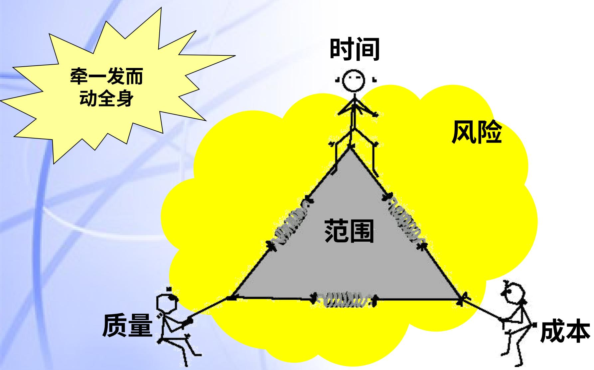
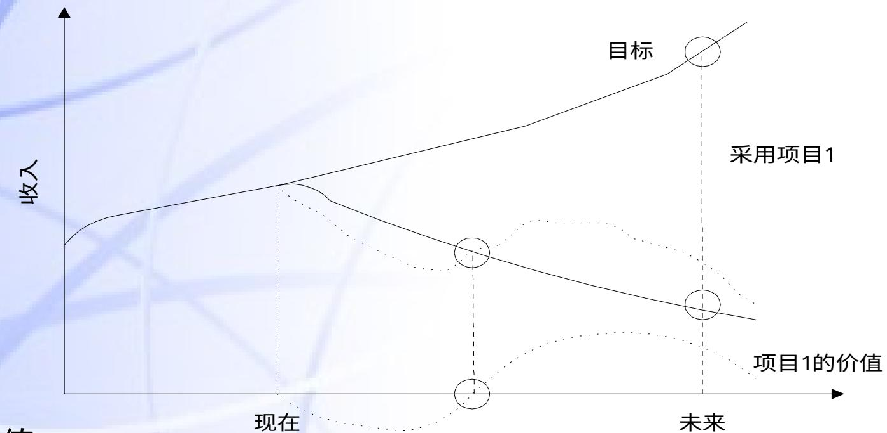
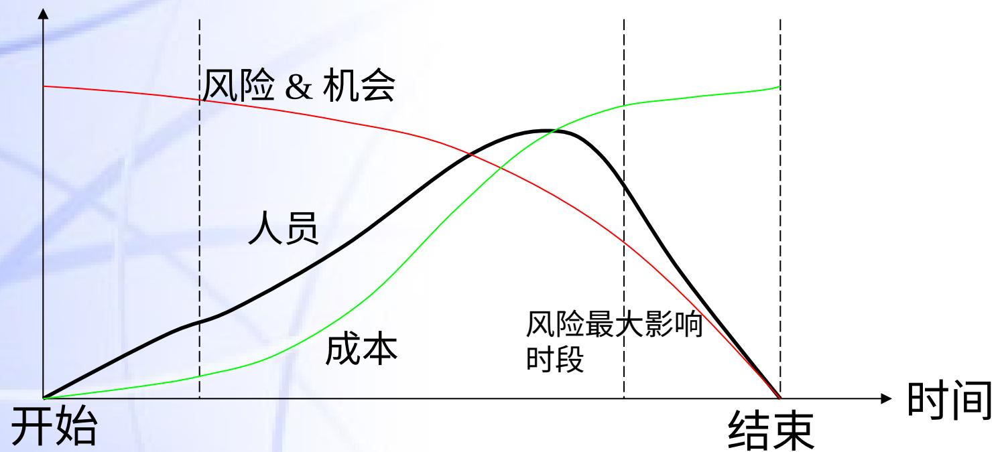

# 项目管理

# 课程目标

• 系统了解项目管理理论
• 熟悉项目管理概念
• 初步掌握项目管理过程和技巧
• 通过项目实际案例领会项目管理的思想
• 用项目管理的方法来指导项目实践
• 交流项目管理经验

# 学习方式

• 个人

— 提问

— 经验交流

— 教训

• 分组（选出项目经理，保证成员的差异性）

— 讨论

— 模拟

• 案例学习

# 讲课提纲

• 第二天上午:

— 项目成本管理

— 项目沟通管理

— 项目人员管理

— 团队建设、高效个人

• 第二天下午:

— 项目风险管理

— 项目质量管理

— 项目综合管理

— 项目经理

— 项目管理工具

— 总结, 书籍、资源推荐

# 变化是永恒的!

• 20 世纪 60 年代: 大规模生产, 重在产量;
• 20 世纪 70 年代: 质量管理, 强调产品一致性;
• 20 世纪 80 年代: 产品多样性;
• 20 世纪 90 年代: 客户化定制服务或者产品;
• 当前: 客户驱动、业务基于项目、挑战变化。。。环境的变化引发对业务模式、管理模式、人才与资源利用的思考。

# 职能型组织

源：Rodney Turner 教授

# 项目型组织

源：Rodney Turner 教授

# 项目管理基本过程（示例）

# PRINCE 2 项目管理过程

# 为什么需要项目管理（1）

• 市场竞争的要求:

- 更快, 更好, 更低廉 (Better, Faster, Cheaper)
- 变化的内外部环境

人类知识的指数性增长, 全球专业化分工越来越细, 项目所提供的产品或服务也越来越复杂

- 合同项目管理和外包 (Outsourcing)

- 多兵种协同作战, 对项目管理提出挑战

- 面临来自世界范围内的竞争

- 商业战略的实现越来越多的依靠一个个项目的成败

- EPM (企业级项目管理) 概念的流行

# 为什么需要项目管理（2）

• 越来越少的项目只需要单一资源就可以成功；
• 越来越少的项目只需要个人，而不是一个团队就可以成功。
• 项目有其独特性，但是内外部环境要求我们“做一次，一次就要成功！”
• 一需要项目管理有效的组织和协调
• 一需要项目管理充分利用现有资源和历史经验与教训

# 项目管理在国外的发展

- 长期以来，发达国家在推动项目管理发展中大受裨益

— 美国政府性科研项目、军事项目得益于系统工程

— NASA（航空航天项目）

— SEI（国家软件采购项目质量标准制定）

— 欧洲则发源于建筑、工程项目管理

— 殊途同归，美洲和欧洲的项目管理在理念上是相通的

- 标准化：项目管理的最佳实践总结，为组织、团队、个人提供实践指导；

— PMI、IPMA、APM 都有自己的“PMBOK”和认证；

- 职业化：项目管理逐渐成为一个职业，产业界需要具有项目管理基本素质的人员担当项目管理工作。

# 项目管理已经成为WTO时代的共同语言

软件、IT 行业:

- Microsoft;- IBM;- 惠普;- Dell。

制造业:

- 摩托罗拉;
- 柯达;
- 福特汽车。

电信行业:

- AT&T;- 朗讯科技;- 诺基亚。

建筑、工程行业:

- Bochtol;- Chevron;- 美国军方工程公司。

源: 美国著名大学 Berkeley 项目管理研究中心

# 美国项目管理学会 (PMI)

# 项目管理在国内的发展

• 其重要性逐渐被国人所认识（从组织到个人）：迫于市场竞争的压力（更快、更好、更低廉）

项目管理知识和最佳实践有待普及

• 项目管理符合朴素的通用管理理念；
• 无论是传统行业，还是新兴行业；
• 项目管理的知识、技能成为职业培训的重要组成部分。

• PMP 认证在 2000 年突然升温，培训市场迅速膨胀

• IPMP 认证从 2001 开始

• 劳动部推行 “项目管理师” 资质认证

• 国内各行业人士渴望接受项目管理的培训、并用之于实践中

项目管理，从哪里入手？

# 项目管理概述

• 项目和项目管理的基本概念
• 项目干系人
• 项目的组织构架
• 项目的生命期
• 项目管理过程

# 项目的定义

什么是项目?

项目的特

一次性, 有始有终;

可交付成果 (Deliverable) 具有独特性;

实现某个具体的目标;

项目受到一些约束;

项目是由人执行;

分阶段、滚动式的管理方法;

经常跨越组织边界;

通过计划和控制来防止失败。

源: PMBOK2000

# 项目的三个约束条件

例：新产品开发速度与经济收益

# 进入项目时代

• 建立一个新企业
• 开发一个新产品
• 实施一项新工程
• 规划一项新活动

考考你：

这些活动哪些是项目？

哪些不是项目？

举办一次招商引资大会一次与投资商的合作谈判

可行性调研与分析

油田开发

举办奥运会

开一次专题会议

惠普与康柏机构重组

生产线产品制造

新工艺的实施

建立人员激励机制

PM培训

家庭购房

子女培养

项目与运作（Operation）的关系

由人来实施，受制于有限的资源需要计划、实施和控制

# 项目——引入变革与创新

项目的的价值:

为了持续的发展，必须要在合适的时机引入变革。

引入变革就会带来风险，管理项目就是在管理风险!

组织的运作与项目——动态的平衡。

# 组织中的项目与运作

源：《项目管理手册》 R.T.

# 公司发展与项目和运作

• 在了解项目的组织结构之后，有必要从公司组织的层面鸟瞰全局。

源: 《项目管理手册》R.T.

# 组织目标—项目一个人

# 战略计划编制 - 关注项目各个阶段

源：Rodney Turner 教授

# 项目模型

项目分类: “目标一方法”矩阵

练习：定义一个项目（S.M.A.R.T.原则）

• 明确性（Specific）：最终目标是否明确了范围、成本、进度、质量？
• 可度量性（Measurable）：你能在多大程度上测量最终目标的完成情况？
• 可完成性（Achievable）：在规定时间内，最终目标是否合理，能够实现？
• 相关性（Relevant）：最终目标是否很重要、有价值，是否值得进行下去？
• 可跟踪性（Trackable）：你能够对整个项目进程进行跟踪检查吗？

补充：基于的假设和不确定因素。

并回答三个问题：

• 在项目完成时，项目团队将要交付什么东西？
• 当项目团队交付成果时，如何评价项目是否成功？
• 谁对以上两个问题有发言权？

# 什么是项目管理

项目管理就发生在我们身边:

- 解决一个问题;

- 组织一个活动;

- 创造一个新的的事物;

- 当我们感到需要整合资源才能够实现目标的时候。。。

# 项目管理的定义

- 什么是项目管理

• 通过使用知识、技能、工具和方法来组织、计划、实施并监控项目活动，使之满足项目需要。

项目管理的特点

过程、管理系统、方法的集合；

有效的计划和控制；

是对项目、项目群、项目组合的管理；

项目管理既是管理科学，也是管理艺术。

源：PMBOK2000

PMBOK—PM Body of Knowledge 项目管理知识体系

# 项目管理所需的技能

硬技巧（方法、过程、技能）

计划、跟踪、控制报告

软技巧（人员管理）

领导

团队建设、冲突解决

激励、训练

协商、沟通、倾听

# 项目管理的功能+工具与技术

# 项目干系人（Stakeholder）

• 参与项目或受项目影响的个人或组织

• 主要的项目干系人

项目经理需要:

一了解和识别各干系人对项目的需求、期望、能发挥作用。

一项目干系人管理。

项目干系人之间的关系（举例）

# 项目成功的关键因素

• 要求你考虑:

谁是项目干系人?

• 项目干系人的期望是什么?

• 在开始时不可能达成完全的一致意见

• 但至少要明确他们是谁?

• 他们想得到什么?

• 最终你的目标是使每一个人得到合理的满意

• 并不必要是“高兴”, “合理的满意”即可。

# 项目干系人的真实需要?

# 干系人登记表（示例）

<table><tr><td colspan="4">项目名称:</td><td colspan="4">评审者:</td></tr><tr><td>序号</td><td>主要项目干系人</td><td>在项目中的角色</td><td>基本需求和期望</td><td>在本项目中的利益程度(高,中,低)</td><td colspan="2">对项目的影
响程度(高,中,低)</td><td>管理与其关系的建议</td></tr><tr><td>1</td><td></td><td></td><td></td><td></td><td></td><td></td><td></td></tr><tr><td>2</td><td></td><td></td><td></td><td></td><td></td><td></td><td></td></tr><tr><td>3</td><td></td><td></td><td></td><td></td><td></td><td></td><td></td></tr><tr><td>4</td><td></td><td></td><td></td><td></td><td></td><td></td><td></td></tr><tr><td>5</td><td></td><td></td><td></td><td></td><td></td><td></td><td></td></tr></table>

# 练习

结合小组的项目，分析项目干系人，编写干系人登记表。

# 项目生命期示例

定义阶段的意义

• 有利于进行计划和对项目进行控制
• 定义了对项目的检查点和项目不同时段的主要焦点

阶段点评审:

• 确保前一阶段的正确性和完整性;
• 为开展下一阶段的工作做好准备, 准备资源;

# 项目管理生命期与项目生命期

# 项目的管理过程模型之间的比较

过程的方法:

• 分步骤实施

• 阶段交接不是“扔过墙”：协同工作

• 下一个阶段的人: 也是你的客户

# 扔过墙 - 彼此的合作？

# 并行工程在项目中的应用

# 并行工程项目模型（新产品开发）

源：IBM Rochester Silver lake Project

• 并行开发是时代的趋势，但也同时对项目管理提出了高的要求
— 有效的组织
— 有效的沟通

可交付成果 (Deliverable)

有形的、可验证的工作产品。

例如：可行性研究、详细设计、或工作原型。

摘自 PMBOK

# 项目生命期的特性 (I)

项目干系人对项目的影响随着时间的推移变得越来越微弱。

成功的概率随着时间的推移越来越大

每个阶段的结束以预先定义的可交付成果为标志

# 项目生命期的特性 (II)

• 项目初期投入直接影响整个项目的成败
• 需求、计划管理的重要性。
• 项目生命期往往是产品生命期的一部分
• 项目生命期主要定义了:

— 项目每个阶段应作的工作
— 每个阶段所包括的人员

• 产品开发仅仅是产品生命期的一部分

— 研发成果到产品的转化应该成为项目生命期的一部分

— 研发过程中应考虑产品使用及维护

# 练习：项目生命期

分组描述你的项目的生命期划分。

明确转阶段可交付成果。

探讨转阶段可能存在的问题。

# 组织结构类型一职能型组织

• 优点：清楚的上下级关系，按专长组织的团队易于提高专业技术。

• 弊端：项目间的跨部门沟通困难，妨碍客户参与项目。项目经理对项目没有足够的控制授权，分层的决策影响对问题的反应速度。

# 组织结构类型一矩阵型

# 集成产品开发采用矩阵式结构

横向沟通与协同

IPT：Integrated Product Team，集成产品团队

# 项目组织结构对项目的影响

<table><tr><td rowspan="2">组织类</td><td rowspan="2">项目特点</td><td rowspan="2">组织</td><td rowspan="2">职能型组织</td><td colspan="2">矩阵型组织</td><td>项目型组织</td></tr><tr><td>弱矩阵型</td><td>平衡矩阵</td><td>强矩阵型</td></tr><tr><td>项目经理的权威</td><td>很少或没有</td><td>有限</td><td>小到中等</td><td>中等到大</td><td>大到几乎全权</td><td></td></tr><tr><td>项目全时人员%</td><td>几乎没有</td><td>几乎没有</td><td>几乎没有</td><td>几乎没有</td><td>几乎没有</td><td>几乎没有</td></tr><tr><td>项目经理</td><td>部分时间</td><td>部分时间</td><td>全部</td><td>全部</td><td>全部</td><td>全部</td></tr><tr><td>项目经理的头衔</td><td>PM协调员/项目主管</td><td>PM协调员/项目主管</td><td>PM协调员/项目主管</td><td>项目经理/项目经理/计划经理</td><td>项目经理/计划经理</td><td>项目经理/计划经理</td></tr><tr><td>项目管理行政人员</td><td>部分时间</td><td>部分时间</td><td>部分时间</td><td>部分时间</td><td>全部</td><td>全部</td></tr></table>

# 保留职能部门的必要性

• 提供职业发展结构；
• 公司的知识经验积累；
• 公司新的管理流程和系统；
• 人力资源的共享式利用；
• 项目之间的缓冲。

# 选择合适的组织结构

结合项目的业务特点

项目大小规模；产品（服务）特点；客户特点及客户管理；对资源的需求情况。

需要考虑的接口：

专业团队之间；项目团队与客户之间；项目与项目之间。

必要时需要考虑结构类型的组合。

# 项目管理办公室的层级设计

根据业务、项目、组织特点确定项目办公室的设立。

# 项目管理办公室的主要作用

- 为项目经理提供技术支持，包括：

- 计划、监测、控制、文档制定、变更控制、成本控制、风险管理

- 总结经验教训，知识管理

- 建立卓越中心（Center of Excellence）- 制定并推广项目管理流程 / 标准和方法（IBM 的 WWPMM，HP 的 FocuPM）

- 最佳实践经验的总结。

- 辅导项目经理

- 为项目团队提供培训方案

- 直接参与项目管理、项目群管理、多项目管理、资源优化

- 项目管理软件

# 过程

导致某种结果的一系列行动。

- - 摘自 PMBOK

• 项目管理 过程 关注对项目活动的描述和组织
•

• 产品导向过程 关注对项目产品的定义和生成。

# 过程举例

• 项目范围计划过程

# 项目管理基本过程（示例）

# 过程之间的相互关系

# 项目管理过程

PMI 的 PMBOK 中的九大知识领域

基准计划

范围管理

时间管理

成本管理

质量管理

协调资源

人力资源管理

采购管理

沟通管理

目标一致

综合管理

防患于未然

风险管理

# 单元总结

• 项目管理背景与发展
• 项目与项目管理的基本概念
• 项目管理基本要素
• 项目干系人管理
• 项目的组织结构
• 项目管理过程与项目生命期
• 项目管理 9 大知识领域
• 主要练习：项目定义与项目干系人管理