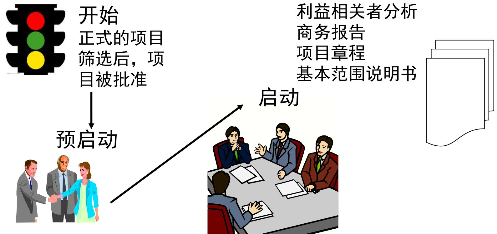
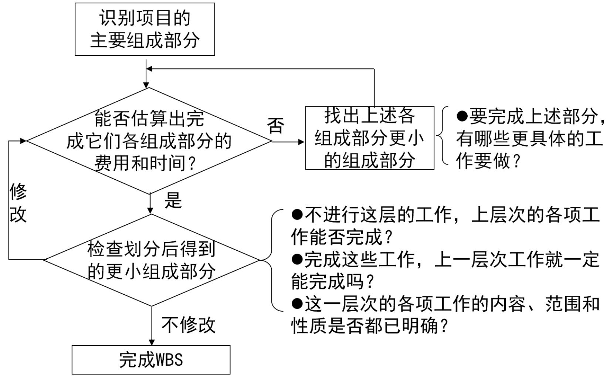

# 项目管理

# 提问

• 你是否学习过项目管理的知识？

• 你正在领导（主导）什么项目？

• 你正在参与哪些项目？

• 你在做项目的过程中遇到哪些问题或者困惑？

1. .
2. .
3. .

# 目录

# 项目管理的基本概念

# 项目管理过程

启动过程

计划过程

执行与控制过程

收尾过程

# 1.1 什么是 “项目” ？

→A project is a temporary endeavor undertaken to create a unique product or service.

→项目是提供独特产品或服务的一次性努力

“独特”指该产品或服务与其它类似的产品或服务在某些方面有明显差别

“一次性”指项目有明确的开始和结束时间

# 1.2 项目的特征有哪些?

→有明确的目标（结果）

→一次性（team的产生与解散）

→独特的

→有开始和结束时间

→需消费资源

→需协调各方关系

# 1.3 项目与日常工作的区别

• 共性:

• 由人来执行
• 受资源约束
• 计划、组织、控制

• 项目的独特性:

• 一次性的, 有确定的开始时间和结束时间
• 独特性
• 有明确的目标, 并有精确的描述

# 练习一: 项目的概念

1. 举例说明自己本月的重点工作中，哪些工作可以按照“项目”的方式来开展？

2. 本次学习，要求每人准备一个“项目”。请列出自己的项目名称：

3. 对照项目的定义和特征，检查自己所带来的项目是否符合“项目”的要求，如果不符合，则进行更换。说明该项目具有的项目特征：

# 1.4 什么是 “项目管理”？

→Project management is the application of knowledge, skills, tools and techniques to project activities in order to meet or exceed stakeholder needs and expectations from a project.

→项目管理 是将知识、技能、工具和技术应用于项目活动以满足或超过项目干系人的需要和期望。

项目管理的实质是：在复杂多变的环境中如何做好一件事

# 1.5 “项目管理” 与其它管理的关系

# 1.6 项目管理的9大知识领域

1.7 项目成本、质量、进度的关系

# 1.8 项目的柔性

项目的柔性：

- 在项目中，你做决定的基础；- 使项目Leader和项目Sponsor达到一致。

- 项目的柔性是项目三个部分的先后排序：

<table><tr><td>序号</td><td>最小</td><td>中间</td><td>最大</td></tr><tr><td>1</td><td>质量</td><td>时间</td><td>资源</td></tr><tr><td>2</td><td>时间</td><td>资源</td><td>质量</td></tr><tr><td>3</td><td>资源</td><td>质量</td><td>时间</td></tr></table>

# 1.8 项目的柔性

<table><tr><td rowspan="2"></td><td colspan="3">项目柔性</td></tr><tr><td>低</td><td>中</td><td>高</td></tr><tr><td>资源</td><td></td><td></td><td>√</td></tr><tr><td>质量</td><td>√</td><td></td><td></td></tr><tr><td>时间</td><td></td><td>√</td><td></td></tr></table>

# 1.11 为什么要学习项目管理

- 项目管理在工作中应用的普遍性

- 新产品开发- 持续改善项目- 质量、工艺改进项目- 信息化建设项目- 工程建设项目- 管理项目

# 1.11 为什么要学习项目管理

• 强化项目管理的益处

- 更好地发挥团队作用，特别是跨部门
- 明确的目标、里程碑和交付物
- 有效利用时间、人力和其它资源
- 统一的日程和时间管理
- 早期识别问题以便采取专门的纠正措施
- 经验积累，知识积累
- 统一的工作模式和工作语言

# 练习二：项目管理的概念

以自己选择的项目为例：

1. 为什么该项工作要以“项目管理”的方式来开展？

2. 项目管理的三个方面的知识：

A、项目管理  
B、一般管理  
C、专业领域

3. 该项目的目标

A、质量：

B、进度：

C、成本：

4. 项目的柔性

# 目录

项目管理的基本概念

项目管理过程

启动过程

计划过程

执行与控制过程

收尾过程

# 2 项目管理过程

启动过程 Initiating Process

计划过程 Planning Process

执行过程 Executing Process

控制过程 Controlling Process

收尾过程 Closing Process

# 2 项目管理过程

• 过程间关系

# 2 项目管理过程

- 一个项目周期中各过程所占比例

  
Figure 3-2. Overlap of Process Groups in a Phase

# 2 项目管理过程——项目管理分工

# 2 项目管理过程——项目生命周期

# 2 项目管理过程——项目周期中士气管理

• 士气微笑曲线图

一项目在实施周期，团队成员一般会面临3个情绪波动阶段

# 2 项目管理过程——项目周期中士气管理

时间

# 目录

# 2.1.1 项目启动过程

• 被提出的问题或机会是什么? (可行性研究)

项目的目的是什么? 为实现这一目的, 有哪些目标是必要的? (目标说明)

项目范围的确认? (项目组成部分)

团队组建

# 2.1.1 项目启动过程

高级管理

• 确定范围、时间和费用约束
• 指派项目发起人
• 选择项目经理
• 评审项目的过程和期望
• 确定项目是否需要分成多个独立的项目

项目经理努力做到

• 认识和理解项目利益相关者
• 准备商务报告分析
• 建立项目章程
• 举行启动会议
• 制定基本范围说明书

# 2.1.1 项目启动过程——项目评价与分类结果

XXX公司或部门项目分类评价操作表  

<table><tr><td>序号</td><td colspan="2">评价条款</td><td>评价结果</td><td>填写人</td></tr><tr><td colspan="3">项目特征符合性判断:(是1分 否0分)</td><td></td><td rowspan="7">项目经理</td></tr><tr><td>1</td><td colspan="2">本项目是否有明确的起始时间?</td><td></td></tr><tr><td>2</td><td colspan="2">本项目是否一定需要组建临时团队来集中工作?</td><td></td></tr><tr><td>3</td><td colspan="2">本项目是否有明确的目标和交付物?</td><td></td></tr><tr><td>4</td><td colspan="2">本项目的交付物是否符合独特性要求?</td><td></td></tr><tr><td>5</td><td colspan="2">本项目在达成目标后是否会尽快结束?</td><td></td></tr><tr><td>小结</td><td colspan="2">如果上述五项得分小于5分,建议本项目无须立项,转为日常工作。</td><td></td></tr><tr><td colspan="3">项目分类标准判定:(按评价分值表计分)</td><td>评价结果</td><td rowspan="8">项目经理</td></tr><tr><td>1</td><td colspan="2">本项目的涉及范围</td><td></td></tr><tr><td>2</td><td colspan="2">本项目的影响程度</td><td></td></tr><tr><td>3</td><td colspan="2">本项目的投入评价</td><td></td></tr><tr><td>4</td><td colspan="2">本项目的风险评价</td><td></td></tr><tr><td>5</td><td colspan="2">本项目的难度评价</td><td></td></tr><tr><td>6</td><td colspan="2">本项目的复杂度评价</td><td></td></tr><tr><td>小结</td><td colspan="2">A、B类为公司或XX中心直接指定
如果得分介于51-60分或总经理室领导指定,本项目列入C类项目
如果得分介于41-50分,本项目列入D类项目
如果得分介于31-40分,本项目列入E类项目</td><td></td></tr><tr><td>小结</td><td colspan="2"></td><td></td><td></td></tr></table>

# 2.1.1 项目启动过程——项目评价与分类结果

项目分类评价分值表  

<table><tr><td>分值
平价维度</td><td>8-10</td><td>6-8</td><td>3-5</td><td>1-2</td></tr><tr><td>项目范围</td><td>厂级</td><td>项目涉及4个部门以上</td><td>项目涉及两个部门</td><td>一个部门内进行</td></tr><tr><td>项目重要度</td><td>迫切需解决的问题，关系到公司的战略</td><td>需尽快解决的问题，影响KPI指标</td><td>对正常运作有影响，但不须迫切解决</td><td>能使运行更理想
的项目</td></tr><tr><td>项目投入</td><td>投入10万元以上</td><td>投入5万元至10万元</td><td>投入1万元至5万元</td><td>投入1万元以下</td></tr><tr><td>项目风险</td><td>很高，风险很难预测或很难制订对策</td><td>高，风险管理有难度，需投入较大的时间和精力</td><td>一般，项目风险可正
常预测并管理</td><td>低，几乎无风险</td></tr><tr><td>项目难度</td><td>极难，无任何旧经验可循，需全新设计方案</td><td>难，大部分方案需重新设计，但有以往经验参考</td><td>一般，大部分可参考
以前的经验</td><td>低，有以前的经验
可完全套用</td></tr><tr><td>项目复杂度</td><td>复杂，项目开展的路线多，且均不清晰，整体控制有一定的难度</td><td>项目主线多，有部分不清晰，控制有难度</td><td>项目有多条路线，但
都很清晰</td><td>项目只有一条清
晰主线，无控制难
度</td></tr></table>

# 2.1.1 项目成功的关键——四个一

# 练习三: 项目背景与范围

针对本人选择的项目，完成下述工作:

1. 项目背景: 为什么要启动该项目?

• 宏观环境:
• 公司战略:
• 部门工作重点:

2. 项目范围:

• 包括:

• 不包括:

# 2.1.2 项目团队

# 2.1.2 项目团队

项目团队的组成

一起人 (Sponsor)

项目经理 (Manager)

指导/咨询者 (Mentor)

核心成员 (Core team member)

一般成员 (Extended team member)

# 2.1.2 项目团队——团队成员的职责

发起人 (Sponsor)

发起人是项目预算及全体人员的管理者，他支持并资助这个项目。

- 职责：

• 决定项目之间的优先权；
• 决定项目的状态（暂停、取消、加速等）；
• 承诺为项目提供资源；
• 批准项目成本、时间、工作范围的预算；
• 确定项目Manager、Mentor，批准核心team；
• 指导项目leader或管理者；
• 屏蔽项目组受不必要的外部因素干扰；
• 了解项目进展状态；
• 对提交的问题决策。

# 2.1.2 项目团队——团队成员的职责

• 项目经理（Manager or Leader）

- 项目经理是对项目实施监控、管理的人员。

- 职责：

• 对项目资源进行协调、管理；
• 对项目的进度进行整体落实监控
• ?
• ?
• ?
• ?

# 2.1.2 项目团队——团队成员的职责

项目指导/咨询者 (Mentor)

- 项目Mentor是为项目组成员提供方法、工具指导的人员，直接对项目Sponsor或Manager负责。

- 职责：

• 根据项目各阶段，提供方法、工具培训；• 为方法、工具的正确、合理应用提供指导；• 指导项目按方法、思路推进。

# 2.1.2 项目团队——团队成员的职责

- 核心team成员

- 他们直接对Team Leader负责，自始至终都在项目中，且在项目中担任重要角色，负责关键活动。

- 职责：

• 听从项目leader 的安排，参与策划项目计划；
• 提供创造性的想法，支持项目组的决定；
• 接受分配的任务履行职责，并按计划推进；
• 分享经验、帮助其他team成员；
• 同项目Leader保持信息沟通。

# 2.1.2 项目团队——团队成员的职责

• 一般成员（Extended team member）

- 由于专业技术方面的原因，在项目部分时间内，为项目或项目核心成员提供支持的人员。

# 2.1.2 项目团队——选择项目核心成员

• 基本要素:

- 1、核心Team一般由4-7人组成;

- 2、项目关键活动, 划定核心成员范围;

- 3、相关技能要求:

• 具有项目成功所需要的知识、技术技能;
• 较强的沟通、协调能力。

- 4、意识与态度

• 愿意接受挑战、勇于揭示问题本质;
• 良好的团队意识;
• 善于角色转换。

- 5、与相关人员沟通, 获得团队成员

参考: 项目与团队成员目前的岗位职责相关性。

# 2.1.2 项目团队——项目团队的建设

• 基本要素:

- 1、向每位成员讲述团队远景、目标以及对各人的任务;

- 2、提供必要的技能培训、必要的处理工具;

- 3、共同建立团队规则;

- 4、根据所需的技能组合和工作风格, 细分任务, 相互补充、促进;

- 5、监控进度, 注意团队成绩并给予表扬, 保持团队凝聚力。

# 2.1.2 项目团队——项目团队的建设

• 成功项目团队的特点

- 1、每位成员分享和支持团队的目标；

- 2、每位成员不仅需要完成任务，也必须处理好团队中的工作关系；

- 3、每位成员理解对团队成功产生影响的内外部因素，并能作出反应；

- 4、每位成员都拥有处理自己项目任务的技能，并支持其他人的工作；

- 5、工作中，每位成员表现出良好的人际沟通能力。

# 2.1.2 项目团队——项目团队的建设

• 团队规则

- 团队成员的沟通

- 项目资料、文件管理

- 项目计划/目标的调整

- 冲突处理

• ....

# 2.1.2 项目团队——项目章程

# 项目章程

2007年7月16日

项目名称：即时培训项目  项目开始时间：2007年7月1日 项目结束时间：2008年6月30日  预算信息：公司分配1,000,000美元用于本项目，其中一般用于内部人力，其余的一半用于外部人力和培训计划。  项目经理：Kristin Maur  项目目标：  开发一个新的即时培训计划，包括一下几个关键主题：供应商管理、谈判技巧、项目管理和软件应用（表格和网络开发）。每个员工的培训费用降低  $10\%$  ，或者每人每年降低100美元，开发一种度量年度生产力提高程度的方法。  方法：  - 在新课程开发后，除了六西格玛外，终止所有的培训课程。  - 就此计划与员工进行沟通以便改进内部培训，让他们知道学费补偿始终如一。  - 与内部经理和员工们紧密联系，以确定提供供应商管理、谈判技巧、项目管理和软件应用等培训的最佳方法。  - 研究现有的培训，与外部专家合作制定有关每个培训如何进行的可选方案。  - 开始执行新的培训。  - 利用新的培训方法和技术，鼓励员工在非工作时间接受培训。  - 鼓励公司内部的专家就当前的工作分工指导工人。  - 确定一种度量年度生产力提高的方法。

# 2.1.2项目团队——项目启动会议

# 项目名称：即时培训项目

会议目标：通过介绍关键利益相关者、评价项目目标和讨论将来的计划来有效启动项目。议程：

- 参与者介绍- 叙述项目背景- 叙述与项目有关的文件（如商务报告、项目章程等）- 讨论项目组织结构- 讨论其他重要事项- 列举会议的行动条款

<table><tr><td>行动条目</td><td>责任人</td><td>截止日期</td></tr><tr><td></td><td></td><td></td></tr><tr><td></td><td></td><td></td></tr><tr><td></td><td></td><td></td></tr><tr><td colspan="3">下次会议的日期和时间：</td></tr></table>

# 练习四：项目团队组建

- 针对本人选择的项目，完成下述工作：

1. 项目团队组建

- 项目组织结构图

- 职责分工

2. 项目章程

# 2.1.3 项目干系人

• 项目干系人是积极参与项目或受项目影响的个人或组织。

- 项目管理人员必须识别项目干系人（有时候是困难的）

- 确认干系人的需求和期望

- 干系人一般包括：项目经理、客户、项目发起人、所在组织、周边群众等等

# 2.1.3 项目干系人——力场分析（X客户）

1、提升供应商的综合能力

2、现场辅导

3、命运共同体

1. 提升X客户竞争力

2. 改善泰鸿形象

1、提升X客户竞争力

2、获得应董认可

3、培养骨干成员

1、提升管理水平

1、学习、掌握先进的管理方法、步骤、

工具等

2、减轻工作压力

# 练习五：项目干系人

1. 针对本人选择的项目，识别干系人，并用力场分析出各个干系人对本项目的作用：

2. 针对不同干系人需要采取的对策

# 2.1.4 客户需求理解

# 2.1.4 客户需求理解——目标设定的原则

# SMART

<table><tr><td>S</td><td>pecific</td><td>具体的</td></tr><tr><td></td><td>Measurable</td><td>可测量的</td></tr><tr><td></td><td>A ttainable</td><td>可达到的</td></tr><tr><td></td><td>R elevant</td><td>相关的</td></tr><tr><td></td><td>T ime-bound</td><td>限定时间的</td></tr></table>

# 2.1.4 客户需求理解——目标设定案例

# 客户的需求：NPI 流程优化

# 练习六：客户需求与目标

1. 理解客户需求：- VOC:

• CTQ:

• KPI:

2. 将客户需求转化为项目目标:

# 目录

2.2 项目计划过程——计划要回答的问题

# 2.2 项目计划过程

- 核心过程

- 辅助过程

• 范围规划
• 范围定义
• 活动定义
• 活动排序
• 活动历时估计
• 进度计划编制
• 资源规划
• 费用估算
• 费用预算
• 项目计划编制

- 质量规划

- 组织机构规划

- 人员招募

- 沟通规划

- 风险识别

- 风险计划

- 采购规划

2.2 项目计划过程——项目计划书主要内容

1. 项目名称
2. 项目来源
3. 项目描述
4. 团队组成
5. 阶段里程碑
6. 项目衡量及监控指标
7. 项目时间计划
8. 项目费用预算
9. 项目的柔性
10. 项目计划确认和批准

# 2.2项目计划过程——项目计划模板

<table><tr><td colspan="13">项目计划书</td><td></td></tr><tr><td>部门</td><td colspan="2"></td><td colspan="2">队名</td><td colspan="2"></td><td colspan="2"></td><td colspan="2"></td><td colspan="2"></td><td></td></tr><tr><td>项目名称</td><td colspan="12"></td><td></td></tr><tr><td>项目周期</td><td>年</td><td>月至</td><td>年</td><td colspan="9">月</td><td></td></tr><tr><td>项目立项背景简述</td><td colspan="12">A.定量描述:
B.定性描述:</td><td></td></tr><tr><td rowspan="2">项目目标</td><td colspan="12">项目目标(符合SMART原则):
A.量化指标(以多少人最多);
B.非量化指标(尽量细化)
项目范围描述(包括。。。,不包括。。。)</td><td></td></tr><tr><td colspan="12">指标定义:</td><td></td></tr><tr><td rowspan="8">交付物</td><td colspan="12">交付物列表</td><td></td></tr><tr><td>序号</td><td colspan="2">交付物描述</td><td>验收人</td><td colspan="8">计划完成时间</td><td></td></tr><tr><td></td><td colspan="2"></td><td></td><td colspan="8"></td><td></td></tr><tr><td></td><td colspan="2"></td><td></td><td colspan="8"></td><td></td></tr><tr><td></td><td colspan="2"></td><td></td><td colspan="7"></td><td></td><td></td></tr><tr><td></td><td colspan="2"></td><td></td><td colspan="8"></td><td></td></tr><tr><td></td><td colspan="2"></td><td></td><td colspan="8"></td><td></td></tr><tr><td></td><td></td><td></td><td></td><td></td><td></td><td></td><td></td><td></td><td></td><td></td><td></td><td></td></tr><tr><td rowspan="16">项目团队</td><td colspan="2">项目成员</td><td colspan="2">职责描述</td><td colspan="8">工作量预计
(每周大小时)</td><td></td></tr><tr><td>组长</td><td></td><td colspan="2"></td><td colspan="8"></td><td></td></tr><tr><td rowspan="13">成员</td><td></td><td colspan="2"></td><td colspan="8"></td><td></td></tr><tr><td></td><td colspan="2"></td><td colspan="8"></td><td></td></tr><tr><td></td><td colspan="2"></td><td colspan="8"></td><td></td></tr><tr><td></td><td colspan="2"></td><td colspan="2"></td><td colspan="6"></td><td></td></tr><tr><td></td><td colspan="2"></td><td colspan="2"></td><td colspan="6"></td><td></td></tr><tr><td></td><td colspan="2"></td><td colspan="2"></td><td colspan="7"></td></tr><tr><td></td><td colspan="2"></td><td colspan="2"></td><td colspan="6"></td><td></td></tr><tr><td></td><td colspan="2"></td><td colspan="2"></td><td colspan="6"></td><td></td></tr><tr><td colspan="2"></td><td></td><td colspan="2"></td><td colspan="6"></td><td></td></tr><tr><td colspan="2"></td><td></td><td colspan="2"></td><td colspan="6"></td><td></td></tr><tr><td colspan="2"></td><td></td><td colspan="2"></td><td colspan="5"></td><td></td><td></td></tr><tr><td colspan="2"></td><td></td><td colspan="2"></td><td colspan="6"></td><td></td></tr><tr><td colspan="2"></td><td></td><td colspan="2"></td><td colspan="6"></td><td></td></tr><tr><td colspan="2">团队例会</td><td>频次:</td><td colspan="9">具体时间:</td><td></td></tr><tr><td colspan="13">项目推进策略:(说明完成项目需要采取的主要举措、工作和程序)</td><td></td></tr><tr><td>阶段名称</td><td>开始日期</td><td>结束日期</td><td>阶段任务描述</td><td>阶段交付物</td><td colspan="8">阶段验收标准</td><td></td></tr><tr><td></td><td></td><td></td><td></td><td></td><td colspan="8"></td><td></td></tr><tr><td></td><td></td><td></td><td></td><td></td><td colspan="8"></td><td></td></tr><tr><td></td><td></td><td></td><td></td><td></td><td colspan="7"></td><td></td><td></td></tr></table>

<table><tr><td rowspan="2">项目推进计划</td><td>项目</td><td colspan="10">项目里程碑:</td></tr><tr><td>序号</td><td colspan="7">里程碑描述</td><td colspan="3">完成</td></tr><tr><td>1</td><td></td><td colspan="7"></td><td colspan="3"></td></tr><tr><td>2</td><td></td><td colspan="7"></td><td colspan="3"></td></tr><tr><td>3</td><td></td><td colspan="7"></td><td colspan="3"></td></tr><tr><td>4</td><td></td><td colspan="7"></td><td colspan="3"></td></tr><tr><td>5</td><td></td><td colspan="7"></td><td colspan="3"></td></tr><tr><td>6</td><td></td><td colspan="7"></td><td colspan="3"></td></tr><tr><td>7</td><td></td><td colspan="7"></td><td colspan="3"></td></tr><tr><td colspan="12">预算费用:</td></tr><tr><td>序号</td><td>预算科目名称</td><td colspan="6">投入说明</td><td>合计</td><td colspan="2">用途说明</td><td></td></tr><tr><td></td><td></td><td></td><td></td><td></td><td></td><td></td><td></td><td></td><td></td><td></td><td></td></tr><tr><td></td><td></td><td></td><td></td><td></td><td></td><td></td><td></td><td></td><td></td><td></td><td></td></tr><tr><td></td><td></td><td></td><td></td><td></td><td></td><td></td><td></td><td></td><td></td><td></td><td></td></tr><tr><td></td><td></td><td></td><td></td><td></td><td></td><td></td><td></td><td></td><td></td><td></td><td></td></tr><tr><td colspan="12">其它需求:</td></tr><tr><td>序号</td><td colspan="7">需求说明</td><td colspan="4">相关部门负责人</td></tr><tr><td></td><td></td><td colspan="6"></td><td colspan="4"></td></tr><tr><td colspan="12">(主要从投入产出角度分析)</td></tr><tr><td colspan="12">量化收益分析(由项目客户提供受益分析):</td></tr><tr><td>效益分析</td><td colspan="11">主要化收益:</td></tr><tr><td rowspan="5">风险控制</td><td>主要风险</td><td colspan="5">应对措施</td><td>备选方案</td><td colspan="4">启动</td></tr><tr><td></td><td colspan="5"></td><td></td><td colspan="4"></td></tr><tr><td></td><td colspan="5"></td><td></td><td colspan="4"></td></tr><tr><td></td><td colspan="5"></td><td></td><td colspan="4"></td></tr><tr><td></td><td></td><td></td><td></td><td></td><td></td><td colspan="4"></td><td></td></tr></table>

# 2.2.1 项目计划过程——项目计划书主要内容

• 1、项目名称与来源

- 项目名称

- 项目来源

• 项目选择部分内容；

• 阐述存在的问题；

• 客户导向、数据驱动。

# 2.2.2 项目计划过程——项目计划书主要内容

• 2、项目描述 (POS)

- POS---the Project Objective Statement.- 核心TEAM成员定义项目、决定应如何开始。

- POS使用名词和动词来回答下面的问题:

• 做什么, 不做什么;
• 为什么做;
• 什么时候做;
• 需要那些资源;
• 衡量的标准是什么;
• 在哪里做。

# 2.2.2 项目计划过程——项目计划书主要内容

项目描述 (POS)

- KISS

- KEEP IT SHORT&SIMPLE

- SMART

• Specific: 特定的、具体的;
• Measurable: 可测量的;
• Achievable: 可实现的;
• Relevant: 与公司/部门战略、KPI相关的;
• Timely: 有时限的。

# 2.2.2 项目计划过程——项目计划书主要内容

项目描述

- 从2000年10月1日起，项目组对不能准时供货的定单及原因进行统计分析，提出并落实改善方案。于2001年5月1日前将定单准时交货率由80%提高到90%。它将耗费约380个工时和5万元，预计直接收益为214万元

# 2.2.3 项目计划过程——项目计划书主要内容

• 3、明确现状、确定目标项目衡量及监控指标

<table><tr><td colspan="2">项目衡量及监控指标:</td><td>现状</td><td>(预计)目标值</td><td>提升率</td><td colspan="2">项目衡量及监控指标:</td><td>实际达成值</td><td>提升率</td></tr><tr><td rowspan="2">效率(E)</td><td></td><td></td><td></td><td></td><td rowspan="2">效率(E)</td><td></td><td></td><td></td></tr><tr><td></td><td></td><td></td><td></td><td></td><td></td><td></td></tr><tr><td rowspan="2">质量(Q)</td><td></td><td></td><td></td><td></td><td rowspan="2">质量(Q)</td><td></td><td></td><td></td></tr><tr><td></td><td></td><td></td><td></td><td></td><td></td><td></td></tr><tr><td rowspan="2">成本(C)</td><td></td><td></td><td></td><td></td><td rowspan="2">成本(C)</td><td></td><td></td><td></td></tr><tr><td></td><td></td><td></td><td></td><td></td><td></td><td></td></tr><tr><td>附带效益:</td><td></td><td></td><td></td><td></td><td>附带效益:</td><td></td><td></td><td></td></tr></table>

# 2.2.3 项目计划过程——项目计划书主要内容

• 3、明确现状、确定目标

明确测量对象、标准

# 直通率 (FTY) 定义

北京厂在一段时（一天）内，未经过维修处理，一次性从生产备料上线到包装入库前的合格产品数量占生产总量的百分比。

# 2.2.3 项目计划过程——项目计划书主要内容

• 3、明确现状、确定目标

- 确定项目目标

- 考虑的因素：

• 目前水平（现状）
• 客户需求
• 业界标准
• 部门/公司目标

# 2.2.3 项目计划过程——项目计划书主要内容

• 3、明确现状、确定目标

- 确定项目目标

• 参考标准

# 练习七：目标设定

# 2.2.4 项目计划过程——项目计划书主要内容

# 4、项目收益与资源需求

# 项目产出预计/核算一般原则

1. 按项目成果保持一年计算总产出，单位人民币；  
2. 项目产出必须是由项目成果直接导致，联想所获得的收益；  
3. 项目产出以降低现有缺陷，获得收益为主进行计算；  
4. 固定资产投资可按公司财务规定，按年限计算折旧。

# 项目概述

<table><tr><td>问题描述
·物料质量影响制造的效率
·产品售后物料质量问题占比高；
·供应商物料质量管控系统化不强，物料质量波动大；</td><td>范围
·对制程，售后影响度大的物料
·重点LCM，电声（RVE/SPK），机壳，按键四大类物料；
·重点在供应商端进行改善</td></tr><tr><td>衡量指标（Y）
制程不良：生产发现不良数/总投入数量；
售后不良：售后不良数/OUT数量</td><td>指标定义及现状水平
制程不良：
按键：0.43%；机壳0.26%；电声
0.08%LCM：0.37%
售后不良：
LCM：0.39%；RVE：0.22%，SPK：0.14%</td></tr><tr><td>目标（2010年12月31日前达成）
制程不良：
按键：035%；机壳0.20%；电声
0.06%LCM：0.29%
售后不良：
LCM：0.31%；RVE：0.18%，SPK：0.11%</td><td>收益
制程：以每月生产80万台计算，减少不良维修费用2.5万元/月；
售后：以每月销量80万台计算，减少不良维修费用8万元/月；
累计月收益10.5万/月，品牌提升价值</td></tr></table>

# 练习八：项目概述

<table><tr><td>问题描述</td><td>范围
•</td></tr><tr><td>衡量指标 (Y)</td><td rowspan="2">指标定义及现状水平</td></tr><tr><td rowspan="2">目标（20xx年xx月xx日前达成）</td></tr><tr><td>收益</td></tr></table>

# 2.2.5 项目计划过程——处理不确定性

• 识别项目风险

- 当你在项目过程中做决定时，要意识到风险伴随着你的决定。

- 可能的风险包括：

• 技术方面 外部
• 需求变化 资源
• 协调 地域
• 交流 法律
• 规章制度 组织结构重组

用高H、中M、低L评估风险概率。

# 2.2.5 项目计划过程——处理不确定性

- 识别项目风险

# 风险评估矩阵

<table><tr><td rowspan="2">项目潜在风险</td><td colspan="4">风险评估</td></tr><tr><td>频度</td><td>探测度</td><td>严重度</td><td>总体评估</td></tr><tr><td>A</td><td>高</td><td>中</td><td>高</td><td>高</td></tr><tr><td>B</td><td>高</td><td>低</td><td>中</td><td>中</td></tr><tr><td>C</td><td>低</td><td>中</td><td>中</td><td>中</td></tr></table>

# 2.2.5 项目计划过程——处理不确定性

• 项目风险管理计划

- 通常项目计划是乐观正常的计划，没有体现出风险。为了更好地管理风险，我们应分析项目实施过程中会出现的风险，并制定风险管理计划。

- 结合前期的风险识别与评估，制定风险管理计划。

# 2.2.5 项目计划过程——处理不确定性

• 项目风险管理计划

# 练习九: 项目风险管理

针对你选定的项目，进行项目风险管理

1. 风险识别（表格）

2. 风险管理（表格）

# 2.2.6 项目计划过程——项目计划书主要内容

# - 6、明确阶段里程碑

<table><tr><td colspan="6">里程碑</td><td>预计完成日期</td><td>实际完成日期</td></tr><tr><td>定义阶段（D）</td><td></td><td></td><td></td><td></td><td></td><td></td><td></td></tr><tr><td></td><td></td><td></td><td></td><td></td><td></td><td></td><td></td></tr><tr><td></td><td></td><td></td><td></td><td></td><td></td><td></td><td></td></tr><tr><td></td><td></td><td></td><td></td><td></td><td></td><td></td><td></td></tr><tr><td></td><td></td><td></td><td></td><td></td><td></td><td></td><td>测量阶段（M）</td></tr><tr><td></td><td></td><td></td><td></td><td></td><td></td><td></td><td></td></tr><tr><td></td><td></td><td></td><td></td><td></td><td></td><td></td><td></td></tr><tr><td></td><td></td><td></td><td></td><td></td><td></td><td></td><td></td></tr><tr><td></td><td></td><td></td><td></td><td></td><td>分析阶段（A）</td><td></td><td></td></tr><tr><td></td><td></td><td></td><td></td><td></td><td></td><td></td><td></td></tr><tr><td></td><td></td><td></td><td></td><td></td><td></td><td></td><td></td></tr><tr><td></td><td></td><td></td><td></td><td></td><td></td><td></td><td></td></tr><tr><td></td><td></td><td></td><td>改进阶段（I）</td><td></td><td></td><td></td><td></td></tr><tr><td></td><td></td><td></td><td></td><td></td><td></td><td></td><td></td></tr><tr><td></td><td></td><td></td><td></td><td></td><td></td><td></td><td></td></tr><tr><td></td><td></td><td></td><td></td><td></td><td></td><td></td><td></td></tr><tr><td></td><td>控制阶段（C）</td><td></td><td></td><td></td><td></td><td></td><td></td></tr><tr><td></td><td></td><td></td><td></td><td></td><td></td><td></td><td></td></tr></table>

由团队共同参与并听取成员的反馈意见将有助于增进团队的向心力。

# 练习十：阶段里程碑

请画一个表格来描述你的项目的阶段里程碑

# 2.2.7 项目计划过程——工作任务分解 WBS

- 工作任务分解 WBS

- The Work Breakdown Structure

- 将项目描述（POS）分解为可被执行、可跟踪的工作单元（任务、活动或关键阶段）。

# 2.2.7 项目计划过程——工作任务分解 WBS

• 任务的分解：

- 使用动作性的动词或名词定义；将项目分解细分四到七个主要任务；- 使用动作性的动词或名词将每一个主要的任务分解为子任务。

注意：确保没有任务被遗漏！！！

# 2.2.7 项目计划过程——工作任务分解 WBS

• WBS Dictionary

- 进一步明确、区分各工作单元，制定WBS Dictionary。

- 需要明确：WBS编号、任务名称、工作内容、输入、输出、标准/质量以及负责人

<table><tr><td>WBS编号</td><td>任务名称</td><td>工作内容</td><td>输入</td><td>输出</td><td>标准/质量</td><td>责任人</td></tr><tr><td></td><td></td><td></td><td></td><td></td><td></td><td></td></tr><tr><td></td><td></td><td></td><td></td><td></td><td></td><td></td></tr></table>

# 2.2.7 项目计划过程——工作任务分解 WBS

要实现项目目标需要完成哪些主要工作？

# 2.2.7 项目计划过程——工作任务分解 WBS

• 工具之一：思维图

- 画思维图是项目计划的工具之一，也是进行创造性思维和联想的十分有效的工具。

- 创造性思维可以被定义为---把以往毫不关联的事物或想法联系在一起。

- 每张思维图包含一个中心主题或中心词，并能对其进行总结。

- 从中心主题中，总结出最重要的分支部分--轮辐从轮辐又引伸出关键词以及关键图。这些词或图是通过大家的集思广益产生的。

# 2.2.7 项目计划过程——工作任务分解 WBS

• 案例分析:

# 2.2.7 项目计划过程——工作任务分解 WBS

- 工具之二：WBS的树形结构

层 1

层 2

层 3

层 4

2.2.7 项目计划过程——工作任务分解 WBS

• 工作分解表（WBS）- 图表式

# 2.2.7 项目计划过程——工作任务分解 WBS

• 工具之三：WBS的大纲形式

1.0 总工作

1.1 分工作A

1.1.1 主任务I

1.1.1.1 子任务a

1.1.1.2 子任务b

1.1.1.3 子任务c

1.1.2 主任务II

1.1.2.1 子任务a

1.1.2.2 子任务b

1.1.2.3 子任务c

1.2 分工作B

1.2.1 主任务I

1.2.1.1 子任务a

# 2.2.7 项目计划过程——工作任务分解 WBS

- 工具之三：WBS的大纲形式

- 案例

1.0 建办公楼

1.1 基础

1.1.1 挖沟 1.1.2 混凝土 1.1.3 回填

1.2 墙

1.2.1 砌砖 1.2.2 装窗 1.2.3 装门 1.2.4 抹灰

1.3 屋顶

1.3.1 安梁

1.3.2 装檩

1.3.3 上瓦

1.4 照明

1.4.1 配线

1.4.2 装照明灯

1.4.3 配电盘

2.2.7 项目计划过程——工作任务分解 WBS

• 工作分解表（WBS）- 表格式
- 装修房子（表格式）

<table><tr><td>任务</td><td>负责人</td><td>持续时间</td><td>费用</td></tr><tr><td>电线埋设</td><td>张三</td><td>10天</td><td>7000</td></tr><tr><td>水管埋设</td><td>李四</td><td>5天</td><td>5000</td></tr><tr><td>木工制作</td><td>王五</td><td>5天</td><td>10000</td></tr><tr><td>墙面油漆</td><td>赵六</td><td>10天</td><td>10000</td></tr><tr><td>灯饰安装</td><td>马七</td><td>2天</td><td>3000</td></tr><tr><td>五金安装</td><td>徐八</td><td>1天</td><td>2000</td></tr></table>

# 2.2.8 项目计划过程——责任矩阵

以表格方式表示WBS中每项目工作的负责人和参与人

<table><tr><td>工作项目</td><td>张</td><td>李</td><td>陈</td><td>赵</td><td>魏</td><td></td><td></td></tr><tr><td>任务A</td><td>P</td><td>S</td><td></td><td></td><td></td><td></td><td></td></tr><tr><td>任务B</td><td></td><td>P</td><td>S</td><td>S</td><td></td><td></td><td></td></tr><tr><td>任务C</td><td></td><td></td><td>P</td><td></td><td></td><td></td><td></td></tr><tr><td>任务D</td><td></td><td></td><td>P</td><td>S</td><td></td><td></td><td></td></tr></table>

# 2.2.8 婚礼操办WBS 案例分享

1. 小组讨论制订一个婚礼操办的WBS

2. 研究别人的WBS，交流感想和体会

# 练习十一: WBS分解

• 针对你选定的项目，选择一种工具进行WBS的分解与设计：

# 2.2.9 项目计划过程——进度计划技术

时间估算方法：

1. 经验类比法；2. 历史数据法；3. 专家意见；4. 德尔菲（Delphi）法；5. 三点法。

# 2.2.9 项目计划过程——进度计划技术

- 德尔菲（Delphi）法:

1. 首先对项目和要估算的时间进行简要介绍;

2. 群体中每人进行估计, 得到第一轮估计值;

3. 与平均值相差大的人各自讲述理由;

4. 每个人进行第二次估计, 得到第二轮估计值;

5. 再次讨论并进行估计, 得到第三轮的估计值;

6. 对第三轮估计值进行整理, 平均后得到估算结果

# 2.2.9 项目计划过程——进度计划技术

• 三点法

-E=(O+4M+P)/6

• E-----估算结果;
• O-----乐观估计;
• P-----悲观估计;
• M-----正常估计。

# 练习十二：时间估算

估算每个任务所需时间，并说明自己的估算方法

# 2.2.9 项目计划过程——进度计划技术

• 项目进度工具1一 前导图法(PDM):

• 这是一种利用节点代表活动，并利用表示依赖关系的箭线将节点联系起来的编制项目网络图的方法。这种万法也称为单代号网络图法(AON)，是大多数项目管理软件包所采用的方法,PDM可以手工或用计算机完成。

# 2.2.9 项目计划过程——进度计划技术

项目进度工具2：网络图

- 带日期信息的项目网络图。这种图一般既表示了项目逻辑关系又表示处在项目关键路线上的活动。

2.2.9 项目计划过程——进度计划技术

• 项目进度工具3: 关键路径 (CPM) 的确定

# - CPM 的定义

• 从项目开始至项目结束，连续的具有最长的持续时间的路径。

• 任何改变关键路径上任务或行动的持续时间的结果必将导致项目完成时间的改变。

• 任何处于非关键路径上的任务或行动被定义为非关键任务，同时该任务具有一定的冗余性。

# 练习十三：网络图与关键路径

请用网络图来表达各个任务之间的关系，并指出关键路径

# 2.2.9 项目计划过程——进度计划技术

• 项目进度工具4: 横道图，也叫做甘特图

一表示活动的开始、完成日期及预期的活动历时，但一般不表示依赖关系

# 2.2.9 项目计划过程——进度计划技术

- 项目进度工具5：里程碑图

- 与横道图类似，但仅表示主要可交付成果的计划开始和完成时间以及关键的外部界面。

<table><tr><td>事件</td><td>一月</td><td>二月</td><td>三月</td><td>四月</td><td>五月</td><td>六月</td><td>七月</td><td>八月</td></tr><tr><td>签署分包合同</td><td></td><td></td><td>△▼</td><td></td><td></td><td></td><td></td><td></td></tr><tr><td>技术要求说明书定稿</td><td></td><td></td><td></td><td>△▼</td><td></td><td></td><td></td><td></td></tr><tr><td>系统查询</td><td></td><td></td><td></td><td></td><td>△</td><td></td><td></td><td></td></tr><tr><td>子系统测试</td><td></td><td></td><td></td><td></td><td></td><td>△</td><td></td><td></td></tr><tr><td>第一个单元支付</td><td></td><td></td><td></td><td></td><td></td><td></td><td>△</td><td></td></tr><tr><td>生产计划完成</td><td></td><td></td><td></td><td></td><td></td><td></td><td></td><td>△</td></tr></table>

# 练习十四：甘特图与里程碑

请用甘特图来表达各个任务之间的关系，画出里程碑

# 2.2.10 项目计划过程——项目审批

• 项目计划确认、批准

- 优化项目计划

• 问以下几个问题来优化项目的计划:

- 计划满足项目目标

- 资源是否在控制之内

- 最近的时间计划表是否能够实现

- 这些假设是否成立

- 进一步平衡成本/周期/质量

# 2.2.10 项目计划过程——项目审批

# - 项目的确认、批准

# 目录

# 2.3.1 项目执行过程

质量保证

团队开发

信息分发

询价与采购

选择货源

合同管理

# 2.3.2 项目控制过程

# 2.3.2 项目控制过程——项目控制流程

# 2.3.3项目控制过程 项目控制

项目名称：  

<table><tr><td>项目经理</td><td></td><td>完成比例</td><td>审批阶段</td><td>执行阶段</td><td></td></tr><tr><td rowspan="6">项目描述;</td><td rowspan="6"></td><td>目标</td><td>100%</td><td>20%</td><td></td></tr><tr><td>实际</td><td>100%</td><td>15%</td><td></td></tr><tr><td colspan="3">2. 关键里程碑/交付物</td><td></td></tr><tr><td>No.</td><td>Description</td><td>Due Date</td><td>Status</td></tr><tr><td>1</td><td></td><td></td><td></td></tr><tr><td>2</td><td></td><td></td><td></td></tr><tr><td colspan="2">1。关键更新内容</td><td>3</td><td></td><td></td><td></td></tr><tr><td>1</td><td></td><td>4</td><td></td><td></td><td></td></tr><tr><td>2</td><td></td><td>5</td><td></td><td></td><td></td></tr><tr><td>3</td><td></td><td>6</td><td></td><td></td><td></td></tr><tr><td colspan="6">3. 主要问题</td></tr><tr><td>No.</td><td>描述</td><td>负责人</td><td>更新</td><td>完成日期</td><td>状态</td></tr><tr><td>1</td><td></td><td></td><td></td><td></td><td></td></tr><tr><td>2</td><td></td><td></td><td></td><td></td><td></td></tr><tr><td colspan="6">4. 主要需求/依赖资源</td></tr><tr><td>No.</td><td>描述</td><td>负责人</td><td>更新</td><td>完成日期</td><td>状态</td></tr><tr><td>1</td><td></td><td></td><td></td><td></td><td></td></tr><tr><td>2</td><td></td><td></td><td></td><td></td><td></td></tr></table>

# 2.3.3项目控制过程——项目控制

<table><tr><td colspan="12">项目评审表</td></tr><tr><td colspan="12">(以下内容由各组组长填写)</td></tr><tr><td>日期</td><td colspan="2"></td><td>时间</td><td colspan="8"></td></tr><tr><td>小组名称</td><td colspan="2"></td><td>项目名称</td><td colspan="8"></td></tr><tr><td>项目目标</td><td colspan="11"></td></tr><tr><td colspan="12">评审内容</td></tr><tr><td rowspan="4">1)进度检查</td><td rowspan="3">进度说明</td><td colspan="10">六步法</td></tr><tr><td>①类别和选择问题</td><td>②理解问题并探究原因</td><td>③制定解决方案</td><td>④选择方案</td><td>⑤执行方案</td><td>⑥评估与总结</td><td></td><td></td><td></td><td></td></tr><tr><td></td><td></td><td></td><td></td><td></td><td></td><td></td><td></td><td></td><td></td></tr><tr><td>填写说明</td><td colspan="10">当实施到某一阶段时,从现阶段内说明完成总工作量的百分比,在其之前的各阶段填写“100%”。</td></tr><tr><td rowspan="4">2)工具/方法检查</td><td rowspan="2">可使用工具</td><td>①类别和选择问题</td><td>②理解问题并探究原因</td><td>③制定解决方案</td><td>④选择方案</td><td>⑤执行方案</td><td>⑥评估与总结</td><td></td><td></td><td></td><td></td></tr><tr><td>A. 头脑风暴B. 因果图C. 抽拉图D. 客户调查E. 抽样统计F. 能解决G. 常达图H. KPII. 流程图</td><td>A. 头脑风暴B. 因果图C. 常达图D. Process mappingB. 检查表</td><td>A. 头脑风暴B. 检查表</td><td>A. 矩阵</td><td>A. 项目管理C. 责任矩阵</td><td>A. 对比分析B. SPCC. 超势图D. 挂柱图E. FMEAF. 客户满意度调查</td><td></td><td></td><td></td><td></td></tr><tr><td>已运用的工具</td><td></td><td></td><td></td><td></td><td></td><td></td><td></td><td></td><td></td><td></td></tr><tr><td>填写说明</td><td colspan="10">1) 在上述表格中,只需填写代号,如A、B等;2) 若“可使用的工具”栏中未列出,写明具体的工作。</td></tr><tr><td rowspan="5">下阶段计划</td><td>起止时间</td><td colspan="2">工作内容</td><td>责任人</td><td colspan="2">资源需求</td><td>备注</td><td></td><td></td><td></td><td></td></tr><tr><td></td><td colspan="2"></td><td></td><td colspan="2"></td><td></td><td></td><td></td><td></td><td></td></tr><tr><td></td><td colspan="2"></td><td></td><td colspan="2"></td><td></td><td></td><td></td><td></td><td></td></tr><tr><td></td><td colspan="2"></td><td></td><td colspan="2"></td><td></td><td></td><td></td><td></td><td></td></tr><tr><td></td><td>序号</td><td colspan="2">投资说明</td><td colspan="7">原因</td></tr><tr><td>其它资源需求</td><td></td><td colspan="3"></td><td colspan="7"></td></tr></table>

<table><tr><td colspan="12">项目评审表</td></tr><tr><td colspan="12">已运用的工具</td></tr><tr><td colspan="12">填写说明</td></tr><tr><td colspan="12">下阶段计划</td></tr><tr><td colspan="12">其它资源需求</td></tr><tr><td colspan="12">序号</td></tr><tr><td colspan="12">序号</td></tr><tr><td colspan="11">序号</td><td></td></tr><tr><td colspan="12">序号</td></tr><tr><td colspan="12">序号</td></tr><tr><td colspan="12">序数</td></tr><tr><td colspan="12">序数</td></tr><tr><td colspan="11">序数</td><td></td></tr><tr><td colspan="12">序数</td></tr><tr><td colspan="12">序数</td></tr><tr><td colspan="12">序号</td></tr><tr><td colspan="12">序号</td></tr><tr><td colspan="12">序号</td></tr><tr><td colspan="12">序号</td></tr><tr><td colspan="12">序列</td></tr><tr><td colspan="12">序列</td></tr><tr><td colspan="8">序列</td><td colspan="4">缺点</td></tr><tr><td colspan="12">序号</td></tr><tr><td colspan="12">序号</td></tr><tr><td colspan="11">序号</td><td></td></tr><tr><td colspan="11">序号</td><td></td></tr><tr><td colspan="8">序号</td><td colspan="3">缺点</td><td></td></tr><tr><td colspan="11">序号</td><td></td></tr><tr><td colspan="11">序号</td><td></td></tr><tr><td colspan="10">序号</td><td></td><td></td></tr><tr><td colspan="10">序号</td><td></td><td></td></tr><tr><td colspan="8">序号</td><td colspan="2">缺点</td><td></td><td></td></tr><tr><td colspan="10">序号</td><td></td><td></td></tr><tr><td colspan="10">序号</td><td></td><td></td></tr><tr><td colspan="9">序号</td><td></td><td></td><td></td></tr><tr><td colspan="9">序号</td><td></td><td></td><td></td></tr><tr><td colspan="8">序号</td><td colspan="2">缺点</td><td></td><td></td></tr><tr><td colspan="9">序号</td><td></td><td></td><td></td></tr><tr><td colspan="9">序号</td><td></td><td></td><td></td></tr><tr><td colspan="10">序号</td><td></td><td></td></tr><tr><td colspan="9">序号</td><td colspan="2">缺点</td><td></td></tr><tr><td colspan="10">序号</td><td></td><td></td></tr><tr><td colspan="9">序号</td><td></td><td></td><td></td></tr><tr><td colspan="10">序号</td><td></td><td></td></tr><tr><td colspan="10">序号</td><td></td><td></td></tr><tr><td colspan="10">序号</td><td></td><td></td></tr><tr><td colspan="10">序号</td><td></td><td></td></tr><tr><td colspan="9">序号</td><td></td><td></td><td></td></tr><tr><td colspan="9">序号</td><td></td><td></td><td></td></tr><tr><td colspan="9">序号</td><td></td><td></td><td></td></tr><tr><td colspan="11">序号</td><td></td></tr><tr><td colspan="11">序号</td><td></td></tr><tr><td colspan="8">序号</td><td colspan="3">缺点</td><td></td></tr><tr><td colspan="11">序号</td><td></td></tr><tr><td colspan="11">序号</td><td></td></tr><tr><td colspan="11">序号&lt;lcol&gt;</td><td></td></tr><tr><td colspan="11">序号</td><td></td></tr><tr><td colspan="10">序号</td><td></td><td></td></tr><tr><td colspan="11">序号</td><td></td></tr><tr><td colspan="10">序号</td><td colspan="2">缺点</td></tr><tr><td colspan="11">序号</td><td></td></tr><tr><td colspan="11">序号</td><td></td></tr><tr><td colspan="11">序号</td><td></td></tr><tr><td colspan="11">序号</td><td></td></tr><tr><td colspan="8">序号</td><td colspan="3">缺点</td><td></td></tr><tr><td colspan="11">序号</td><td></td></tr><tr><td colspan="11">序号</td><td></td></tr><tr><td colspan="10">序号</td><td></td><td></td></tr><tr><td colspan="10">序号</td><td></td><td></td></tr><tr><td colspan="8">序号</td><td colspan="2">缺点</td><td></td><td></td></tr><tr><td colspan="10">序号</td><td></td><td></td></tr><tr><td colspan="10">序号</td><td></td><td></td></tr><tr><td colspan="9">序号</td><td></td><td></td><td></td></tr><tr><td colspan="9">序号</td><td></td><td></td><td></td></tr><tr><td colspan="8">序号</td><td colspan="2">缺点</td><td></td><td></td></tr><tr><td colspan="9">序号</td><td></td><td></td><td></td></tr><tr><td colspan="9">序号</td><td></td><td></td><td></td></tr><tr><td colspan="10">序号</td><td></td><td></td></tr><tr><td colspan="9">序号</td><td colspan="2">缺点</td><td></td></tr><tr><td colspan="10">序号</td><td></td><td></td></tr><tr><td colspan="9">序号</td><td></td><td></td><td></td></tr><tr><td colspan="10">序号</td><td></td><td></td></tr><tr><td colspan="10">序号</td><td></td><td></td></tr><tr><td colspan="11">序号</td><td></td></tr><tr><td colspan="11">序号</td><td></td></tr><tr><td colspan="7">序号</td><td colspan="3">缺点</td><td></td><td></td></tr><tr><td colspan="11">序号</td><td></td></tr><tr><td colspan="11">序号</td><td></td></tr><tr><td colspan="10">序号&lt;lcol&gt;&lt;lcl&gt;&lt;/lcel&gt;</td><td></td><td></td></tr><tr><td colspan="10">序号&lt;lcol&gt;&lt;lcl&gt;&lt;/lcel&gt;</td><td></td><td></td></tr><tr><td colspan="3">序号&lt;lcol&gt;&lt;lcl&gt;&lt;/lcel&gt;</td><td colspan="6">缺点</td><td></td><td></td><td></td></tr><tr><td colspan="10">序号&lt;lcol&gt;&lt;lcl&gt;&lt;/lcel&gt;</td><td></td><td></td></tr><tr><td colspan="11">序号&lt;lcol&gt;&lt;lcl&gt;&lt;/lcel&gt;</td><td></td></tr><tr><td colspan="10">序号&lt;lcol&gt;&lt;lcl&gt;&lt;/lcel&gt;</td><td></td><td></td></tr><tr><td colspan="10">序号&lt;lcol&gt;&lt;lcl&gt;&lt;/lcel&gt;</td><td></td><td></td></tr><tr><td colspan="11">序号&lt;lcol&gt;</td><td></td></tr><tr><td colspan="11">序号&lt;lcol&gt;</td><td></td></tr><tr><td colspan="10">序号&lt;lcol&gt;</td><td></td><td></td></tr><tr><td colspan="11">序号&lt;lcol&gt;</td><td></td></tr><tr><td colspan="11">序号&lt;lcol&gt;</td><td></td></tr><tr><td colspan="11">序号&lt;lcol&gt;&lt;/lcel&gt;</td><td></td></tr><tr><td colspan="11">序号&lt;lcol&gt;&lt;/lcel&gt;</td><td></td></tr><tr><td colspan="5">序号&lt;lcol&gt;&lt;/lcel&gt;</td><td colspan="5">缺点</td><td></td><td></td></tr><tr><td colspan="11">序号&lt;lcol&gt;&lt;/lcel&gt;</td><td></td></tr><tr><td colspan="11">序号&lt;lcol&gt;&lt;/lcel&gt;</td><td></td></tr></table>

# 2.3.4项目控制过程——变更管理

# XXX项目变更申请报告

项目名称：项目经理：变更申报日期：变更申请人：变更批准

<table><tr><td>签批人</td><td></td><td></td><td></td></tr><tr><td>签字栏</td><td></td><td></td><td></td></tr></table>

变更内容  

<table><tr><td>变更项目</td><td>变更前</td><td>变更后</td><td>变更原因</td><td>变更影响</td></tr><tr><td>□ 项目目标</td><td></td><td></td><td></td><td></td></tr><tr><td>□ 项目范围</td><td></td><td></td><td></td><td></td></tr><tr><td>□ 项目进度</td><td></td><td></td><td></td><td></td></tr><tr><td>□ 项目预算</td><td></td><td></td><td></td><td></td></tr><tr><td>□ 项目组织</td><td></td><td></td><td></td><td></td></tr><tr><td>□ 其它</td><td></td><td></td><td></td><td></td></tr></table>

项目变更审批原则：

1 项目目标和预算的调整、项目经理的变更，项目重大里程碑变更，需要项目领导小组、项目SPONSOR审批；2 项目预算范围内的项目范围调整、项目核心成员变更、项目里程碑变更，项目领导小组审批；

# 目录

# 项目管理的基本概念

# 项目管理过程

2.1 启动过程  2.2 计划过程  2.3 执行与控制过程  2.4 收尾过程

# 2.4 项目收尾过程

• 合同收尾
• 管理收尾
  - 项目分析
    - 成本、进度、技术参数
    - 范围变化
    - 质量
    - 特殊情况
    - 标完成情况
    - 经验教训
  - 其他

# 2.4 项目收尾过程

• 项目收尾:

- 跟进完成项目结案报告, 完成存档备案

- 组织项目结案评审会议, 并邀请管理层以及相关各项目经理参加, 以便管理层和其它项目经理能够借鉴经验或吸取教训。

交付物:

项目结案报告

项目交付物文档

# 2.4.1 项目收尾过程——结案报告

<table><tr><td>项目名称</td><td colspan="2"></td><td>项目编号</td><td colspan="2"></td></tr><tr><td>SPONSOR</td><td colspan="5"></td></tr><tr><td>项目经理</td><td colspan="5"></td></tr><tr><td>项目成员</td><td colspan="5"></td></tr><tr><td>结案申报日期</td><td colspan="5">.</td></tr><tr><td>项目评审人员</td><td colspan="5"></td></tr><tr><td>PMO成员意见</td><td colspan="3">项目综合评审得分与意见</td><td colspan="2">签字:</td></tr><tr><td rowspan="2">SPONSOR审核</td><td colspan="3">评价项目经理绩效得分:</td><td rowspan="2" colspan="2">签字:</td></tr><tr><td colspan="3">是否同意项目结案意见:</td></tr><tr><td>总经理审批</td><td colspan="3">是否同意项目结案</td><td colspan="2">签字:</td></tr><tr><td></td><td></td><td></td><td></td><td colspan="2"></td></tr></table>

注：1项目综合评审得分参考项目结案评分表2项目SPONSOR评价项目经理绩效，评分标准请参照考核计划表评价标准，以便于考核时反馈。

# 2.4.1 项目收尾过程——结案报告

项目总结 - 1

- 项目完成情况简述:

- 项目启动、结束时间, 达成目标的主要手段、方法, 主要的阶段性工作等

- 项目目标总结:

<table><tr><td>序号</td><td>项目原定目标描述</td><td>项目目标达成情况 (LEADER填写)</td><td>评审人</td><td>评审人意见</td></tr><tr><td>1</td><td></td><td></td><td></td><td></td></tr><tr><td>2</td><td></td><td></td><td></td><td></td></tr><tr><td>3</td><td></td><td></td><td></td><td></td></tr></table>

# 2.4.1 项目收尾过程——结案报告

- 项目总结 -2

- 项目费用核算：（LEADER填写）

<table><tr><td rowspan="2">费用名称</td><td rowspan="2">预算费用</td><td rowspan="2">实际支出</td><td rowspan="2">会计科目</td><td colspan="4">分摊计入各部门的费用</td></tr><tr><td></td><td></td><td></td><td></td></tr><tr><td></td><td></td><td></td><td></td><td></td><td></td><td></td><td></td></tr><tr><td></td><td></td><td></td><td></td><td></td><td></td><td></td><td></td></tr><tr><td></td><td></td><td></td><td></td><td></td><td></td><td></td><td></td></tr></table>

# 2.4.1 项目收尾过程——结案报告

• 项目总结 -3

- 项目关键交付物列表：（含立项书、设计方案、合同、流程、程序、源代码、实物、项目报告PPT等）（LEADER填写）

<table><tr><td>序号</td><td>文档名称</td><td>版本号</td><td>撰写人</td><td>保存介质</td><td>保存地</td></tr><tr><td>1</td><td></td><td></td><td></td><td></td><td></td></tr><tr><td>2</td><td></td><td></td><td></td><td></td><td></td></tr><tr><td>3</td><td></td><td></td><td></td><td></td><td></td></tr></table>

# 2.4.1 项目收尾过程——结案报告

- 项目总结 -4

- 项目遗留问题列表：（LEADER填写）

<table><tr><td>序号</td><td>遗留问题描述</td><td>搁置原因或者后续解决方案</td><td>负责人</td><td>问题最终处理情况跟进</td></tr><tr><td>1</td><td></td><td></td><td></td><td></td></tr><tr><td>2</td><td></td><td></td><td></td><td></td></tr><tr><td>3</td><td></td><td></td><td></td><td></td></tr></table>

# 2.4.2 项目收尾过程——项目总结

<table><tr><td colspan="2"></td><td>主要事件</td><td>交付物</td><td>文档收集需求</td><td>管理计划</td></tr><tr><td rowspan="15">审批阶段</td><td rowspan="5">启动</td><td>获取项目idea</td><td>立项报告中的第一、二、第四部分</td><td>kick off meeting minute</td><td>kick off meeting 时间点</td></tr><tr><td>了解项目背景、来源、意义</td><td>kick off meeting</td><td>定期进展通报</td><td>周通报时间点</td></tr><tr><td>选择并确定团队成员</td><td>定期进展通报</td><td></td><td></td></tr><tr><td>kick off meeting</td><td></td><td></td><td></td></tr><tr><td>定期进展通报</td><td></td><td></td><td></td></tr><tr><td rowspan="10">计划</td><td>确定项目范围</td><td>WBS</td><td>WBS</td><td>评审会时间点</td></tr><tr><td>编制WBS</td><td>项目计划表</td><td>项目计划表</td><td>双周通报时间点</td></tr><tr><td>确定及编写项目计划</td><td>立项报告</td><td>审批后的立项报告</td><td></td></tr><tr><td>确定人员、费用等需求</td><td>立项评审结果</td><td>评审会纪要</td><td></td></tr><tr><td>确定团队守则</td><td>定期进展通报</td><td>定期进展通报</td><td></td></tr><tr><td>确定团队例会时间及形式内容</td><td></td><td></td><td></td></tr><tr><td>完成立项报告及其修改</td><td></td><td></td><td></td></tr><tr><td>召开立项评审会</td><td></td><td></td><td></td></tr><tr><td>立项报告审批</td><td></td><td></td><td></td></tr><tr><td>定期进展通报</td><td></td><td></td><td></td></tr><tr><td rowspan="11">执行阶段</td><td rowspan="5">实施</td><td>定期进展通报</td><td>定期进展通报</td><td>定期进展通报</td><td>双周通报时间点</td></tr><tr><td>项目例会</td><td>项目例会纪要</td><td>项目例会纪要</td><td>进度监控与提醒</td></tr><tr><td>团队建设</td><td>变更申请单</td><td>变更申请单</td><td>项目变更提醒与管理</td></tr><tr><td>项目推进</td><td>变更申请审批结果</td><td></td><td></td></tr><tr><td>项目变更申请及审批</td><td></td><td></td><td></td></tr><tr><td rowspan="6">收尾</td><td>项目总结</td><td>项目总结</td><td>项目总结</td><td>评审会时间点</td></tr><tr><td>项目成果验收与交付使用</td><td>项目成果</td><td>项目成果相关文档</td><td>所有文档打包上传KM</td></tr><tr><td>结项评审会</td><td>评审会纪要</td><td>评审会纪要</td><td>双周通报时间点</td></tr><tr><td>结项会议</td><td>评审结果</td><td>评审结果</td><td></td></tr><tr><td>团队奖励</td><td>定期进展通报</td><td>定期进展通报</td><td></td></tr><tr><td>定期进展通报</td><td></td><td></td><td></td></tr></table>

# 参考资料

- 参考书目：项目管理知识体指南 (PMBOK)

• A Guide to the Project Management Body of Knowledge

- 项目管理有关网址:

项目管理学会 (PMI) www.pmi.org

项目管理论坛 www.pmforum.org

项目网 www.projectnet.co.uk

# 让精益思想

# 贯穿企业的每一个角落