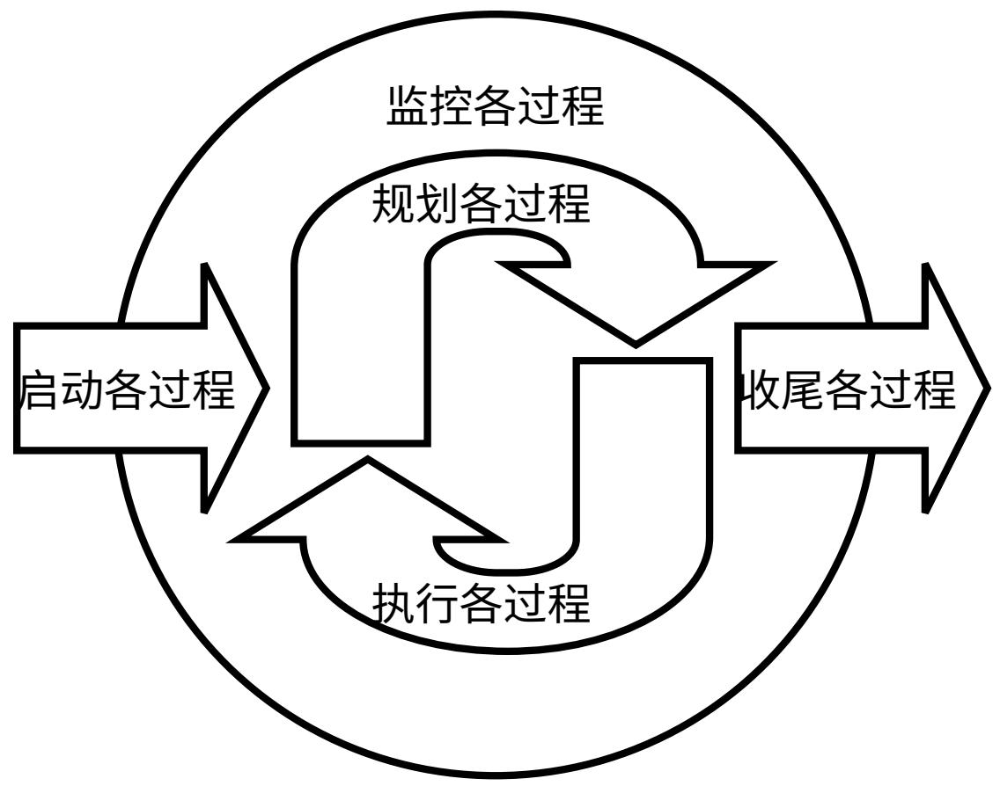
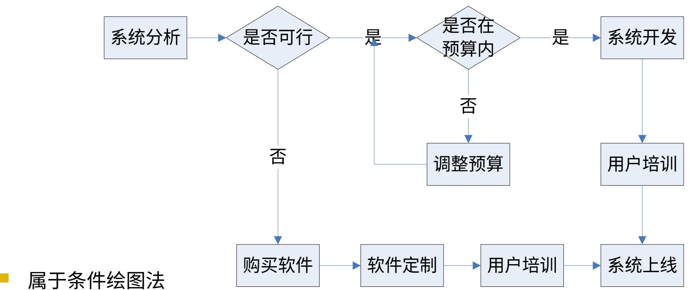
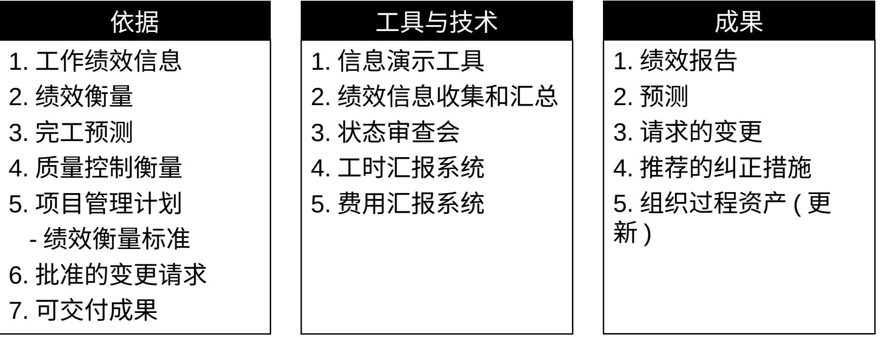

Kingdee

# 项目管理知识—PMBOK 的启发

# 课程目录

- 第一单元：项目管理基础- 第二单元：项目整体管理- 第三单元：项目范围管理- 第四单元：项目时间管理- 第五单元：项目成本管理- 第六单元：项目质量管理- 第七单元：项目人力资源管理- 第八单元：项目沟通管理- 第九单元：项目风险管理- 第十单元：项目采购管理

Kingdee

# 第一单元：项目管理基础

# 提纲

• 1 项目与项目管理
• 2 阶段与生命周期
• 3 组织结构与项目
• 4 项目管理过程组
• 5 项目干系人管理

# 1.1 什么叫项目

一家公司被收购

海外建设通讯站点

研究院研发一种新型的药物

中国当局缉拿新疆针刺袭击嫌疑人

招募 5.22 金蝶软件园开园志愿者

野生动物湿地保护区的建立

与朋友一起旅游

房屋装修

请问哪些是项目？

# 1.2 项目管理的发展历程

1900 年代早期，Henry Gantt 发明甘特图

1950 年代，PERT、CPM、ADM、PDM

1950 年代，单点责任概念

1960，NASA 开发出矩阵型组织结构

1963，美国空军和北极星导弹项目开发出 EVM 技术

1964，NASA 提出配置管理

1969，美国项目管理协会成立

1984，第一届 PMP 考试在美国举行

2000，第一届 PMP 考试在中国举行

PMP 已经超过 19.8 万人，160 多个国家和地区

# 1.3 什么是项目?

为提供独特的产品、服务或成果所进行的临时性努力

A project is a temporary endeavor undertaken to create a unique product, service, or result

# 1.4 项目的四大特征

临时性 temporary

独特的产品、服务或成果unique product, services, or results

渐进明细（逐步完善）progressively elaboration

目标 Objective

# 1.5 项目与日常运作 project vs. operation

每个组织都为实现某些目标而从事某种工作：

- 项目的目标是实现其目标，然后结束项目- 日常运作的目标一般是为了维持运营

共同点：

- 由人来实施- 受制于有限的资源- 需要计划、执行和控制

# 1.6 项目的三种制约与三种目标

# 1.7 什么是成功的项目？

# 项目成功的定义 - 三要素

按时完成

预算内

质量符合预期要求：

功能性能

期望管理 - 项目经理的成功规则

“成本 - 时限 - 质量”平衡的现实的期望

在整个项目期间进行期望管理

在预算内准时交付承诺成果

# 1.8 什么是项目管理？

把各种知识、技能、工具和技术应用于项目各项活动中，以达到项目的要求

Knowledge, skills, tools and techniques

项目管理是对变化的管理

项目管理既是科学，又是艺术

项目管理是一门学科、专业、职业

项目管理是一种理念、一种方法

# 1.9 项目管理的过去与现在

# 传统项目管理

- 进度，成本- 强调执行- 提高生产率- 重视组织和控制- 利用职权来完成工作

# 现代项目管理

- 复杂，高风险，多变化- 信息时代的特点- 独特的、暂时的工作- 强调质量、风险- 对公司使命至关重要的工作- “突破和商业生存”- 跨组织，多元文化- 在正式权力很少的情况下，必须善于鼓舞和激励员工- 社会、经济及可持续性  - 组织越来越多地被要求：  - 不仅对项目直接结果负责  - 好药为项目完成相当长时间后对人类、社会、经济和环境产生的后果负责

# 法律约束

- 法律、法规，并在合同中体现

# 1.10 国内实际项目管理中的重大挑战

组织对项目的重视程度

组织结构

项目经理的授权（人力、金钱……）

责、权、利的平衡

实施与控制

工作绩效的评估

沟通、沟通、沟通

# 1.11 项目经理

负责实现项目目标的个人

- The PM is the person responsible for accomplishing the project objectives- 管理一个项目包括

识别要求

确定清晰而能实现的目标

平衡质量、范围、时间和成本四方面互不相让的要求

Balancing the competing demands

使技术规范、计划和方法适用于各个项目干系人不同的需求与期望

# 1.12 项目管理所需的技能

硬技巧

选择、计划、跟踪、控制

WBS、CPM、EVM

报告

软技巧（人员管理）

领导、管理

团队建设、冲突解决

激励、协商

沟通、倾听

# 1.13 子项目 Subproject

项目常被分为若干个较易管理的组成部分或自项目

子项目常发包给外部单位或实施组织内部的其他职能单位

内部：project team

外部：subcontractor

以一个单独阶段或项目过程为基础，如：

根据项目过程分：项目生命周期的一个阶段人员技能分：工种（管道、电气、土建）技术内容分：软件（编码、测试）

单个子项目一般被视为项目，并按项目进行管理

非常大的项目，子项目可以由更小的子项目组成

# 2.1 项目阶段与项目生命周期

- 将每一个项目划分为若干个阶段（phases），以便提高管理控制，并提供与该项目实施组织的日常运作之间的联系- 这些阶段合在一起称为项目生命周期- 项目的生命周期用于定义一个项目的开始和结束- 许多组织识别出一套具体的生命周期供其所有项目使用

# 2.2 项目生命周期的关键概念

从项目生命周期的一个阶段到另一个阶段常常涉及某种形式的技术交接  项目阶段是以一个或多个可交付成果的完成为标志的  可交付成果是某种有形的、可测量的和 / 或可验证的工作成果，如：可行性研究，详细设计

项目阶段的结束以审查：

- 关键可交付成果  
- 迄今为止的项目实施情况，作为标志  
- 目的：  
- 确定项目是否应当继续实施，并进入下一阶段  
- 以最低成本最有效地发现和纠正错误与偏差  概念、开发、实施和终止是常见的项目生命周期

# 2.3 建筑项目典型生命周期模型

# 2.4 典型项目生命周期图

# 2.5 产品生命周期

# 通常为六个阶段

项目前阶段（项目孵化阶段）

项目阶段

运行阶段

维护阶段

扩展阶段

收尾阶段

第二阶段是项目生命周期

# 3.1 组织结构与项目管理

<table><tr><td rowspan="2">组织结构
\项目特征</td><td rowspan="2">职能型</td><td colspan="3">矩阵型</td><td rowspan="2">项目型</td></tr><tr><td>弱矩阵</td><td>平衡矩阵</td><td>强矩阵</td></tr><tr><td>项目经理权限</td><td>很少或没有</td><td>有限</td><td>少到中等</td><td>中等到大</td><td>很高，甚至全权</td></tr><tr><td>可利用的资源</td><td>很少或没有</td><td>有限</td><td>少到中等</td><td>中等到多</td><td>很多，甚至全部</td></tr><tr><td>控制项目预算者</td><td>职能经理</td><td>职能经理</td><td>职能经理与项目经理</td><td>项目经理</td><td>项目经理</td></tr><tr><td>项目经理的角色</td><td>半职</td><td>半职</td><td>全职</td><td>全职</td><td>全职</td></tr><tr><td>项目管理行政人员</td><td>半职</td><td>半职</td><td>半职</td><td>全职</td><td>全职</td></tr></table>

# 3.2 职能型组织的优缺点

# 优点

简单

对专家更易于管理，管理更具灵活性

只向一个上司汇报

项目人员有“家”——他们在部门里工作，部门给予相应的技术支持

员工可以不断得到提高

# 缺点

项目经理没有足够的权力

没有明确的责任人

客户可能找不到专门的联络点

当项目范围需要从一个部门转移至另一部门时，整体管理不太容易

首先做部门工作

建立项目管理生涯的机会较少

# 3.3 项目型组织的优缺点

# 优点

项目经理拥有全权

项目拥有所有必须的资源

所有项目成员直接向项目经理汇报

更有效的沟通

有利于快速决策

容易被激励，对项目忠诚，有责任心

# 缺点

项目结束时“无家可归”

公司资源利用率不佳

比平常占用更多的资源与设备

决策时项目导向因素更甚于技术可行性

# 3.4 矩阵型组织的优缺点

# 优点

- 非常清楚的项目目标，责任点单一- 改进的资源控制- 最有效地利用公司资源；几个项目可以共享稀缺的资源；资产成本也可以由项目和职能部门共同承担- 客户与项目经理直接沟通，对客户相应速度快- 职能部门是“家”：技术专家依然保留在职能部门，有利于知识库的建立- 职能部门给予更多支持：更好的协调；集思广益，有利于解决问题- 信息流畅通[指跨部门的水平（项目信息）与穿越组织的垂直（技术信息）沟通]

# 缺点

- 复杂的结构，比职能型或项目型更难于理解- 即使有奖励机制，员工也不愿意在一个项目中工作很长时间- 职能经理不可能为了项目放弃最好的资源；同时有多个项目实施时，分享稀缺资源会导致部门间出现问题- 当问题涉及的人比较多时，会延长决策时间- 双重责权、权力平衡及逊色的沟通体系会带来困扰- 运作矩阵型组织的成本更高，需要的程序更多，更多管理人员牵涉到决策过程当中；重复汇报和管理将增加成本- 容易出现信息混乱；即使在西方公司，良好的信息流（水平与垂直）只在完好的流程体系及拥有优秀的协调者的情况下才能实现

# 4.1 单个项目管理过程

如何实现项目管理？

通过“过程” processes 实现大多数情况下，大多数项目都有共同的项目管理过程项目管理知识提供的是 good practice

应用这些过程能大大提高项目成功的机会

项目经理与项目团队的责任

- 确定哪些过程适用于具体给定的项目- 各个过程适用于该项目的严格程度- 剪裁 tailoring

# 4.2 项目管理五大过程组

启动：定义和授权项目或阶段

计划：定义与细化目标，并为实现项目的目标和范围而计划必要的行动路线

执行：集合人力与其它资源，实施项目管理计划

控制：定期测量与监视进程，识别有否偏离计划之处，必要时采取纠正措施，以确保实现项目目标

收尾：正式验收产品、服务或成果，并井井有条地结束项目或项目阶段

# 4.3 过程的交互作用

在每个过程组中，各个过程通过其输入和输出相关联，一个过程的输出往往成为另一个过程的输入

输入：作为行动依据的文件或可记载成文的事项

工具与技术：作用于输入以产生输出的机制

输出：作为过程结果的文件或可记载成文的事项

版权所有 © 1993- 2006 金蝶软件（中国）有限公司

4.4 项目启动过程组的工作

制定项目章程

制定项目初步范围说明书

# 4.5 项目计划过程组的工作

制定项目管理计划

范围规划

范围定义

制定工作分解结构

活动定义

活动排序

活动资源估算

活动持续时间估算

制定进度表

费用估算

费用预算

质量规划

人力资源规划

沟通规划

风险管理规划

风险识别

定性风险分析

定量风险分析

风险应对规划

采购规划

发包规划

# 4.6 项目执行过程组的工作

- 指导与管理项目执行- 实施质量保证- 项目团队组建- 项目团队建设- 信息发布- 询价- 卖方选择

# 4.7 项目控制过程组的工作

- 监控项目工作- 整体变更控制- 范围核实- 范围控制- 进度控制- 费用控制- 实施质量控制- 项目团队管理- 绩效报告- 利害关系者管理- 风险监控- 合同管理

# 4.8 项目收尾过程组的工作

• 项目收尾
• 合同收尾

# 4.9 五大过程组的关系图

# 5.1 项目干系人 Stakeholder

积极参与项目，或其利益因项目的实施或完成而受到积极或消极影响的个人或组织

他们会对项目的目标和结果施加影响

项目管理需要

- 识别项目干系人- 确定各项目干系人的要求、期望、能发挥的作用- 对其影响力尽量加以管理

- 如果有分歧怎么办？

# 5.2 每个项目都包含的项目干系人

主要的项目干系人（每个项目都包含）

- 项目经理- 客户- 项目实施组织- 项目管理团队- 项目团队成员- 项目发起人、出资方- 施加影响者- PMO

# 5.3 项目经理与交流沟通

交流沟通有许多方面

- 书面和口头的，倾听和讲解- 内部（项目范围内）和外部（对顾客、媒体、大众等）- 正式（报告、简报等）和非正式（备忘录、专题会谈等）- 垂直（组织内上下级之间）和水平（同事之间或合作单位之间）

项目经理5个不同方向的交流沟通关系

- 对高层管理人员- 对项目团队- 对职能部门经理- 对同事团体- 对客户、供应商、政府、媒体、公众

# 5.4 谈判

与他人协商以取得共识或达成协议

协议可通过直接谈判，或在外界协助下谈判

调解（mediation）和仲裁（arbitration）是两种借助外界的谈判形势

- 范围、成本和进度目标- 范围、成本和进度变更- 合同条款和条件- 任务分工- 资源

# 单元练习

1. 美国印第安人事务局外包给你们公司一个合同，以修复纳瓦霍保护区的小学。一个叫“印第安人优先”的合同条款要求你在保护区内雇用“土生土长的”劳工与分包商。这是以下哪一个限制条件的实例？

a. 社会

b. 经济

c. 环境

d. 法律

Kingdee

# 第二单元：项目综合管理

# 项目整体管理

定义:

- 识别、定义、结合、统一与协调项目管理过程组中的各个过程以及项目管理活动

- 在各个相互冲突的目标与方案之间权衡取舍

- 在项目管理中发挥明显的重要作用

- Eg：应急计划的成本估算 = 成本管理 + 时间管理 + 风险管理

- 基本任务:

- 按照实施组织确定的程序实现项目目标

- 将项目管理过程组中需要的各个过程有效综合

# 项目整体管理过程

# 1.1 制定项目章程

<table><tr><td>依据</td></tr><tr><td>1. 合同（如果适用）</td></tr><tr><td>2. 项目工作说明书</td></tr><tr><td>3. 事业环境因素</td></tr><tr><td>4. 组织过程资产</td></tr></table>

<table><tr><td>工具与技术</td><td>成果</td></tr><tr><td>1. 项目选择方法</td><td>1. 合同项目章程</td></tr><tr><td>2. 项目管理方法论</td><td>3. 项目管理信息系统</td></tr><tr><td>4. 专家判断</td><td></td></tr></table>

# 1.1-1 项目章程

用途：正式批准项目，授权项目经理在项目活动中动用组织的资源，建立项目与组织日常工作之间的联系。

签发人：项目发起人；组织中项目之外的相应层级的领导内容：

- 为满足顾客、赞助人及其他利害关系者期望而提出的要求；- 经营需要、高层项目说明或本项目对应的产品要求；- 项目目的或上项目的理由；- 委派的项目经理与权限级别；- 总体里程碑进度表；- 利害关系者影响；- 职能组织及其参与；- 组织、环境与外部假设；- 组织、环境与外部制约因素；- 说明项目合理性的经营实例，包括投资收益率；- 总体预算。

# 1.1-2 制作项目章程

完成一个项目章程

项目内容自定义，例如：一次旅游、一次装修等

# 事业环境因素

存在于项目周围并对项目成功有影响的组织事业环境因素与制度内容：

- 组织或公司的文化与组成结构- 政府或行业标准（如规章制度、产品标准、质量标准与工艺标准）- 基础设施（如现有的设施和生产设备）- 现有的人力资源（如技能、专业与知识，例如设计、开发、法律、合同发包与采购）- 人事管理（如雇用与解雇指导方针、员工业绩评价与培训记录）- 公司工作核准制度- 市场情况- 利害关系者风险承受力- 商业数据库（如费用估算数据、行业风险研究信息与风险数据库）- 项目管理信息系统（如自动化工具套件，例如进度管理软件、配置管理系统、信息收集与分发系统，或者与其他在线自动化系统的联网接口）

# 组织过程资产（上）

# 含义：

- 任何一种以及所有参与项目的组织所有的正式或非正式的方针、程序、计划和原则，也包括组织从以前项目中吸取的教训和知识

内容（上）——组织进行工作的过程与程序：

- 组织标准过程，如标准、方针（安全健康方针、项目管理方针），标准产品与项目生命期，以及质量方针与程序（过程审计、目标改进、核对表，以及组织内部使用的标准过程定义）

- 标准指导原则、工作指令、建议评价标准与实施效果评价准则

- 模板（如风险模版、工作分解结构模板与项目进度网络图模版）

- 根据项目的具体需要修改组织标准过程的指导原则与准则

- 组织沟通要求（如可用沟通技术与媒介、记录保留，安全要求）

- 收尾指导原则或要求（如项目审计、评价、产品确认，验收标准）

- 财务控制程序（如时间报告、必要的开支与支付审查、会计编码，验收标准）

- 确定问题与缺陷控制、问题与缺陷识别和解决，以及行动追踪的问题与缺陷管理程序

# 组织过程资产（下）

变更控制程序，包括修改公司正式标准、方针、计划与程序，或者任何项目文件，以及批准与确认任何变更时应遵循的步骤

风险控制程序，包括风险类型、概率的确定与后果及其矩阵

批准与签发工作授权的程序

内容（下）——组织整体信息存储检索知识库：

过程测量数据库，用于搜集与提供过程与产品实测数据

项目档案（如范围、费用、进度，质量基准、实施效果测量基准、项目日历、进度网络图、风险登记册、计划的应对行动，确定的风险后果）

历史信息与所得经验知识库（如项目记录与文件，项目收尾资料与文件记录，以前项目选择决策结果与绩效的信息，以及风险管理努力的信息）

问题与缺陷管理数据库，包括问题与缺陷状态，控制信息，问题与缺陷解决和行动结果

配置管理知识库，包括公司所有正式标准、方针、程序和任何项目文件的各种版本与基准

财务数据库，包括如工时、费用、预算以及项目费用超支等信息

# 制约因素 constraint

# 定义：

适用于项目，因而影响其绩效的某项限制

举例：

- 实现规定的预算 
- 影响项目团队在范围、人员配备、进度方面的选择- 合同条款 
- 如果项目根据合同实施- 要求项目在社会、经济与环保上具有可持续性（范围、进度、人员配备）- 组织结构- 组织方针和程序：实施组织、客户组织

制约因素的特点：

- 限制团队作计划时的选择- 通常事先已知- 将不会发生改变- 不是逐步完善的

# 假设 assumption

# 定义：

- 假设是指就规划之目的而言，被视作正确、真实、或肯定的因素- 影响项目规划所有方面，是项目逐步完善的组成部分- 假设对于规划而言很重要，因为：

- 它允许项目团队将其作为参考或基线- 它是以当时所能得到的最准确信息为基础的- 对已经认可的信息达成了团队的共识- 使项目团队免于不断地分析相同的信息- 被记载下来作为决策制定的参考

# 假设的特点：

- 关键词“就规划之目的”；正确、真实、肯定- 可逐步完善；可以作为风险识别的一项投入- 应该形成文件以支持决策制定- 具有时限因素- 以当时所能得到的最准确信息为基础

# 1.1-3 项目选择方法

# 收益衡量法

- 对比法- 打分模型：如加权评分表- 收益贡献- 经济模型  
- 回收期、投资报酬率、收益成本比率、贴现现金流- 数学模型（约束优化法）  
- 线性；非线性；动态；整数；多目标编程算法

# 1.1-4 专家判断

可将专家判断和专门知识用于任何技术和管理细节

任何具有专门知识或培训的集体和个人可提供专家知识

组织内部其他单位、咨询顾问、包括客户和发起人在内的项目干系人、专业技术协会

德尔菲法：专家就某一主题达成一致意见的方法

使用问卷征求意见，收集匿名专家意见，将意见反馈回专家，再次征求专家意见

优点：无偏见、更真实；可获得专家独特意见；避免个人因素对结果产生不当影响

缺点：历时长、缺乏争论

# 1.2 制定项目初步范围说明书

# 项目范围说明书（初步）

# 目的：

- 登记项目及其产品和服务的特征与边界，以及验收与范围控制的方法- 内容：

- 项目与产品的目标- 产品或服务的要求与特性- 产品验收标准- 项目边界- 项目要求与可交付成果- 项目制约因素- 项目假设- 项目的初步组织- 初步识别的风险- 进度里程碑- 初步工作分解结构- 量级费用估算- 项目配置管理要求- 审批要求

# 1.3 制定项目管理计划

# 项目管理计划

# 目的：

确定执行、监视、控制和结束项目的方式和方法，记录规划过程组的各个规划子过程的全部成果

# 内容：

项目管理团队选择的各个项目管理过程

每一选定过程的实施水平

对实施这些过程时使用的工具与技术所作的说明

在管理具体项目中使用选定过程的方式和方法，包括过程之间的依赖关系和相互作用，以及重要的依据和成果

为了实现项目目标所执行工作的方式、方法

监控变更的方式、方法

实施配置管理的方式、方法

使用实施效果测量基准并使之保持完整的方式、方法

利害关系者之间的沟通需要与技术

选定的项目生命期和多阶段项目的项目阶段

高管加快待解决问题和未定决策，对内容、范围、时间的审查

# 1.3-1 项目管理计划

# 子计划

- 项目范围管理计划- 进度管理计划- 费用管理计划- 质量管理计划- 过程改进计划- 人员配备管理计划- 沟通管理计划- 风险管理计划- 采购管理计划

# 其他组件

- 里程碑清单- 资源日历- 进度基准- 费用基准- 质量基准- 风险登记册

# 1.4 指导与管理项目执行

<table><tr><td>依据</td><td>工具与技术</td><td>成果</td></tr><tr><td>1. 项目管理计划</td><td>1. 项目管理方法论</td><td>1. 可交付成果</td></tr><tr><td>2. 批准的纠正措施</td><td>2. 项目管理信息系统</td><td>2. 请求的变更</td></tr><tr><td>3. 批准的预防措施</td><td></td><td>3. 实施的变更请求</td></tr><tr><td>4. 批准的变更请求</td><td></td><td>4. 实施的纠正措施</td></tr><tr><td>5. 批准的缺陷补救</td><td></td><td>5. 实施的预防措施</td></tr><tr><td>6. 确认的缺陷补救</td><td></td><td>6. 实施的缺陷补救</td></tr><tr><td>7. 行政收尾程序</td><td></td><td>7. 工作绩效信息</td></tr></table>

<table><tr><td>工具与技术</td></tr><tr><td>1. 项目管理方法论</td></tr><tr><td>2. 项目管理信息系统</td></tr></table>

# 工作授权系统

计划实施的工具之一

工作授权系统 work authorization system

确保工作按规定时间与顺序进行

是一套项目工作正式审批程序

以书面授权方式开始具体的一项活动或工作

其设计应当在提供控制的价值和为其所付出的代价两者之间权衡

可以防止镀金

# 1.5 监控项目工作

<table><tr><td>依据</td></tr><tr><td>1. 项目管理计划</td></tr><tr><td>2. 工作绩效信息</td></tr><tr><td>3. 否决的变更请求</td></tr></table>

<table><tr><td>工具与技术</td></tr><tr><td>1. 项目管理方法论</td></tr><tr><td>2. 项目管理信息系统</td></tr><tr><td>3. 挣值技术</td></tr><tr><td>4. 专家判断</td></tr></table>

<table><tr><td>成果</td></tr><tr><td>1. 推荐的纠正措施</td></tr><tr><td>2. 推荐的预防措施</td></tr><tr><td>3. 预测</td></tr><tr><td>4. 推荐的缺陷补救</td></tr><tr><td>5. 请求的变更</td></tr></table>

# 监控项目工作过程的关注点

对照项目管理计划比较实际项目绩效

评价项目绩效，判断是否需要采取预防或纠正措施，必要时推荐行动方案

分析、跟踪并监视项目风险，确保及时识别风险，报告其状态，执行相应的风险应对计划

建立有关项目产品及其相关文件的准确、及时的信息库，并保持到项目完成

为状态报告、绩效测量和预测提供信息支持

为更新当前的成本和进度信息提供预测

在实施批准的变更时进行检测

# 工作绩效信息

# 说明：

- 按常规收集有关为了完成项目工作而进行的项目活动工作状态的信息和数据，它数据任务执行的一部分。

# 内容：

- 表明进度绩效的状态信息

- 已经完成与尚未完成的可交付成果

- 已经开始与已经完成的计划活动

- 质量标准满足的程度

- 批准与已经开销的非哟噢能够

- 对完成已经开始的计划活动的估算

- 执行过程中的计划活动实际完成百分比

- 吸取并已记录且转入所得经验知识库的内容

- 资源利用的细节

# 1.6 整体变更控制

<table><tr><td>依据</td></tr><tr><td>1. 项目管理计划</td></tr><tr><td>2. 请求的变更</td></tr><tr><td>3. 工作绩效信息</td></tr><tr><td>4. 推荐的预防措施</td></tr><tr><td>5. 推荐的纠正措施</td></tr><tr><td>6. 推荐的缺陷补救</td></tr><tr><td>7. 可交付成果</td></tr></table>

<table><tr><td>工具与技术</td></tr><tr><td>1. 项目管理方法论</td></tr><tr><td>2. 项目管理信息系统</td></tr><tr><td>3. 专家判断</td></tr></table>

<table><tr><td>成果</td></tr><tr><td>1. 批准的变更请求</td></tr><tr><td>2. 否决的变更请求</td></tr><tr><td>3. 项目管理计划（更新）</td></tr><tr><td>4. 项目范围说明书（更新）</td></tr><tr><td>5. 批准的纠正措施</td></tr><tr><td>6. 批准的预防措施</td></tr><tr><td>7. 批准的缺陷补救</td></tr><tr><td>8. 确认的缺陷补救</td></tr><tr><td>9. 可交付成果</td></tr></table>

版权所有 ©1993- 2006 金蝶软件（中国）有限公司

# 1.6-1 整体变更控制的工作

确认是否需要变更或变更已经发生

对造成整体变更控制的因素施加影响，以保证只实施经过批准的变更对请求的变更进行审查和批准

规范变更申请流程，在发生变更时管理批准的变更

仅允许被批准的变更纳入到项目产品或服务中，以维护基准的完整，并维护项目产品或服务相关的配置与计划文件

审查与批准所有推荐的纠正与预防措施

得到批准的变更应反映到基准之中

# 1.6-2 请求的变更

项目执行过程中变更经常发生的领域

扩大或缩小项目范围

修改方针或程序

修改项目成本或预算

修改项目进度表

变更的类型

直接/间接

内部/外部

可选择的/法律（合同）强制的

# 1.6-3 变更控制委员会

变更控制委员会（CCB）：正式成立的一个项目干系人组织，负责审议、评价、批准、推迟或否决项目基准的变更，也称ERB（工程审查委员会）、TRB（技术审查委员会）、TAB（技术评估委员会）

所有决议和建议都记录在案

配置控制与变更控制程序明确规定其角色与责任

得到项目发起人、客户及项目干系人认可

大组织设立多层次CCB结构，分清各CCB责任

根据合同进行的项目，某些变更需得到客户批准

CCB的3个核心：

文字工作、审批层次、跟踪系统

紧急——自动程序

# 1.7 项目收尾

<table><tr><td>依据</td></tr><tr><td>1. 项目管理计划</td></tr><tr><td>2. 合同文件</td></tr><tr><td>3. 事业环境因素</td></tr><tr><td>4. 组织过程资产</td></tr><tr><td>5. 工作绩效信息</td></tr><tr><td>6. 可交付成果</td></tr></table>

<table><tr><td>工具与技术</td><td>成果</td></tr><tr><td>1. 项目管理方法论
2. 项目管理信息系统
3. 专家判断</td><td>1. 行政收尾程序
2. 合同收尾程序
3. 最终产品服务成果
4. 组织过程资产（更新）</td></tr></table>

# 1.7-1 行政收尾程序

详细规定项目团队与参与执行项目行政收尾的其他项目干系人的所有活动、相互作用、相关的角色与责任

制定和建立将项目产品或服务移交生产或运营的程序

收集项目记录、分析项目成败、收集经验教训、项目信息存档

解散项目成员

# 1.7-2 合同收尾程序

了解项目所有的合同协议

定义项目正式行政收尾的有关活动

设计产品核实与行政收尾

产品核实：所有工作均正确满意地完成

行政收尾：更新合同记录以反映最终结果，将该信息存档以供将来使用

合同条款条件对合同收尾做了具体规定则必须成为本程序一部分

合同提前终止时合同收尾特例

是采购知识领域合同收尾的输入

# 单元练习

1. 在选择最适合的项目组织形式时，要采取的第一步骤是：

a. 创建工作分解结构（WBS），并让它来决定项目的组织结构

b. 制定一份初始的项目计划，并确定负责每一项任务的职能部门

c. 参加高级管理层制定的项目章程

d. 制定项目进度计划，包括自上而下的流程图，并确定执行每一项任务的职能部门

Kingdee

# 第三单元：项目范围管理

# 项目范围管理

# 定义：

- 确保项目包括成功完成项目所需的全部工作，但又只包括必须完成的工作的各个过程

项目范围：

- 为提供具有规定特征与功能的产品、服务或成果而需要完成的工作- 是否完成以项目管理计划、项目范围说明书、相应的WBS、WBS词典为衡量标准

- 产品、服务或成果的特征与功能- 是否完成以产品要求作为衡量标准

# 项目范围管理过程

# 2.1 范围规划

# 项目范围管理计划

# 用途：

项目团队确定、记载、核实、管理和控制项目范围的指南

# 内容：

根据初步范围说明书编制详细范围说明书的一个过程

能够根据详细的项目范围说明书制作工作分解结构，并确定如何维持与批准该工作分解结构的一个过程

规定如何正式核实与验收已完成可交付成果的过程

控制详细项目范围说明书变更请求处理方式的一个过程。该过程同整体变更控制过程有直接联系

来源——范围规划过程

要求：正式或非正式、概括或详细

# 2.2 范围定义

# 产品分

各应用领域都有将项目目标转变为有形的可交付成果和要求的一个或多个普遍接受的方法

产品分析的技术包括：

产品分解- 系统分析- 系统工程- 功能分析- 价值工程（VE）/价值分析：Value=Function/Cost

# 项目范围说明书（上）

# 目的：

- 详细说明项目的可交付成果和为提交这些成果而必须开展的工作- 是所有利害关系者对项目范围的共同理解，说明了项目的主要目标- 是项目团队能够实施更详细的规划，在执行过程中指导项目团队的工作- 构成了评价变更请求或增加的工作是否超出了项目边界的基准

内容（上）：

- 项目目标：可测量的项目成功标准。项目可能有各种运营方式、费用、进度、技术和质量目标。项目目标可能还包括费用、进度和质量指标- 产品范围说明书：说明了项目应创造的产品、服务或成果的特征。产品特征在早期不够详细，以后阶段随产品特征逐步明确，产品范围说明书也逐步详细

# 项目范围说明书（中）

# 内容（中）：

- 项目要求说明书：说明项目可交付成果为满足合同、标准、技术规定说明书或其他正式强制性文件的要求，而必须满足的条件或具备的能力。对利害关系着的所有需要、需求、期望的分析结果，要按照轻重缓急和重要性大小反映在这里- 项目边界：明确哪些事项属于项目的内容，易误解的内容哪些不包括在项目内- 项目可交付成果：包括由项目产品、服务或成果组成的结果，也包括附带结果，如项目管理报告和文件- 产品验收准则：确定了验收已完成产品的过程和原则- 项目制约因素：列出并说明同项目范围有关并限制项目团队选择的具体项目制约因素- 项目假设：列出并说明同项目范围有关的具体项目假设，以及其在不成立时可能造成的潜在后果

# 项目范围说明书（下）

# 内容（下）：

- 项目初步组织：识别项目团队的成员与利害关系者- 初步确定的风险：识别已知风险- 进度里程碑：顾客或执行组织可能识别里程碑，并为之规定强制性日期。这些日期可以当作进度制约因素看待- 资金限制：说明了置于项目资金上的所有限制，包括总金额或规定的时间- 费用估算：项目的费用估算分解为项目的预期总费用，而且一般在前面加一个修饰词，指明估算的准确性，如概念或确定- 项目配置管理要求：说明了项目实施的配置管理和变更控制水平- 项目技术规定说明书：识别了项目应当遵守的技术规定文件- 批准要求：识别了适用于诸如项目目标、可交付成果、文件和工作事项的批准要求

# 2.3 制作工作分

<table><tr><td>依据</td></tr><tr><td>1. 组织过程资产</td></tr><tr><td>2. 项目范围说明书</td></tr><tr><td>3. 项目范围管理计划</td></tr><tr><td>4. 批准的变更请求</td></tr></table>

<table><tr><td>工具与技术</td></tr><tr><td>1. 工作分解结构模版</td></tr><tr><td>2. 分解</td></tr></table>

<table><tr><td>成果</td></tr><tr><td>1. 项目范围说明书（更新）</td></tr><tr><td>2. 工作分解结构</td></tr><tr><td>3. 工作分解结构词汇表</td></tr><tr><td>4. 范围基准</td></tr><tr><td>5. 项目范围管理计划（新）</td></tr><tr><td>6. 请求的变更</td></tr></table>

# WBS（工作分

WBS- Work Breakdown Structure

面向可交付成果的对项目工作的层次化分解

WBS 有机地组织和定义了项目的整个范围

WBS 将项目工作分解成较小的、更易于管理的多项工作

WBS 每下降一层代表对项目工作更详细的定义

WBS 反映当前批准的项目范围说明书规定的工作

WBS 的各个组成部分有助于项目干系人理解项目的可交付成果

许多组织有标准的 WBS 分解模版

# 基础——工作包

工作包 - work package 工作细木

定义：WBS 最底层的可交付成果或项目工作成分

能够对工作包进行：

- 进度安排
- 成本估算
- 监视和控制

工作包下面是进度活动（schedule activity）和进度里程碑 (schedule milestone)

# WBS 类型与制作

# WBS类型：

按组成部分、按功能用途、按项目生命周期、按地理区域

WBS表示方法：

- 树状结构、列表式

WBS用途：

- WBS被用于确定所需资源，确定责任归属，帮助定义项目工作顺序及估计项目时间分解的几个问题（80小时原则）

- 分解过粗有什么问题

- 能够估计每个工作包所需的时间、资源和成本？- 能够发现各个工作、任务之间的相关关系？- 能交给具体人去负责？

- 分解过细有什么问题

# WBS词典

# 定义：

制作WBS过程中产生并与WBS配合使用的文件

# 内容：

- 简明的范围定义- 工作说明- 可交付成果是什么- 具体活动清单- 里程碑清单- 开始与完成日期- 需要哪些资源- 费用多少- 合同信息

# 2.4 范围核实

# 范围核实的说明

审查可交付成果，以保证每一个都令人满意地完成

每个阶段都作

若项目提前终止，则应记载项目完成的水平和程度

范围核实关心的是对可交付成果的验收；质量控制关心的是满足可交付成果的质量要求

质量控制一般限于范围核实进行，但两者也可同时进行

# 检查 inspection

判断工作和可交付成果是否满足要求及产品验收标准的各项活动

测量 measuring  测验 examining  核实 verifying

可在任何层面上进行

检查单项活动的结果  检查项目的最终产品

其他名称（某些应用领域，较窄较具体的含义）

评审 review  产品评审 product review  审计 audit  走查 walkthrough

# 2.5 范围控制

<table><tr><td>依据</td><td>工具与技术</td><td>成果</td></tr><tr><td>1. 项目范围说明书</td><td>1. 变更控制系统</td><td rowspan="2">1. 项目范围说明书（更新）2. 工作分解结构（更新）</td></tr><tr><td>2. 工作分解结构</td><td>2. 偏差分析</td></tr><tr><td>3. 工作分解结构词汇表</td><td>3. 补充规划</td><td>3.WBS 词汇表（更新）</td></tr><tr><td>4. 项目范围管理计划</td><td>4. 配置管理系统</td><td>4. 范围基准（更新）</td></tr><tr><td>5. 绩效报告</td><td></td><td>5. 请求的变更</td></tr><tr><td>6. 批准的变更请求</td><td></td><td>6. 推荐的纠正措施</td></tr><tr><td>7. 工作绩效信息</td><td></td><td>7. 组织过程资产（更新）</td></tr></table>

<table><tr><td>工具与技术</td><td></td></tr><tr><td>1. 变更控制系统</td><td>1. 项目范围说明书（更新）2. 工作分解结构（更新）</td></tr><tr><td>2. 偏差分析</td><td>3. 补充规划</td></tr><tr><td>4. 配置管理系统</td><td>3. WBS 词汇表（更新）</td></tr><tr><td></td><td>4. 范围基准（更新）</td></tr><tr><td></td><td>5. 请求的变更</td></tr><tr><td></td><td>6. 推荐的纠正措施</td></tr><tr><td></td><td>7. 组织过程资产（更新）</td></tr></table>

<table><tr><td>成果</td></tr><tr><td>1. 项目范围说明书（更新）2. 工作分解结构（更新）</td></tr><tr><td>3.WBS 词汇表（更新）</td></tr><tr><td>4. 范围基准（更新）</td></tr><tr><td>5. 请求的变更</td></tr><tr><td>6. 推荐的纠正措施</td></tr><tr><td>7. 组织过程资产（更新）</td></tr><tr><td>8. 项目管理计划（更新）</td></tr></table>

# 范围变更控制内容

范围变更请求有多种形式：口头/书面；直接/间接；外部/内部；法律规定/可选的

必须是正式的

范围变更原因

- 外部事件（政府条例变更）- 产品范围定义时的错误或疏漏- 项目范围定义时的错误或疏漏- 增值变更- 应对风险的变更

# 单元练习

1. 范围核实:

a. 提高成本与进度的精确度，特别是在使用到革新技术的项目中

b. 是在把项目提交给客户之前所实施的最后一项活动

c. 记录项目所应创造的产品或服务的特征

d. 不同与质量控制，范围核实是关于工作结果的接受程度，而非正确程度

# 章节回顾

• 范围说明书一般包含的内容
• WBS 最底层的项通常称为（）
• WBS 每一个都被分配了一个唯一标识符。称为（）
• 范围核实不同与质量控制，范围核实关心的是（）；质量控制关心的是（）
• 范围核实的工具是（）

Kingdee

# 第四单元：项目时间管理

# 项目时间管理过程

# 3.1 活动定义

# 活动、活动属性、活动依赖关系

活动：通过对工作包的识别与分解而得出，进度活动（又称计划活动）是估算、进度制定、执行和监控项目的基础

活动属性ActivityAttributes：能列入活动清单的各进度活动所具有的多种属性，包括：

活动标志符；活动编码前导活动；后续活动；逻辑关系提前与滞后；资源要求强加的日期；约束和假设

活动依赖关系：

强制性依赖关系——硬逻辑

可自由处理的依赖关系

在具体应用领域的“最佳惯例”对某些特殊方面，即使存在其它可接受的顺序，也期望采用的专门顺序又称：首选逻辑、优先逻辑或软逻辑

外部依赖关系：召开环境影响听证会；软件测试vs.硬件到货

# 滚动波式计划 rolling wave planning

WBS&WBS 词典反映了项目范围的演进（达到工作包层面）

滚动波式计划是项目渐进明细的一种形式

近期计划完成的工作在 WBS 最底层详细计划

远期要完成的工作在 WBS 较高层计划

故进度活动在项目生命期内可处于不同的详细水平

早期信息不确定的计划阶段，活动可能仅达到里程碑水平

# 3.2 活动排序

依据1. 项目范围说明书2. 活动清单3. 活动属性4. 里程碑清单5. 批准的变更请求

# 工具与技术

工具与技术1. 紧前关系绘图法 (PDM)2. 箭线绘图法 (ADM)3. 进度网络模版4. 确定依赖关系5. 利用时间提前量与滞后量

# 成果

成果1. 项目进度网络图2. 活动清单（更新）3. 活动属性（更新）4. 请求的变更

# PDM 前导图法

- 方型或矩形（节点）代表活动，用箭线表示依赖关系将节点联系起来的编制项目网络图的方法- 也称单代号网络图法（AON），项目管理软件多采用此法- PDM 可以使用四种依赖关系或先后关系  
- FS 完成开始；SS 开始开始；FF 完成完成；SF 开始完成

# ADM 箭线图法

用箭线代表活动（而不是逻辑关系），并在节点处将活动连接起来表示依赖关系的编制项目网络图的方法

也叫双代号网络图法（AOA），不如PDM用的广泛

箭线图法只使用完成——开始依赖关系，所以为了正确地确定某些逻辑关系，可能需要使用虚拟活动dummy activities（工作时间=0，无工作内容）

# 提前与滞后

项目管理团队确定可能的提前与滞后依赖关系，以便准确定义逻辑关系

提前与滞后及相关假设要形成文件

提前 LEAD

滞后 LAG

# GERT图形评审技术

与前导图和箭线图的区别：

- GERT允许回路或条件分支，而PDM和ADM不允许- 图例：采用类似流程图的方式来描述项目中的分支活动或回路活动

# 3.3 活动资源估算

<table><tr><td>依据</td><td>工具与技术</td><td>成果</td></tr><tr><td>1. 事业环境因素</td><td>1. 专家判断</td><td>1. 活动资源要求</td></tr><tr><td>2. 组织过程资产</td><td>2. 多方案分析</td><td>2. 活动属性（更新）</td></tr><tr><td>3. 活动清单</td><td>3. 出版的估算数据</td><td>3. 资源分解结构</td></tr><tr><td>4. 活动属性</td><td>4. 项目管理软件</td><td>4. 资源日历（更新）</td></tr><tr><td>5. 资源可利用情况</td><td>5. 自下而上估算</td><td>5. 请求的变更</td></tr><tr><td>6. 项目管理计划</td><td></td><td></td></tr></table>

# 什么是资源

# 资源是一切具有现实及潜在价值的东西

# 资源包括：

自然资源；人造资源内部资源；外部资源有形资源；无形资源

# 7M

Man Machine Material Money Message Method of science & Technology Market

项目管理作为一种方法，也是一种资源

# 3.4 活动持续时间估算

<table><tr><td>依据</td></tr><tr><td>1. 事业环境因素</td></tr><tr><td>2. 组织过程资产</td></tr><tr><td>3. 项目范围说明书</td></tr><tr><td>4. 活动清单</td></tr><tr><td>5. 活动属性</td></tr><tr><td>6. 活动资源要求</td></tr><tr><td>7. 资源日历</td></tr><tr><td>8. 项目管理计划</td></tr><tr><td>- 风险登记册</td></tr><tr><td>- 活动费用估算</td></tr></table>

<table><tr><td>工具与技术</td><td>成果</td></tr><tr><td>1. 专家判断
2. 类比估算
3. 参数估算
4. 三点估算
5. 后备分析</td><td>1. 活动持续时间估算
2. 活动属性（更新）</td></tr></table>

# 类比

也称为“自上而下的估算”，是指以从前类似活动的实际历时（实际成本）为基本依据估算未来活动的历时（成本）

经常在项目详细信息有限的情况下使用，像项目早期阶段

是专家判断的一种形式

使用的成本通常低于其他方法，但精度常较低

类比估算法在以下条件下非常可靠

和以前活动在本质上而不是表面上相似

估算者掌握必要的专门技术

# 参数估算

由某一特定类型工作所需完成的工作量（例如，图纸数量、电缆米数、钢铁吨数等等），称以生产率（例如，每张图纸所需小时数、每小时电缆米数等等），所得结果可用于估算活动历时或成本

什么时候比较可靠

- 建模的历史资料准确- 模型中的参数容易量化- 模型具有可缩放性时，对大小项目都适用，比较可靠- 准确性取决于模型的复杂性以及作为模型一部分的资源数量和成本数据

# 三点估算（PERT法）

计划评审技术

50年代美国军方北极星潜艇项目首用

一种概率方法

期望值  $=$  （最乐观时间  $+4^{\star}$  最可能时间  $+$  最悲观时间）/6标准差  $=$  （最悲观时间- 最乐观时间）/6

# 储备分 reserve analysis- 应急储备

# 时间储备分析

项目团队可以选择一个附加的/额外的时间，并将之作为认可的进度风险添加至活动历时或进度计划中（如关键研发人员的健康）

承认进度风险的表现

应急时间可以是估算时间的

（1）一个百分比；（2）固定长短的时间

根据定量风险分析的结果确定

当日后可获取更准确的项目信息时，储备时间可减少或去除

# 成本储备

处理预期但不确定事件

是项目范围与成本基准的一部分

管理方法：不把风险储备金分配到每一项活动中，以免造成成本估算膨胀，影响估算的精确度

在工作包层面，将储备分配给一个持续时间为零的虚拟活动

根据实际情况对储备量进行调整

更精确，不是基于悲观估计的

# 储备分 - 管理储备

时间与成本储备应当与其它数据和假设一起形成文件时间与成本储备可由项目经理动用

管理储备

- 应对未计划但有可能需要的变更- 应对项目范围和成本的变更- 项目经理动用之前要获得批准- 不是项目成本基准的一部分，但包括在项目预算中- 不作为预算进行分配，也不在 EV 中计算

# 3.5 制定进度表

<table><tr><td>依据</td></tr><tr><td>1. 组织过程资产</td></tr><tr><td>2. 项目范围说明书</td></tr><tr><td>3. 活动清单</td></tr><tr><td>4. 活动属性</td></tr><tr><td>5. 项目进度网络图</td></tr><tr><td>6. 活动资源要求</td></tr><tr><td>7. 资源日历</td></tr><tr><td>8. 活动持续时间估算</td></tr><tr><td>9. 项目管理计划</td></tr><tr><td>- 风险登记册</td></tr></table>

# 工具与技术

工具与技术1. 进度网络分析2. 关键路线法3. 进度压缩4. 假设情景分析5. 资源平衡6. 关键链法7. 项目管理软件8. 应用日历9. 调整时间提前量与滞后量10. 进度模型

<table><tr><td>成果</td></tr><tr><td>1. 项目进度表</td></tr><tr><td>2. 进度模型数据</td></tr><tr><td>3. 进度基准</td></tr><tr><td>4. 资源要求（更新）</td></tr><tr><td>5. 活动属性（更新）</td></tr><tr><td>6. 项目日历（更新）</td></tr><tr><td>7. 请求的变更</td></tr><tr><td>8. 项目管理计划（更新）</td></tr><tr><td>- 进度管理计划（更新）</td></tr></table>

# CPM 关键路径法

# 进度网络分析：关键路径法（CPM）

根据指定的网络顺序逻辑关系和单一的历时估算，计算每一个活动的单一的、确定的最早和最迟的开始和完成日期

由于不考虑任何资源限制，由此得到的上述日期不一定就是项目进度，只是指明进度活动在给定的活动历时、逻辑关系、提前与滞后、其它已知约束下应安排的时间段与长短

CPM的核心是计算浮动时间，确定哪些活动进度安排灵活性最小

是经常应用于进度网络分析中的快捷、简单的方法

关键路径：按照总浮动时间为0的活动决定的路径

关键活动：关键路径上的进度活动

关键路径是项目整个路径中最长的路径，是项目最短的时间，但很容易变化关键路径可能有多个

向关键路径要时间，向非关键路径要资源

# CPM：浮动时间

浮动时间（Float）

自由浮动时间（free float）：在不推迟紧随其后的下一活动的最早开始日期的前提下，活动可以向后推迟的时间长度

浮动时间（float）/总浮动时间（total float）：在不延误项目完成日期的前提下，活动从其最早开始时间起可以向后推迟的时间。它是一项数学计算，可随项目的进展以及项目计划的变更而改变

关键路径 = 总浮动时间为 0 的路径

总浮动时间可以  $< 0$  吗？

# CPM：前推法、逆推法

前推法得出活动的ES、EF及项目最早完工时间：EF=ES+DU- 1逆推法确定LS、LF及项目的最晚完工时间：LS=LF- DU+1

# 进度压缩

在不改变项目范围的条件下，为满足进度约束、强加的日期和其他进度目标而缩短项目进度

进度压缩的技术有：

- 赶工：对成本和进度进行权衡，确定如何以最小的成本增加最大限度地缩短项目所需时间

- 赶工意味着用成本来争取时间，此时优先考虑的是缩短那些位于项目关键路径中的活动的持续时间- 赶工并不总是一种可行的方案，并且常导致成本增加

- 快速跟进：将正常情况下按顺序实施的多个活动调整为“并行进行”，以压缩项目工期

- 快速跟进经常导致返工，会“欲速则不达”- 经常会增加风险- 与并行工程区别

- 增加资源或改变技术路线可以压缩进度，但不是专门的进度压缩技术- 对工期压缩后则要重新判断项目的关键路径

# 资源平衡

# 用于已经用关键路径法分析过的进度模型中

问题来源：

关键资源只在一定时间可用

关键资源只有一定数量可用

均匀地使用资源

将稀缺资源分配到关键路径上

资源决定法：项目进度比预期长（受资源限制）

使资源从非关键路径重新分配到关键路径上，是使项目最可能与初始进度一致的方法

资源利用率

# 进度管理计划

# 用途：

确定制定项目进度表的格式与控制项目进度的准则

# 内容：

项目时间管理的各个过程及有关的工具与技术，因应用领域而异，在确定之后通常都属于项目生命期的一部分，并记载于进度管理计划之内

来源——制定项目管理计划过程

要求：正式或非正式、概括或详细

# 进度基准

进度基准 - schedule baseline

从进度网络分析中得到的项目进度表的具体的一个版本

由项目管理团队认可和批准

标明基准开始日期与基准完成日期

# 3.6 进度控制

<table><tr><td>依据</td></tr><tr><td>1. 进度管理计划</td></tr><tr><td>2. 进度基准</td></tr><tr><td>3. 绩效报告</td></tr><tr><td>4. 批准的变更请求</td></tr></table>

<table><tr><td>工具与技术</td></tr><tr><td>1. 进度报告</td></tr><tr><td>2. 进度变更控制系统</td></tr><tr><td>3. 绩效衡量</td></tr><tr><td>4. 项目管理软件</td></tr><tr><td>5. 偏差分析</td></tr><tr><td>6. 进度比较模型</td></tr></table>

<table><tr><td>成果</td></tr><tr><td>1. 进度模型数据（更新）</td></tr><tr><td>2. 进度基准（更新）</td></tr><tr><td>3. 绩效衡量</td></tr><tr><td>4. 请求的变更</td></tr><tr><td>5. 推荐的纠正措施</td></tr><tr><td>6. 组织过程资产（更新）</td></tr><tr><td>7. 活动清单（更新）</td></tr><tr><td>8. 活动属性（更新）</td></tr><tr><td>9. 项目管理计划（更新）</td></tr></table>

# 进度控制的内容

- 确定项目进度的当前状况- 对造成进度变化的因素施加影响- 确定项目进度是否已经改变- 在实际变化出现时对其进行管理- 是综合变更控制的一部分

# 单元练习

1. 修改项目进度基准计划应慎重，这是因为：
a. 修订必须要得到管理层的批准
b. 项目进度的历史数据会被遗失
c. 必须进行根源分析
d. 对于在后面的速度中所描述的活动，不能对其进度恢复做出计划编制

Kingdee

# 第五单元：项目成本管理

# 项目成本管理过程

# 4.1 费用估算

# 费用管理计划

# 用途：

列出模版并制定项目费用规划、结构、估算、预算和控制的标准

# 内容：

- 费用管理的过程及使用的工具与技术，因应用领域而异，一般在项目生命期定义过程中对此进行选择，并在费用管理计划中记录- 包括：精确等级、测量单位、组织程序链接、控制下限、挣值规则（信用标准、WBS需作分析的级别）、报告格式、过程说明- 来源——制定项目管理计划过程- 要求：正式或非正式、概括或详细

# 4.2费用预算

# 成本基准

- 成本基准 cost baseline- 按时间分段的预算- 用来度量与监测项目总体成本绩效- 通常以 S 曲线表示

- 大项目常有多个成本基准，以量度成本绩效的各个方面（内部人工成本 & 外部分包成本）

# 4.3 费用控制

<table><tr><td>依据</td></tr><tr><td>1. 费用基准</td></tr><tr><td>2. 项目资金需求</td></tr><tr><td>3. 绩效报告</td></tr><tr><td>4. 工作绩效信息</td></tr><tr><td>5. 批准的变更请求</td></tr><tr><td>6. 项目管理计划</td></tr></table>

<table><tr><td>工具与技术</td></tr><tr><td>1. 费用变更控制系统</td></tr><tr><td>2. 绩效衡量分析</td></tr><tr><td>3. 预测技术</td></tr><tr><td>4. 项目绩效审核</td></tr><tr><td>5. 项目管理软件</td></tr><tr><td>6. 偏差管理</td></tr></table>

<table><tr><td>成果</td></tr><tr><td>1. 费用估算（更新）</td></tr><tr><td>2. 费用基准（更新）</td></tr><tr><td>3. 绩效衡量</td></tr><tr><td>4. 预测完工</td></tr><tr><td>5. 请求的变更</td></tr><tr><td>6. 推荐的纠正措施</td></tr><tr><td>7. 组织过程资产（更新）</td></tr><tr><td>8. 项目管理计划（更新）</td></tr></table>

# 挣值技术

挣值/实现价值技术（Earned Value Technique）

将范围、进度和资源综合起来，进而客观测量项目绩效和进展的一种管理方法。它比较了计划工作量、实际挣得多少与实际花费成本，以测量成本和进度是否符合原定计划

成本：EV vs. AC

进度：EV vs. PV

挣值的数据都以货币表示，这容易使人认为挣值与钱有关，但它反映的是项目绩效和进展。因此，挣值既是沟通工具，又是项目绩效测量的一个工具

偏差是不可避免的 Variance will invariably occur

# 基础概念

# 完工规则

0/100；20/80；50/50

其它：如签约  $10 \%$  ，到货  $40 \%$  ，安装  $20 \%$  ，终验  $20 \times 2$  年质保  $10 \%$

PV (Planned Value)：完成计划工作量的预算值

AC (Actual Cost)：所完成工作的实际支出成本

EV (Earned Value)：实际完成工作的预算价值

# 基本公式

<table><tr><td>简称</td><td>说明</td><td>公式说明</td></tr><tr><td>PV</td><td>计划值</td><td>计划完成工作的预算值</td></tr><tr><td>EV</td><td>挣值</td><td>实际完成工作的预算值</td></tr><tr><td>AC</td><td>实际成本</td><td>实际花费成本</td></tr><tr><td>BAC</td><td>完工预算</td><td>整个项目的预算</td></tr><tr><td>EAC</td><td>完工估算</td><td>实际成本+完工尚需估算 AC+ETC</td></tr><tr><td>ETC</td><td>完工尚需估算</td><td>剩下的工作还需多少钱</td></tr><tr><td>SV</td><td>进度偏差</td><td>挣值-计划值 EV-PV</td></tr><tr><td>SPI</td><td>进度偏差指数</td><td>挣值/计划值 EV/PV</td></tr><tr><td>CV</td><td>成本偏差</td><td>挣值-实际成本 EV-AC</td></tr><tr><td>CPI</td><td>成本偏差指数</td><td>挣值/实际成本 EV/AC</td></tr><tr><td>PC</td><td>完工百分比</td><td>挣值/完工预算 EV/BAC</td></tr><tr><td>PS</td><td>花费百分比</td><td>实际成本/完工预算 AC/BAC</td></tr><tr><td>TCPIC</td><td>尚需竣工绩效指数(成本的)</td><td>(BAC-EV) / (BAC-AC)</td></tr><tr><td>TCPIS</td><td>尚需竣工绩效指数(进度的)</td><td>(BAC-EV) (BAC-PV)</td></tr></table>

# 用于绩效测量分

绩效测量分析

成本偏差  $\mathrm{CV} = \mathrm{EV} - \mathrm{AC}$

进度偏差  $\mathrm{SV} = \mathrm{EV} - \mathrm{PV}$

成本绩效指数  $\mathrm{CPI} = \mathrm{EV} / \mathrm{AC}$

进度绩效指数  $\mathrm{SPI} = \mathrm{EV} / \mathrm{PV}$

EVT 是一种通用的绩效测量方法

将项目范围、成本（资源）、进度综合在一起，帮助项目团队评估项目绩效

也是沟通的工具

# 用于预测

# 计算ETC

# 基于新估算

等于修正后的剩余工作估算

非计算方法

比较精确的综合估算

基于非典型偏差计算：当前偏差在以后不会出现

ETC=BAC- EVC

基于典型偏差计算：当前偏差代表未来偏差的典型

ETC=（BAC- EVC）/CPI

# 计算EAC

基于新估算：以往绩效表明原有估算假设有根本缺陷，或由于情况改变，原有假设不成立：EAC=AC+ETC(New)

基于非典型偏差计算：EAC=AC+BAC- EV

基于典型偏差计算（默认）：EAC=AC+(BAC- EV)/CPI

# 单元练习

1. 在“顶点”项目的第4个月中，计划的累积支出是10万美元。实际支出总计12万美元。“顶点”项目现在的情况如何？

a. 它赶在进度计划之前

b. 它因成本超支而陷入困境

c. 它将在原先的预算内完成

d. 所提供的信息不够充分，不能作出评估

Kingdee

# 第六单元：项目质量管理

# 什么是质量？

美国质量协会：质量是内在系列特性满足要求的程度质量管理与项目管理的共同关注点一一客户满意

理解、评估、定义和管理客户需求，以达到客户期望要求：符合要求&易于使用

等级grade与质量quality

具有相同功能用途但技术特性不同的范畴或级别

质量偏低永远是个问题，但等级较低不一定是个问题

确定并交付所要求的质量与等级水准是项目经理与项目团队的职责

<table><tr><td>等级</td><td colspan="2">质量</td></tr><tr><td rowspan="2">大量功能
(高等级)</td><td>无明显错误;有可读性好的文件</td><td>高质量</td></tr><tr><td>许多错误;组织很差的使用手册</td><td>低质量</td></tr><tr><td rowspan="2">有限功能
(低等级)</td><td>无明显错误;有可读性好的文件</td><td>高质量</td></tr><tr><td>许多错误;组织很差的使用手册</td><td>低质量</td></tr></table>

# 质量管理与项目管理的共同关注点

客户满意 customer satisfaction

理解、评估。定义和管理客户需求，以达到客户期望

要求：符合要求 & 易于使用

预防胜于检查

管理层责任

持续改进

# 持续改进过程的原则

日文未 Kaizen

持续的，渐进的改变来改善情况

与创新不同，不是突然的跳到一个台阶上

集中在11原则

- 目标的一贯性- 质量承诺- 以顾客为中心- 面向过程- 持续改进- 以系统为中心的管理- 投资于知识- 团队协作- 保持人力资源- 全面参与- 永久承诺

# 舒瓦特的质量思想

舒瓦特 Walter A. Shewhart

被尊称为“统计质量控制之父”和控制图的发明者

首先将统计方法应用到工业生产中，将统计学、工程学、和经济学等学科结合起来

美国以“Shewhart奖章”办法给在质量控制与管理领域有突出贡献的人

# 戴明的治疗思想

质量并不是由工作人员的能力决定的，而是取决于如何开展工作的程序和制度

- 计划 plan 提高当前的时间- 执行 do 计划的事实- 检查 check 通过测试来观察是否得到了期望的结果- 行动 act 实施纠正行动

高质量会带来高生产率

- 85% 的质量问题应由管理层负责，另外 15% 由团队负责

# 朱兰的质量思想

质量问题可以通过（计划、控制和改进）来解决，所谓“质量三部曲”

质量计划

- 确定谁是顾客- 确定顾客需求- 开发产品满足顾客需求- 优化产品性能

质量控制

- 证实开发的过程能在运行环境下生产产品- 将过程转化为“运行”

质量改进

- 开发生产产品的过程- 优化产品生产过程

# 克劳斯比 质量思想

提倡“零缺陷”计划，质量定义为“符合要求”

零缺陷管理的四项基本规则

- 每个人第一次就做到符合要求- 高质量的体系是预防，而非鉴定- 执行的标准必须是零缺陷，而非差不多- 以产品“不符合标准的代价”衡量质量

# 田口宏一 Taguchi 的质量思想

质量是设计出来，而非检查出来的

质量最好通过减少目标偏差获得。产品应审计的对不可控环境因素有免疫力

质量成本通过标准差函数来衡量

# 全面质量管理TQM

一个组织以质量为中心，以全员参与为基础，目的在于通过让顾客满意和本组织所有成员及社会收益而达到长期成功的管理

TQM蕴涵着如下含义

- 前列关注顾客- 领导作用- 坚持不断改进- 全过程控制- 向员工授权- 为顾客服务的思想

# 项目质量管理过程

# 5.1 质量规划

<table><tr><td>依据</td><td>工具与技术</td></tr><tr><td>1. 事业环境因素</td><td>1. 成本效益分析</td></tr><tr><td>2. 组织过程资产</td><td>2. 基准对照</td></tr><tr><td>3. 项目范围说明书</td><td>3. 试验设计</td></tr><tr><td>4. 项目管理计划</td><td>4. 质量成本(COQ)</td></tr><tr><td></td><td>5. 其他质量规划工具</td></tr></table>

<table><tr><td>工具与技术</td><td>成果</td></tr><tr><td>1. 成本效益分析</td><td>1. 质量管理计划</td></tr><tr><td>2. 基准对照</td><td>2. 质量测量指标</td></tr><tr><td>3. 试验设计</td><td>3. 质量核对表</td></tr><tr><td>4. 质量成本(COQ)</td><td>4. 过程改进计划</td></tr><tr><td>5. 其他质量规划工具</td><td>5. 质量基准</td></tr><tr><td></td><td>6. 项目管理计划(更新)</td></tr></table>

# 实验设计

实验设计 DOE （design of experiments）

一种统计方法

以比较低的成本找到重大影响的变量

帮助识别哪些因素将影响产品或某种变量

多用于项目产品上。如：汽车设计中确定哪种悬置与车轮的搭配效果最好，并且价位合理

可以系统地改变所有重要因素，而非一次只改变一个重要因素

揭示影响结果的因素，以及因素间的交互作用

# 质量成本

质量成本：戴明提出，一般设定项目价值  $3 - 5\%$  作为质量管理成本

质量成本类型

- 预防成本 prevention cost- 鉴定成本 appraisal cost- 失败成本：内部失败（缺陷）成本 internal failure cost；外部失败（缺陷）成本 external failure cost

<table><tr><td colspan="2">分类</td><td colspan="2">要素</td></tr><tr><td colspan="2">预防成本</td><td>培训
工艺能力研究</td><td>制造商/供货商调查</td></tr><tr><td colspan="2">评估(鉴定)成本</td><td>检验和试验
检验和试验设备的维护
处理和报告检查数据的费用</td><td>设计审查
内部设计审查和走查
费用审查</td></tr><tr><td rowspan="2">缺陷成
本</td><td>内部缺
陷成本</td><td>废料和返工
与推迟罚款相关的费用
缺陷造成的库存成本</td><td>设计变更成本
初期失败率
更改文档</td></tr><tr><td>外部缺
陷成本</td><td>担保成本
现场服务人员培训
产品责任诉讼</td><td>处理投诉
未来经营损失</td></tr></table>

# 质量管理计划

# 用途：

说明项目管理团队将如何把执行组织的质量方针付诸实践

# 内容：

为整体项目计划提供依据

考虑项目质量控制、质量保证和过程持续改进问题

涵盖项目前期的质量工作，以确保先期决策（如概念、设计和试验）正确无误

来源——质量规划过程

要求：正式或非正式、概括或详细

# 过程改进计划

# 用途：

详细说明过程分析的具体步骤，以便于确定浪费和非增值活动，进而提高客户价值

# 内容：

过程边界：描述过程目的、起始和终结，其依据和成果、所需信息（如需要），以及本过程的负责人和利害关系

过程配置：过程流程图，以便接口和界面分析

过程测量指标：对过程状态进行控制

绩效改进目标：指导过程改进活动

来源——质量规划过程

要求：正式或非正式、概括或详细

# 质量检查表

质量检查表 quality checklist

一种结构化工具，用于核实所要进行的各个步骤是否已经完成

使数据收集变得快捷而又容易

应认真设计核对单，这样才能使数据具有效用

常用祈使句（do this! Have U done this?）

通常用于收集有关的缺陷事项的数量、缺陷位置所在、以及产生缺陷原因的数据资料

QC 过程的输入

许多组织有专门的检查表

# 质量基准

质量基准 Quality baseline

质量基准记录了项目的质量目标

测量和汇报质量绩效

是绩效测量基准的组成部分

绩效测量基准

批准的一个计划，用于对项目执行情况做对比及偏差分析

常综合项目的范围、时间和成本的参数

也可以包括技术和质量参数

# 5.2-1 实施质量保证

<table><tr><td>依据</td></tr><tr><td>1. 质量管理计划</td></tr><tr><td>2. 质量测量指标</td></tr><tr><td>3. 过程改进计划</td></tr><tr><td>4. 工作绩效信息</td></tr><tr><td>5. 批准的变更请求</td></tr><tr><td>6. 质量控制衡量</td></tr><tr><td>7. 实施的变更请求</td></tr><tr><td>8. 实施的纠正措施</td></tr><tr><td>9. 实施的缺陷补救</td></tr><tr><td>10. 实施的预防措施</td></tr></table>

<table><tr><td>工具与技术</td><td>成果</td></tr><tr><td>1. 质量规划工具与技术</td><td>1. 请求的变更</td></tr><tr><td>2. 质量审计</td><td>2. 推荐的纠正措施</td></tr><tr><td>3. 过程分析</td><td>3. 组织过程资产（更新）</td></tr><tr><td>4. 质量控制工具和技术</td><td>4. 项目管理计划（更新）</td></tr></table>

# 5.2-2 实施质量保证说明

QA 贯穿项目始终

QA 往往由 QA 部门或组织中与此名称相似的单位提供

QA 的对象可以是：项目团队、实施组织的管理层、客户 / 发起人、未积极参与项目工作的其他项目干系人

QA 也为过程持续改进提供支持

<table><tr><td>责任人</td><td>具体责任</td></tr><tr><td>项目经理</td><td>对项目的质量负全面 (overall) 和主要 (primary) 责任</td></tr><tr><td>执行任务的具体员工</td><td>对任务 / 工作的质量负最终 (ultimate) 的责任</td></tr><tr><td>管理层</td><td>至少 85% 的质量成本是其责任</td></tr><tr><td>项目工程师</td><td>对设计和测试规范负主要责任</td></tr><tr><td>执行组织</td><td>对产品质量提高的投入，特别是缺陷预防和评估，由项目的执行组织承担。这是由项目“一次性”的特征决定的，项目的“一次性”特征意味着项目持续时间不足以等到回报</td></tr></table>

# 5.3 实施质量控制

<table><tr><td>依据</td></tr><tr><td>1. 质量管理计划</td></tr><tr><td>2. 质量测量指标</td></tr><tr><td>3. 质量核对表</td></tr><tr><td>4. 组织过程资产</td></tr><tr><td>5. 工作绩效信息</td></tr><tr><td>6. 批准的变更请求</td></tr><tr><td>7. 可交付成果</td></tr></table>

<table><tr><td>工具与技术</td></tr><tr><td>1. 因果图</td></tr><tr><td>2. 控制图</td></tr><tr><td>3. 流程图</td></tr><tr><td>4. 直方图</td></tr><tr><td>5. 帕累托图</td></tr><tr><td>6. 趋势图</td></tr><tr><td>7. 散点图</td></tr><tr><td>8. 统计抽样</td></tr><tr><td>9. 检查</td></tr><tr><td>10. 缺陷补救审查</td></tr></table>

<table><tr><td>成果</td></tr><tr><td>1. 质量控制衡量</td></tr><tr><td>2. 确认的缺陷补救</td></tr><tr><td>3. 质量基准（更新）</td></tr><tr><td>4. 推荐的纠正措施</td></tr><tr><td>5. 推荐的预防措施</td></tr><tr><td>6. 请求的变更</td></tr><tr><td>7. 推荐的缺陷补救</td></tr><tr><td>8. 组织过程资产（更
新）</td></tr><tr><td>9. 确认的可交付成果</td></tr><tr><td>10. 项目管理计划（更
新）</td></tr></table>

# 因果图 QC7T-1

因果分析图（石川图、鱼骨图）

直观地显示潜在问题或结果与各种因素之间的联系，描述相关的各种原因以及子原因如何对质量产生潜在的影响

四类主要原因常称为“4M”：人力、机器、方法、原料

# 控制图 QC7T-2

过程的结果随时间变化的图形化报告，能检测任何类型的结果变量确定过程“是否在控制中”，偏差是因随机事件而生还是由异常事件引发对由异常事件引发的需要确定起因并进行纠正不应对处在控制之中的过程进行调整，但为过程改进提供参照UCL 和 LCL 一般设定在  $\pm 3\sigma$  的位置，使用七点规则在项目中可确定：项目管理过程、成本、进度是否在可接受的标准中

  
图 2 决定限累积和控制图

# 企业申请资质流程图

注: 是 —符合条件, 否 —不符合条件

# 直方图 QC7T-4

一种统计报告，可以显示在某个最小值和最大值之间的值的等级或范围内值出现的频率

图2 直方图

# 帕累托图 QC7T-5

# 趋势图 QC7T-6

趋势图反映偏差的历史和规律。反映一个过程在一定时间段的：

（1）趋势；（2）偏差情况；（3）过程的改进或恶化趋势分析是根据历史结果，利用数学工具预测未来的成果趋势分析经常用来检测：

技术绩效：多少错误或缺陷已被确认，还剩多少没有纠正成本和进度绩效：每个时期有多少活动完成时有显著偏差

# 散点图 QC7T-7

- 散点图显示两个变量之间的关系和规律：积极的、消极的，还是两者毫无关系

- 虽然散点图不能证明一个变量的变化引起另一个变量的变化，但它有助于说明是否存在某种关系，也可以说明这种关系的强度

# 单元练习

1. 你们公司是鸡肉加工商，最近你们公司在产品方面出现了一些与健康有关的恐慌。在不同的地理区域发生了一些相互独立的事件，但这些事件都是在相同的 3 个星期内发生的。公司过去从来没有产品安全性方面的顾虑，而且相信其检验系统不存在任何问题。但是，公司最近引入了一个新的加工系统。你是这个系统的项目经理，现在，你被要求领导一个团队来调查情况并实施任何所需的变更。为了帮助你分析这个新的过程，你和你的团队决定使用以下哪一种技术？

a. 系统流程图

b. 试验设计

c. 帕雷托分析

d. 控制图

Kingdee

# 第七单元：项目人力资源管理

# 项目团队

什么是项目团队？

为完成项目而分派的有角色和职责的人员项目团队成员应尽可能参与到项目的计划与决策中项目成员的早期参与

为计划过程提供专业知识

增强对项目的承诺

项目团队成员的类型与人数常随项目的进展变化

团队的七个特征：

明确的团队目标- 资源共享- 个体拥有差异性- 良好的人际关系- 共同的价值观和行为规范- 归属感- 有效的授权

# 项目人力资源管理过程

# 6.1 人力资源规划

<table><tr><td>依据</td><td>工具与技术</td><td>成果</td></tr><tr><td>1. 事业环境因素</td><td>1. 组织机构图和</td><td>1. 角色与职责</td></tr><tr><td>2. 组织过程资产</td><td>岗位描述</td><td>2. 项目组织图</td></tr><tr><td>3. 项目管理计划</td><td>2. 建立网络</td><td>3. 人员配备管理计划</td></tr><tr><td>- 活动资源需求</td><td>3. 组织理论</td><td></td></tr></table>

# 制约条件

# 限制项目团队选择的因素

组织结果

集体谈判协议

经济条件

项目管理团队的偏好

# 人员配备管理计划

# 用途：

描述何时、以何种方式满足项目人力资源需求

# 内容：

项目团队组建：人员招募的问题：内外、集中分散、费用等时间表：项目对各个（组）团队成员的时间安排要求，何时开始招募

成员遣散安排：遣散方法和时间

培训需求：预期的员工不具有要求的技能和能力时制定培训计划

表彰和奖励：明确的奖赏标准和有计划的奖赏系统来促进并加强期望的行为。制定奖赏计划，确定奖赏时间安排，确保兑现

合规性：包括一些策略，以遵循相关的政府规定、工会合同和其他既定的人力资源政策

安全：针对安全隐患，为保护团队成员安全而制定的政策和程序

来源——人力资源规划过程

要求：正式或非正式、概括或详细

# 组织结构图及岗位描述

# 目的：

每个工作包都由一位明确的负责人负责- 团队成员对自己的角色和职责有明确了解

# 三大类型：

层级结构图Hierarchical- type charts- 矩阵结构图Matrix- based charts- 文字描述形式Text- oriented formats

<table><tr><td colspan="8">责任矩阵-RACI矩阵：用矩阵的形式列出对某项任务负责的个人或团体</td></tr><tr><td>任务\资源</td><td>赵</td><td>钱</td><td>孙</td><td>李</td><td>周</td><td colspan="2">R-Responsible 负责执行任务的角色
A-Accountable 对任务负全责的角色
C-Consult 提供信息，辅助执行任务的人员
I-Inform 拥有既定特权应及时得到通知的人员
RACI 可以在各个等级实行</td></tr><tr><td>需求</td><td>R</td><td>C</td><td>A</td><td>I</td><td>I</td><td rowspan="4" colspan="2">R-Responsible 负责执行任务的角色
A-Accountable 对任务负全责的角色
C-Consult 提供信息，辅助执行任务的人员
I-Inform 拥有既定特权应及时得到通知的人员
RACI 可以在各个等级实行</td></tr><tr><td>设计</td><td>I</td><td>C</td><td>R</td><td>C</td><td>A</td></tr><tr><td>测试</td><td>A</td><td>C</td><td>I</td><td>R</td><td>A</td></tr><tr><td>验收</td><td>C</td><td>R</td><td>I</td><td>A</td><td>A</td></tr></table>

# 6.2 项目团队组建

<table><tr><td>依据</td><td>工具与技术</td></tr><tr><td>1. 事业环境因素</td><td>1. 预分派</td></tr><tr><td>2. 组织过程资产</td><td>2. 谈判</td></tr><tr><td>3. 角色和职责</td><td>3. 招募</td></tr><tr><td>4. 项目组织图</td><td>4. 虚拟团队</td></tr><tr><td>5. 人员配备管理计划</td><td></td></tr></table>

<table><tr><td>工具与技术</td><td>成果</td></tr><tr><td>1. 预分派</td><td>1. 项目人员分派到位</td></tr><tr><td>2. 谈判</td><td>2. 资源可利用情况</td></tr><tr><td>3. 招募</td><td rowspan="2">3. 人员配备管理计划（新）</td></tr><tr><td>4. 虚拟团队</td></tr></table>

# 团队组建工具4种

# 预先分派：

项目是方案竞标承诺的结果  项目取决于特有的技能  项目章程中规定了某些人员的分派

# 谈判 (多数情况)

与职能经理；与其他PM班子 (稀缺、特殊)

招募：外部资源的聘用与分包

虚拟团队：具有共同目标，在完成角色任务过程中基本或完全没有面对面工作的一组人员

依赖于现代通讯技术：电子邮件、视频会议等

好处：

组建一个在同一组织工作，但工作地点十分分散的团队  增加具有特殊技能和专业知识但不在同一地理区域的专家  可以把SOHO人员纳入虚拟团队  把不同工作时间段的人纳入虚拟团队  实施由于差旅费过高而被忽略的项目

沟通计划尤其重要

制定解决冲突机制；如何召集人员参与决策过程；分享成功等

# 6.3 项目团队建设

<table><tr><td>依据</td></tr><tr><td>1. 项目人员分派</td></tr><tr><td>2. 人员配备管理计划</td></tr><tr><td>3. 资源可利用情况</td></tr></table>

<table><tr><td>工具与技术</td></tr><tr><td>1. 通用管理技能</td></tr><tr><td>2. 培训</td></tr><tr><td>3. 团队建设活动</td></tr><tr><td>4. 规则</td></tr><tr><td>5. 集中办公</td></tr><tr><td>6. 奖励与表彰</td></tr></table>

<table><tr><td>成果</td></tr><tr><td>1. 团队绩效评估</td></tr></table>

# 团队建设活动

- 项目启动会 Kick off Meeting- 作战室 War Room- 符号 / 暗号 Symbols/Codes- 庆典活动 Celebrate- 远离工作现场的会议 Off Site Meeting

# 团队激励

- 展示挑战性- 定期进行评审或给出反馈- 利用团队奖励系统- 鼓励良性竞争- 提供良好的环境- 关怀团队成员- 解决团队成员的后顾之忧

# 规则 ground rules

- 界定了对项目团队成员可接受行为的明确期望- 应尽早承诺- 可减少误解、提高生产力- 达成共同的价值观- 一旦制定，严格遵守

# 培训

- 工具- 专业- 技能- 理念

# 奖励与表彰 recognition & rewards

在人力资源计划中已经制定

在管理项目团队过程中通过绩效考核来定

正式

非正式

应只奖励优良行为

计划不好造成的加班要表扬吗？

Win- lose（zero sum）奖励方法会破坏团队凝聚力

如：只表彰少数成员

Win- win 奖励方式会提高团队间的相互支持

如：表彰每人都能达到的行为（按时提交进展报告）

考虑文化差异

# 项目团队建设输出

团队绩效评估

是对团队建设工作进行的找你格式或非正式的评估

评估的指标有

技能的提升能力与感情的提升团队成员流动性降低

# 6.4-1 项目团队管理

# 6.4-2 项目团队管理内容

项目管理团队负责：

- 观察团队行为- 管理冲突- 解决问题- 评估团队成员绩效- 为组织绩效鉴定提供依据- 为组织数据库增加新的经验教训项目经理负责管理矩阵组织结构中的双重汇报关系

# 项目绩效评估

# 目的：

重新确定角色和职责提供反馈发现问题/解决问题制定个人培训计划

正式/非正式项目绩效评估取决于

项目工期长短复杂程度组织政策劳动合同要求

360度反馈法：从与项目团队成员交往的其他人处收集相关的考核信息

上级领导、同级同事、下属人员

# 冲突管理

# 对冲突看法的变化

传统观点：A、冲突是由于性格差异和领导不力造成的；B、应避免冲突；C、冲突应通过空间隔离和上层管理者干涉来解决

新的看法：A、冲突是组织间相互作用的不可避免的结果；B、冲突可以是有益的；C、应通过识别原因解决冲突、通过团队成员解决问题

# 冲突的七个来源：

- 进度、任务优先次序、资源、技术意见、管理程序、成本、个性

# 冲突解决技巧

- 撤退（Withdraw）：一方或双方从冲突中撤出- 缓和（Smoothing）：强调共性、弱化分歧- 妥协（Compromising）：双方同意各让一步- 解决（面对）问题（Confronting）：双方一起解决问题，最好- 强制（Forcing）：使用权力强加自己观点于人，最坏

# 冲突管理补充 - 领导风格

独裁型 Autocratic

项目经理很少或根本不从团队收集信息  - 独断专行 Make decision solely  - 又称：指导型 Directing

咨询独裁型 Consultive autocratic

从团队那里收集大量信息

但自己做决定 PM still makes the decisions solely  - 又称：说服型 Persuading

民主型 Democratic

将问题交给团队讨论并收集信息

团队作决策

又称：参与型 Participating / Consensus Manager

自由放任型 Laissey Faire

集体内上下之间很少或没有信息交换

团队有最终决策权

又称：授权性 / 股东型 Delegating / Shareholder Manager

被认为是糟糕的管理 Poor management

# 冲突管理补充 - 权力类型

法定 Legitimate or Formal

基于一个人在组织中的正式职位

奖赏 Reward

提供好结果的能力。如：提升、加薪等

强制 Coercive / Penalty

提供坏结果的能力。如：停职、解聘等

威望 / 参照 Referent

通过团队成员将某人视为模范，崇拜并心甘情愿地追随而获得的能力

专家权威 Expert

通过在某方面公认的知识或技能水平而获得的能力

# 激励理论：马斯洛的需求层次论

# 自我实现

自我实现，成长，学习

# 尊重需求

成就，尊重，关注，欣赏

# 社会需求

爱，感情，朋友，社团

# 安全需求

安全，稳定，远离伤害

# 生理需求

对空气，谁，食物，住处的需求

# 赫茨伯格卫生理论

“卫生因素”保健因素（与工作环境相关）

工作环境，薪水，个人生活，工作关系和安全

在生产能力方面没有增长

仅仅在执行中预防损失

满足时主观的：具备时不会产生激励；不具备时会产生不满

激励行为”（与工作本身相关）

责任，自我实现，专业知识增长，获得赏识

当被恰当的满足时，效果长久

满足是主观的：具备时会产生激励；不具备时不会产生不满

# 麦克哥雷格 XY 理论

针对管理者如何看待员工在工作中的行为的问题，道格拉斯·麦克雷戈在《企业中人的方方面面》一书中阐明了两种观点，他认为，管理者采取何种管理策略，在很大程度上受到一种对人性的观点的影响，这种观点将人性假设为 X 理论和 Y 理论。

X 理论：一般人天生好逸恶劳，只要有可能，就会逃避工作；由于人不愿意工作，所以不得不采取奖赏、惩罚等手段驱使他们工作；他们更愿意受人控制，听从指挥，逃避责任，安于现状，缺乏进取心。

Y 理论：人的天性并不好逸恶劳，在适当的条件下，人还是乐于工作的；如果让人们参与实现组织的目标，那么他们会进行自我指导与自我控制，而不是被动地受上级控制；如果人们能从工作中获得足够的满足感，那么他们就会主动完成目标；在适当的条件下，一般人会倾向于去接受和谋求责任。

# 麦克哥雷格 XY 理论

员工对工作满意的因素有什么

成就感：完成某项工作、解决某个问题，或者看到了自己的努力去得成功，而导致的个人满意感。

被认可：由于出色地完成一项工作而得到认可。既可以是自我认可，也可以是别人的赞赏。

工作本身：工作对人产生的积极影响，如工作的趣味性、变化性、创造性及挑战性。

责任感：责任感来自一个人对工作的控制程度。人们实际控制的范围，部分地受他们的权力以及随之产生的责任感的影响。

发展：指在组织中获得提升的机会。在日常工作中若能给予员工更多的创新空间，他们也能获得进步。

# Z 理论

Z 理论认为，一切企业的成功都离不开信任、敏感与亲密，因此主张以坦白、开放、沟通作为基本原则来实行“民主管理”。大内把由领导者个人决策、员工处于被动服从地位的企业称为 A 型组织，他认为当时研究的大部分美国机构都是 A 型组织。

A 型组织的特点为：

1. 短期雇用；2．迅速的评价和升级，即绩效考核期短，员工得到回报快；3. 专业化的经历道路，造成员工过分局限于自己的专业，但对整个企业并不了解很多；4．明确的控制；5．个人决策过程，不利于诱发员工的聪明才智和创造精神；6．个人负责，任何事情都有明确的负责人；7. 局部关系。

相反，他认为日本企业具有不同的特点：

1. 实行长期或终身雇佣制度，使员工与企业同甘苦、共命运；2．对员工实行长期考核和逐步提升制度；3．非专业化的经历道路，培养适应各种工作环境的多专多能人才；4．管理过程既要运用统计报表、数字信息等清晰鲜明的控制手段，又注重对人的经验和潜能进行细致而积极的启发诱导；5．采取集体研究的决策过程；6．对一件工作集体负责；7．人们树立牢固的整体观念，员工之间平等相待，每个人对事物均可作出判断，并能独立工作，以自我指挥代替等级指挥。他把这种组织称为 J 型组织。

# 亚当斯的公平理论

公平是激励的动力。

公平理论认为，人能否受到激励，不但受到他们得到了什么而定，还要受到他们所得与别人所得是否公平而定。

公平理论的模式（即方程式）：Qp/lp=Qo/Io

不公平的心理行为。

当人们感到不公平待遇时，在心里会产生苦恼，呈现紧张不安，导致行为动机下降，工作效率下降，甚至出现逆反行为。个体为了消除不安，一般会出现以下一些行为措施：通过自我解释达到自我安慰，逐个上造成一种公平的假象，以消除不安；更换对比对象，以获得主观的公平；采取一定行为，改变自己或他人的得失状况；发泄怨气，制造矛盾；暂时忍耐或逃避。

# 期望理论

期望理论是以三个因素反映需要与目标之间的关系的，要激励员工，就必须让员工明确：。

工作能提供给他们真正需要的东西

他们欲求的东西是和绩效联系在一起的

只要努力工作就能提高他们的绩效

这种需要与目标之间的关系用公式表示即：

激励力（工作动力）= 期望值（工作信心）× 效价（工作态度）成就，尊重，关注，欣赏

这种需要与目标之间的关系用过程模式表示即：

“个人努力→个人成绩（绩效）→组织奖励（报酬）→个人需要”爱，感情，朋友，社团

# 浩罗效应

又称光环效应：个人在社会知觉中将知觉过程对象的某种总体印象不加分析的扩大到其他具体方面去的现象

对事物的好感转移到与该事物相关的其他事物上去

严红杰一研发

号角效应

员工在某方面表现不好就认定他在其他方面也表现不佳

# 单元练习

1. 你的某些团队成员经常有斗嘴、旷工以及绩效达不到标准的行为。你已经计划让整个团队在当地的山区参加一系列的活动，包括芬香疗养、品酒、静思以及泡温泉裕另外，你还计划了一些更为紧张激烈的活动，如大槌球与草地保龄球。你在这件事上投入时间与金钱所要达到的首要目标是改善：

a. 团队绩效

b. 士气

c. 质量

d. 个人绩效

Kingdee

# 第八单元：项目沟通管理

# 沟通模型与沟通管理

  
确认收到表示同意吗？

沟通管理：保证及时恰当地产生、收集、分发、储存、检索和最终处置项目信息所需的过程

- 在人员和信息之间提供取得成功所必需的关键联系- PM 要花很多时间与项目团队、客户、项目干系人与项目发起人进行沟通- 每个参与项目的人都应看到他们作为个人所参与的沟通对项目整体有何影响

# 项目沟通管理过程

# 7.1 沟通规划

# 沟通需求分

目的：得到项目干系人对信息需求的总合

项目资源应用于沟通

- 利于项目成功的消息；缺乏沟通会造成失败的消息；“Bad New”也要发布- 宗旨：防止项目干系人因过多的细节内容而应接不暇

沟通渠道：

- 项目越大、团队越大，传输信息的渠道数就越多，越来越多的资源就会被用于传输信息及协调方方面面的工作- 沟通渠道数 C 与成员人数 N 之间的关系是：C=N（N-1）/2

# 沟通技术

沟通技术差异很大：简短交谈 / 会议；书面文件 / 在线资料

影响项目的沟通技术因素

影响项目的沟通技术因素- 对信息需求的紧迫性：不断更新 / 定期发布- 技术是否具备：已满足 / 改进- 预期的项目人员分配：还需要培训学习？- 项目时间的长短：现有沟通技术在项目结束前是否变化- 项目环境：face- to- face/virtual

# 沟通类型

沟通类型- 书面：A、正式：报告、任务书、会议记录等；B、非正式：备忘、个人笔记、不干胶贴纸等- 语言：A、正式：会议、评审等；B、非正式：个人联系、集会、餐会讨论等- 非语言：A、正式：文字陈述、动画、视频等；B、非正式：肢体语言、眼神等

# 沟通技术的特点

# 非语言信息的典型含义

# 非语言信息的典型含义

- 非语言信息的典型含义  
- 目光接触：友好、真诚、自信、果断  
- 不做目光接触：冷淡、紧张、说谎、缺乏安全感  
- 打哈欠：厌倦  
- 踮脚：紧张、不耐烦、自负  
- 双臂交叉胸前：生气、防卫、不同意  
- 身体前倾：注意、感兴趣  
- 坐在椅子边缘上：焦虑、紧张、有理解力的  
- 摇椅子：厌倦、自以为是

信息的影响，人际沟通中

- 信息的影响，人际沟通中  
- 7%靠语言表达  
- 38%取决于语调和声音  
- 55%靠肢体语言

# 沟通的障碍

# 过滤

- 大量信息在上行沟通或下行沟通过程中损失掉，其主要决定因素是组织结构中的层次数目

障碍：延误或曲解信息

- 信息过载- 缺少知识- 文化差异- 组织氛围：有害的态度（敌对、不信任）、权力游戏、滞留信息、隐藏议程- 情绪- 沟通线路- 选择性认知- 发送者和接受者的物理距离- 行话、技术术语- 噪声

# 主动倾听

全部精力集中在信息内容和讲话人的意图上

集中注意力：注意姿势，使用眼神沟通、控制注意力的转移  询问开放式问题：不能用 YN 回答，多用 “有关...”、“什么是...”、“为什么...”、“如何...”

积极反馈

- 专心寻求成功  
- 尽快去做  
- 告诉他们我们做了什么  
- 反馈要真实、准确  
- 给以信任和支持  
- 选择合适的地点、适当的时机，可以公开去做

# 沟通管理计划

# 内容：

- 利害关系者的沟通要求- 对要发布的信息的描述，包括格式、内容、详尽程度- 沟通相关信息的责任人- 信息接受的个人或组织- 传达信息所需的技术或方法，如备忘录、电子邮件和新闻发布等- 沟通频率，如每周沟通等- 升级过程——规定低层员工无法解决的问题上交时间及管理链- 随项目进展对沟通管理计划进行更新与细化的方法- 通用词语表- 其他：项目状态会、团队会、网络会、电子邮件等指导原则

计划属性：

- 沟通内容、目的、频率、起止日期、格式/媒介、责任- 来源——沟通规划过程- 要求：正式或非正式、概括或详细

# 7.2 信息发布

<table><tr><td>依据</td></tr><tr><td>1. 沟通管理计划</td></tr></table>

<table><tr><td>工具与技术</td><td>成果</td></tr><tr><td>1. 沟通技能
2. 信息收集和检索系统
3. 信息发布系统
4. 经验教训总结过程</td><td>1. 组织过程资产（更新）
2. 请求的变更</td></tr></table>

# 7.3 绩效报告

# 绩效报告

绩效报告向项目干系人提供资源如何用于实现项目目标的信息，包括：

状况报告 status：项目目前所处阶段（进度、预算）

进展报告 progress：项目团队已完成的工作（已完成工作与正进行工作的百分比）

预测 forecasting：项目将来状况与进展

绩效报告一般应提供有关范围、进度、成本与质量的信息，必要时还包括风险与采购的信息

工具：EVM

PPOP：Progress 进展、Problem 问题、Opportunity 机会、Plan 计划

# 7.4 利害关系者管理

<table><tr><td>依据</td></tr><tr><td>1. 沟通管理计划</td></tr><tr><td>2. 组织过程资产</td></tr></table>

<table><tr><td>工具与技术</td><td>成果</td></tr><tr><td>1. 沟通方法
2. 问题登记簿</td><td>1. 解决的问题
2. 批准的变更请求
3. 批准的纠正措施
4. 组织过程资产（更新）
5. 项目管理计划（更新）</td></tr></table>

# 单元练习

1. 假设你和你们公司的首席执行官是邻居，而你们之间已建立了友好的个人关系。你的同事与合伙人并不知道有这么一回事。最近，公司将你任命为一个新项目的项目经理，这个新项目对公司是否能完成下一年度的财政目标至关重要。你能够依赖以下哪一种项目经理可以使用的权力？

a. 指示性权力

b. 奖励权力

c. 正式权力

d. 专家权力

Kingdee

# 第九单元：项目风险管理

# 项目风险

一种不确定的事件或状况

项目目标：时间、费用、范围、质量……

起源：任何项目中都会存在的不确定性

一旦发生，会产生一项或多项影响

项目生命周期中的变化

项目风险

包括对项目目标的威胁

也包括对这些项目目标提高的机会

# 项目风险管理过程

# 8.1 风险管理规划

# 风险管理计划（上）

# 用途：

描述如何安排与实施项目风险管理，保证风险管理水平、类型和可见性与风险和项目对组织的重要性相匹配，为风险管理活动提供充足的资源和时间，建立一致同意的风险评估基础

# 内容（上）：

方法论：确定实施项目风险管理可使用的方法、工具及数据来源

角色与职责：确定风险管理计划中每项活动的领导、支援与风险管理团队的成员组成。为这些角色分配人员并澄清其职责

预算：分配资源，并估算风险管理所需费用，将之纳入项目费用基准

时间安排：确定在项目整个生命期中实施风险管理过程的次数和频率，并确定应纳入项目进度计划的风险管理活动

风险类别：为确保系统、持续、详细和一致地进行风险识别的综合过程，并为保证风险识别的效率和质量的风险管理工作提供了一个框架

# 风险管理计划（下）

# 内容（下）：

- 风险概率和影响的定义：确保定性风险分析过程的质量和可信度，要求界定不同层次的风险概率和影响- 概率和影响矩阵：根据风险可能对实现项目目标产生的潜在影响，对风险进行优先排序，典型方法是用对照表或概率和影响矩阵- 修改的利害关系者承受度：对利害关系者承受度修订，以适应具体项目- 汇报格式：阐述风险登记册的内容和格式，及所需的任何其他风险报告。界定如何对风险管理过程的成果进行记录、分析和沟通- 跟踪：说明如何记录风险活动的各个方面，以供当前项目使用，或满足未来需求或满足经验教训总结过程的需要。说明是否对风险管理过程进行审计以及如何审计来源——风险管理规划过程

# 8.2 风险识别

# 风险登记册

包含有定性风险分析、定量风险分析和风险应对计划的文件风险登记册详细记录了所有已识别的风险

风险名称（已识别风险清单）- 风险类别- 风险根本原因- 发生概率- 对项目目标的影响- 潜在的应对措施- 风险负责人- 当前状态

# 8.3 定性风险分

# 风险分

技术、质量或绩效风险

新技术、复杂技术、不切实际的绩效目标......

项目管理风险

时间、资源配置不合理；项目计划质量欠佳

组织风险

成本、时间与范围目标内部相互矛盾

各项目的优先级；资金不足；资源冲突

外部风险

法律、法规、环境的变化

劳资关系；国家风险；天气

不是风险：地震、洪水、内乱等不可抗力（force majeure），应采取拯灾行动（disaster recovery），但不是风险管理

# 风险概率与影响评估

风险概率：指每项具体风险发生的可能性

风险影响：指风险一旦发生对项目目标（时间、费用、范围、质量）的潜在影响

包括消极影响或威胁

也包括积极影响或机会

风险概率与风险影响可以用极高、高、中、低、极低等定性术语加以描述

应由有经验者加以引导

若风险概率和影响明显很低，则不对其排序，而是放入 watchlist，待进一步监测

# 风险影响级别判定

<table><tr><td>项目目标</td><td>非常低</td><td>低</td><td>中</td><td>高</td><td>非常高</td></tr><tr><td>线性度量</td><td>0.1</td><td>0.3</td><td>0.5</td><td>0.7</td><td>0.9</td></tr><tr><td>成本</td><td>不明显的成本增加</td><td>成本增加小于5%</td><td>成本增加介于5-10%</td><td>成本增加介于10-20%</td><td>成本增加大于20%</td></tr><tr><td>进度</td><td>不明显的进度拖延</td><td>进度拖延小于5%</td><td>进度拖延介于5-10%</td><td>进度拖延介于10-20%</td><td>进度拖延大于20%</td></tr><tr><td>范围</td><td>范围减少几乎察觉不到</td><td>范围的次要部分受到影响</td><td>范围的主要部分受到影响</td><td>范围的缩小不被客户接受</td><td>项目最终产品不能有效使用</td></tr><tr><td>质量</td><td>质量等级降低几乎察觉不到</td><td>只有某些要求非常严格的工
作受到影响</td><td>质量的降低需要得到客户批准</td><td>质量降低不被客户接受</td><td>项目最终产品实际不能使用</td></tr></table>

# 概率影响矩阵

将概率与影响的标度结合起来

建立一个对风险或风险情况的评定等级（极低、低、中、高、极高）

可使用描述性文字或使用数字表示

组织偏好

PI矩阵 probability impact matrix

<table><tr><td>概率</td><td colspan="5">风险值=概率（P）*影响（I）</td></tr><tr><td>0.9几乎肯定</td><td>0.05</td><td>0.09</td><td>0.18</td><td>0.36</td><td>0.72</td></tr><tr><td>0.7最有可能</td><td>0.04</td><td>0.07</td><td>0.14</td><td>0.28</td><td>0.56</td></tr><tr><td>0.5中度</td><td>0.03</td><td>0.05</td><td>0.10</td><td>0.20</td><td>0.40</td></tr><tr><td>0.3不太可能</td><td>0.02</td><td>0.03</td><td>0.06</td><td>0.12</td><td>0.24</td></tr><tr><td>0.1几乎不能</td><td>0.01</td><td>0.01</td><td>0.02</td><td>0.04</td><td>0.08</td></tr><tr><td rowspan="2"></td><td>0.05</td><td>0.10</td><td>0.20</td><td>0.40</td><td>0.80</td></tr><tr><td colspan="5">对某一项目目标（如成本、时间或范围）的影响比值</td></tr></table>

# 8.4 定量风险分

# 定量风险分 和模型技术

敏感性分析：取定哪些风险对项目具有最大的潜在影响

龙卷风图

预期货币价值分析

机会：正数

威胁：负数

常用于决策树分析

决策树分析：对现有方案可能后果进行描述的图解技术

模型和模拟：一般用 Monte Carlo 技术

# 8.5 风险应对规划

<table><tr><td>依据</td></tr><tr><td>1. 风险管理计划</td></tr><tr><td>2. 风险登记册</td></tr></table>

<table><tr><td>工具与技术</td></tr><tr><td>1. 消极风险或威胁的应对策略
2. 积极风险或机会的应对策略
3. 威胁或机会的应对策略
4. 应急应对策略</td></tr></table>

<table><tr><td>成果</td></tr><tr><td>1. 风险登记册（更新）
2. 项目管理计划（更新）
3. 与风险相关的合同协议</td></tr></table>

# 风险的应对策略

消极风险或威胁的应对策略

回避：排除威胁；使项目目标免受影响；改变项目管理计划

如：延长进度；减少高风险活动；规避不熟供应商；不可能消除所有风险- 转嫁：将风险转为另一方责任；没有消除风险；尤其适合财务性风险

外包；涉及支付风险保证金；保险、履约保函、承保书

减轻：降低概率及/或后果而不降低EMV，达到可接受的警戒程度

用简单工艺，更多检测，选更好供应商；尽早采取措施

积极风险或机会的应对策略

开拓：增加工作以使机会发生

用更好的员工；提供比预先计划更好的质量

分享：把所有权分配给最适合抓住机会的第三方

合伙或合资

提高：修正概率及/或后果；使风险的正面影响因素最大化

及早开始谈判以获得更好的价格和条件

威胁和机会的应对策略：接受

主动接受：应急储备

被动接受

应急应对策略

应急储备：Known unknown- 管理储备：Unknown unknown

# 8.6-1 风险监控

<table><tr><td>依据</td><td>工具与技术</td></tr><tr><td>1. 风险管理计划</td><td>1. 风险再评估</td></tr><tr><td>2. 风险登记册</td><td>2. 风险审计</td></tr><tr><td>3. 批准的变更请求</td><td>3. 偏差和趋势分析</td></tr><tr><td>4. 工作绩效信息</td><td>4. 技术绩效测量</td></tr><tr><td>5. 绩效报告</td><td>5. 储备金分析</td></tr><tr><td></td><td>6. 状态审查会</td></tr></table>

<table><tr><td>工具与技术</td><td>成果</td></tr><tr><td>1. 风险再评估</td><td>1. 风险登记册（更新）</td></tr><tr><td>2. 风险审计</td><td>2. 请求的变更</td></tr><tr><td>3. 偏差和趋势分析</td><td>3. 推荐的纠正措施</td></tr><tr><td>4. 技术绩效测量</td><td>4. 推荐的预防措施</td></tr><tr><td>5. 储备金分析</td><td>5. 组织过程资产</td></tr><tr><td>6. 状态审查会</td><td>6. 项目管理计划（更新）</td></tr></table>

# 8.6-2 风险监控工作

识别、分析和计划新生风险

追踪已识别风险和 watchlist 中的风险

重新分析现有风险

监测应急计划的触发条件

监测残余风险

审查风险应对计划的实施并评估其效力

# 风险监控的工具与技术

# 风险再评估

对新风险进行识别并对风险进行重新评估定期进行可能需要额外的风险应对计划

风险审计：效力如何？ （风险应对&风险管理过程）

偏差和趋势分析

EVM；监控项目总体绩效完成时与目标的潜在偏离表明威胁或机会的潜在影响

技术绩效衡量

比较技术结果（功能等）：执行的实际情况与计划比

偏差可能意味着风险：某里程碑没实现计划的功能，可能对项目范围造成风险

储备分析

在项目的任何时点比较剩余的储备与剩余风险，确定剩余储备是否充足

状态会议

风险管理成为项目状态会的一项议程

越重视风险管理，越容易进行

# 风险登记册进程表

<table><tr><td>风险识别(初始内容)</td><td>定性风险分析(更新)</td><td>定量风险分析(更新)</td><td>风险应对计划(更新)</td><td>风险监控(更新)</td></tr><tr><td>已识别风险清单</td><td>风险相对排序或优先级清单</td><td>项目概率分析</td><td>已识别风险及描述、所影响领域及成因</td><td>风险再评估、风险审计和审核结果</td></tr><tr><td>潜在应对措施清单</td><td>按照类别分类的风险</td><td>实现成本和进度目标的概率</td><td>风险责任人及职责</td><td>风险和应对策略的实际结果</td></tr><tr><td>风险根本原因</td><td>需近期应对的风险清单</td><td>量化风险优先级清单</td><td>定性与定量分析的结果</td><td></td></tr><tr><td>风险类别更新</td><td>需进一步分析应对的风险清单</td><td>定量风险分析结果趋势</td><td>商定的应对措施及其具体行动</td><td></td></tr><tr><td></td><td>低优先级风险观察清单</td><td></td><td>风险触发器</td><td></td></tr><tr><td></td><td>定性风险分析结果的趋势</td><td></td><td>实施应对策略所需的预算和进度活动</td><td></td></tr><tr><td></td><td></td><td></td><td>应急储备金</td><td></td></tr><tr><td></td><td></td><td></td><td>应急计划及触发因素</td><td></td></tr><tr><td></td><td></td><td></td><td>备用计划</td><td></td></tr><tr><td></td><td></td><td></td><td>残留风险、二次风险及主动接受的风险</td><td>版权所有 ©1993-2006 金蝶软件（中国）有限公司</td></tr></table>

# 单元练习

1. 你为一家高科技的研发组织工作，你理解风险管理对于项目的成功的重要性。因为你的团队经常在信息不完整的基础上做出决策，你问你的经理是否可以派两名团队成员参加风险管理培训课程。你还建议购买一个软件包来帮助分析风险。虽然你的经理很欣赏你的建议，但是她告诉你她没钱培训员工或购买软件。她要你尽全力识别风险、分析风险，并对风险作出应对，她说她会寻找其他方法。今天，她把你叫到她的办公室。她了解到项目管理办公室有3名受过风险管理培训的员工。他们将对你的项目实施审计。风险审计与风险评审之间的主要查以在哪里？

a. 风险评审在主要阶段结束以后实施；审计在项目完成之后实施  
b. 项目的项目干系人实施风险审计；管理层实施评审  
c. 项目团队实施风险评审；来自项目以外的人员实施风险审计  
d. 没有区别；他们事实上是相同的

Kingdee

# 第十单元：项目采购管理

# 项目经理在采购中的作用

PM 必须参与合同的创立过程，确立控制地位，要：

- 识别各种风险，将风险管理配置到合同中去，通过合同来减少项目的风险

- 帮助订立适合项目需要的合同

- 使采购进度符合项目进度

- 参与合同谈判

- 维护与卖方的关系

# 项目采购管理过程

# 9.1 采购规划

# 自制或外购分 Make-or-buy

# 自制或外购分析

- 确定某项具体产品由实施组织自行生产是否具有经济效益- 应考虑项目预算的任何制约因素- 应包括直接费用：购买产品实际支付的直接费用- 和间接费用：管理采购过程间接费用

要能反映实施组织的长远规划和项目的当前需要

现在立刻就需要将来可能需要

自制 The make decision

- 成本更低（但并非总是如此）；综合操作更容易- 使用现有的闲置生产力；稳定现有劳动力；保持直接的控制- 保持设计/生产的秘密；避免不可靠的供应商

外购 The buy decision

- 成本更低（但并非总是如此）；保持多种来源（合格卖方清单）

- 需求较少（自制不划算）；生产力或能力有限；利用供应商技能

# 合同类型

固定价格合同（fixed price，lump sum contracts）：为定义明确的产品规定一个固定总价

也可包括奖励措施

最简单的格式：在规定日期，以一定价格交付规定产品

成本补偿合同（cost reimbursable contracts）：报销卖方的实际费用，另支付一笔酬金作为其利润

成本加成本百分比CPPC/CPF- cost plus percentage of costs/ cost plus fee

对买方不好，卖方没有激励去控制成本

成本加固定费用CPFF- cost plus fixed fee

买方支付所有成本 + 固定的费用（利润）

成本加奖励费用CPIF- cost plus incentive fee

卖方成本 + 费用（利润） + 达到 / 超过目标的奖励（激励条款）

时间与材料合同（time & material contracts）

上两种合同混合体：Open ended与2同；preset unit rates与1同

# 固定价格加奖励合同

固定价格加奖励合同 Fixed Price- Plus- Incentive Fee(FPI)

类型最复杂的合同

分享比例由双方商定，反映各方对不确定性的承受能力

若成本超过封顶价格，卖方无法获得利润。无论实际成本为多少，买方支付价不超过封顶价

风险由买卖双方共同承担，通常卖方承担的多一些

常用于工作量能真实确定但生产周期长的合同

底线：向买方提供激励降低成本以增加利润。若成本超过最高线，则卖方收到惩罚。参数包括：

目标成本、目标费用、目标价格、分享比例、实际成本费用 = （目标成本 - 实际成本） * 卖方分享比例（%）总费用 = 费用 + 目标费用最终价格 = 实际成本 + 总费用

# 合同类型与风险

# 采购管理计划（上）

# 用途：

描述如何管理从制定采购文件到合同收尾的采购过程

内容（上）：

采用的合同类型

如果评估标准要求有独立的估算，由谁进行估算

如果执行组织设有采购或发包部门，项目管理团队本身应采取的行动

标准的采购文件（如果需要）

管理多个供应商

协调采购与项目的其他方面，如进度制定与绩效报告

能够对规划的采购造成影响的制约因素和假设条件

处理从卖方购买产品所需的提前定货期，并就其与项目进度计划制定过程进行协调

# 采购管理计划（下）

# 内容（下）：

- 处理自制或外购决策，并与活动资源需求和进度计划制定过程相关联- 制定每个合同中规定合同可交付成果的进度，并于进度计划制定过程和控制过程相协调- 确定履约保函或保险合同，以降低一些项目风险- 制定提供给卖方的有关如何制定和维持合同工作分解结构的指导说明- 确定合同工作说明书应使用的格式和形式- 确定经过资格预审的优选卖方（如有）- 管理合同和评估卖方使用的采购衡量指标

来源——采购规划过程

要求：正式或非正式、概括或详细

# 9.2 发包规划

<table><tr><td>依据</td><td>工具与技术</td><td>成果</td></tr><tr><td>1. 采购管理计划</td><td>1. 标准表格</td><td>1. 采购文件</td></tr><tr><td>2. 合同工作说明书</td><td>2. 专家判断</td><td>2. 评估标准</td></tr><tr><td>3. 自制或外购决策</td><td></td><td>3. 合同工作说明书（更新）</td></tr><tr><td>4. 项目管理计划</td><td></td><td></td></tr><tr><td>- 风险登记册</td><td></td><td></td></tr><tr><td>- 风险相关的合同协议</td><td></td><td></td></tr><tr><td>- 资源要求</td><td></td><td></td></tr><tr><td>- 项目进度计划</td><td></td><td></td></tr><tr><td>- 活动费用估算</td><td></td><td></td></tr><tr><td>- 费用基准</td><td></td><td></td></tr></table>

# 9.3 询价

# 投标人会议

# 又叫：

承包商会议 contractor conference  供货商会议 vendor conference  标前会议 pre- bid converences

在准备建议书之前

保证所有的卖方对本项采购都有清楚和共同的理解

问题的答复可作为补充并入采购文件

所有潜在卖方都应得到同等对待

要注意的是：

防止勾结  确保所有问题和答案都是书面的，交到所有卖主手中

# 9.4 卖方选择

<table><tr><td>依据</td></tr><tr><td>1. 组织过程资产</td></tr><tr><td>2. 采购管理计划</td></tr><tr><td>3. 评估标准</td></tr><tr><td>4. 采购文件包</td></tr><tr><td>5. 建议书</td></tr><tr><td>6. 合格卖方清单</td></tr><tr><td>7. 项目管理计划</td></tr><tr><td>- 风险登记册</td></tr><tr><td>- 风险相关的合同协议</td></tr></table>

# 工具与技术

工具与技术1. 加权系统  2. 独立估算  3. 筛选系统  4. 合同谈判  5. 卖方评级系统  6. 专家判断  7. 建议书评估技术

<table><tr><td>成果</td></tr><tr><td>1. 选中的卖方</td></tr><tr><td>2. 合同</td></tr><tr><td>3. 合同管理计划</td></tr><tr><td>4. 资源可利用情况</td></tr><tr><td>5. 采购管理计划（更新）</td></tr><tr><td>6. 请求的变更</td></tr></table>

# 独立估算

独立估算：采购组织可以（自己/第三方）制定独立估算，用以核对卖方提出的要价。“should cost”又称标底

当报价或与标底相差甚大时，说明：

- SOW 编写的不甚恰当- 卖方对 SOW 产生误解- 未对 SOW 的全部内容作出相应应答- 市场条件已发生变化

# 筛选系统

筛选系统：为一项或多项评估标准建立最低要求

Screening system

世界银行贷款：是否有PMP作为项目管理员

也可应用加权和独立估算

# 合同谈判

谈判：与他人协商以取得共识或达成协议  PM 可以不是合同的主谈人（列席、澄清）

双赢的理念

谈判的主要条款

- 责任 responsibilities  
- 权力 authorities  
- 适用的条款/法律 applicable terms and laws  
- 技术与商务管理的方法  
- 合同融资 contract financing  
- 技术解决方案  
- 总体进度 overall schedule  
- 价格/付款 price and payment

复杂采购项目的合同谈判可能是一个独立的过程，有独立的输入和输出

# 合同谈判步骤

合同谈判过程以买卖双方签署合同而结束

最终的合同可以是卖方修订的要约或买方提出的反要约

合同谈判五个步骤

草案 protocol：做一些介绍，形成谈判气氛

询价 probing：谈判代表确定问题的关键点，同时明白对方的实力和弱点

讨价还价 scratch bargaining：进行实际的讨价还价和作出让步

收尾 closure：总结立场观点，做出最后让步

协议 agreement：将最终协议形成文件

价格谈判范围 “+”或“- ”30%

# 谈判战术

最终期限 deadline：强加一个达成协议的最后期限。“今晚回国，你是否签约？”

出其不意 surprise：用新的信息或建议给对手一个出其不意

有限权力 limited authority：宣称无权确认刚达成的协议

不在现场 missing man：宣称有权拍板的人不在

公平合理 fair and reasonable：提供与其他情形的比较。“我们价格基于常规做法，合理”

战略拖延 strategic delay：拖延可以使谈判冷却下来

共同探讨 reasoning together：试图找到各方利益。可作花招

声东击西 withdrawal：对某一问题发起假性攻击，然后撤退

极不合理 unreasonable：使对方的要求显得极不合理

既成事实 fait accompli：宣称一个正在争论的问题已经确定了并且无可更改

# 9.5 合同管理

<table><tr><td>依据</td><td>工具与技术</td><td>成果</td></tr><tr><td>1.合同</td><td>1.合同变更控制系统</td><td>1.合同文件</td></tr><tr><td>2.合同管理计划</td><td>2.买方进行的绩效审查</td><td>2.请求的变更</td></tr><tr><td>3.选中的卖方</td><td>3.检验和审计</td><td>3.推荐的纠正措施</td></tr><tr><td>4.绩效报告</td><td>4.绩效报告</td><td>4.组织过程资产（更新）</td></tr><tr><td>5.批准的变更请求</td><td>5.支付系统</td><td>5.项目管理计划（更新）</td></tr><tr><td>6.工作绩效信息</td><td>6.索赔管理</td><td>- 采购管理计划</td></tr><tr><td></td><td>7.合同档案管理系统</td><td>- 合同管理计划</td></tr><tr><td></td><td>8.信息技术</td><td></td></tr></table>

# 9.6 合同收尾

<table><tr><td>依据</td><td>工具与技术</td><td>成果</td></tr><tr><td>1. 采购管理计划</td><td>1. 采购审计</td><td>1. 合同收尾</td></tr><tr><td>2. 合同管理计划</td><td>2. 合同档案管理系统</td><td>2. 组织过程资产（更新）</td></tr><tr><td>3. 合同文件</td><td></td><td></td></tr><tr><td>4. 合同收尾程序</td><td></td><td></td></tr></table>

# 单元练习

1. 你的工作领域是系统的整合，你的主要工作是协调诸多承包商的工作。你的当前项目是将空中交通控制系统替换为一个完全依赖全球卫星定位装置的系统，这个项目已经接近尾声。你有 15 个主要的承包商以及其他众多的卖主。有些承包商很容易合作，你们组织会在今后再次雇用他们。有一个承包商几乎每两个星期就要提交一次变更申请，要求得到更多的钱。而另一个承包商从来不交货。有两家公司没能达到某些管理要求，但是他们达到了技术交付日期的要求。现在，你已经进入了收尾阶段，你应该：

a. 进行趋势分析

b. 利用挣值来评估应吸取的教训

c. 要求每一个承包商单独与你见面，以使他们处于不利地位

d. 进行采购审计

# 项目管理知识领域

  
版权所有1993-2006金蝶软件（中国）有限公司

# 单元练习

1. 你曾经与哈里在一个团队工作过, 多年来, 哈里一直是公司里最有人气的、最成功的项目经理之一。哈里备受尊敬, 并因其出众的专业技术与正直在整个公司与业界有极高的声誉。当哈里离开公司去为你们的一个主要竞争对手工作时, 人们震惊万分, 但很快就恢复了平静。哈里离开若干个月之后, 打电话问你是否可以 给他一份他在 MCCAW 项目中使用的项目章程的更新版本。他说他只是想把他当前的章程与他曾经为 MCCAW 项目制定的章程进行比较, 因为那份章程非常详细 而且效果很好。在这种情况下, 你应该:

a. 给他一个更新版本, 因为是他制定了原来的章程, 并且他基本上知道这份章程所包含的内容

b. 不给他更新版本; 请他到办公室来, 让他在你的座位上看这份章程 
c. 给他一个更新版本, 同时, 让他签一份保密协议 
d. 不给他更新版本; 他所提出的了解文件内容的要求是不合理的

# 单元练习题答案

第一单元：项目管理基础 d

第二单元：项目整体管理 b

第三单元：项目范围管理 d

第四单元：项目时间管理 b

第五单元：项目成本管理 d

第六单元：项目质量管理 d

第七单元：项目人力资源管理 a

第八单元：项目沟通管理 a

第九单元：项目风险管理 c

第十单元：项目采购管理 d

其他：项目经理职业道德 d

Kingdee

# http://www.kingdee.com

# Thank You !